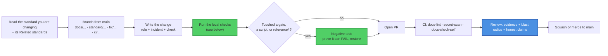

# Contributing to sk-standards

Thanks for helping with `sk-standards`. This is the canonical home of the SKWorld
engineering standards, so a change here is a **fleet change**: the standards govern
every `sk*` repo, and the reusable `docs-check` gate runs inside every consumer's CI at
`@main`. Tighten a rule and thirty repos can go red at once. That is the point of the
repo, and it is also the reason the bar for a PR here is "show your work", not "sounds
right".

By participating you agree to the [Code of Conduct](CODE_OF_CONDUCT.md). All
contributions are licensed under **Apache-2.0**, this repo's recorded license. It is not
being relicensed.

Start with [SOP.md](SOP.md) if you have not read it: sections 3, 4, and 7 cover the
toolchain, what CI actually enforces, and the full reference for the scripts and the
reusable workflow.

---

## Ground rules

1. **A standard states a rule, an incident, and a check.** The strongest documents here
   follow that shape: what to do, the failure that taught us, and the command or gate
   that catches a regression. `SERVICE_UNIT_STANDARD` names the 47,187-restart incident.
   `DOCS_FRESHNESS_STANDARD` names the gitleaks gate that scanned zero bytes for months.
   A rule with no incident behind it and no way to check it is an opinion.
2. **No claim without evidence.** [SK_REPO_DOC_STANDARD section 5](./standards/SK_REPO_DOC_STANDARD.md)
   applies to this repo's own prose. Every external-facing claim carries its verifier: a
   command, a test name, a cited spec, or a file and line. If you cannot verify it,
   write what is known and say the rest is unverified.
3. **Never write a forbidden crypto word**, in a standard, a comment, or a commit
   message: "quantum-proof", "unbreakable", "quantum-safe", "CNSA 2.0 compliant", "FIPS
   206", "Falcon". Say "post-quantum" or "quantum-resistant", cite the FIPS number, and
   scope the claim to a surface. Never imply AES-256 is quantum-broken; it is symmetric
   and Grover-only. A hybrid is secure if **either** leg holds, and it should be
   described that way. Reviewers block a PR over this even in a comment.
4. **Green on day one.** Never land a gate that starts red. Land the compliance pass and
   the gate in the same PR. A red check is triaged as known-broken within days and
   routed around thereafter. [DOCS_FRESHNESS_STANDARD section 2](./standards/DOCS_FRESHNESS_STANDARD.md).
5. **Verify a gate in both directions.** A gate that passes everything is worth no more
   than one that never ran. Break the fact, confirm the gate goes red, restore, and
   record the negative test in the PR.
6. **One canonical source.** State a fact once, link to it, never copy it. Duplicated
   truth drifts, and a reader who finds two answers trusts neither.
7. **Do not weaken a check to make your PR green.** If a gate is wrong, fix the gate in
   its own PR with the reasoning. If it is right, fix your change.

---

## What kind of change is this?

| Change | Extra requirements |
|---|---|
| **Wording, typo, clarification** | Nothing beyond CI green. |
| **New standard** (`standards/NEW_THING_STANDARD.md`) | Link it from the `README.md` table with a one-line "what it governs" (a `docs-evidence` check enforces that every `standards/*.md` is linked from the README, so an unlinked standard fails CI). Cross-link it from the related standards, and add a "Related standards" section pointing back. Ship a validator if the rule is checkable. |
| **Changing an existing rule** | Say in the PR body which repos this can turn red and how they migrate. A rule change with no migration note is an unscheduled fleet incident. |
| **Touching a validator or a reusable workflow** (`scripts/docs_check.py`, `scripts/ci_gate_check.py`, `.github/workflows/docs-check.yml`, `.github/workflows/ci-gate-check.yml`) | These run in every consumer's CI at `@main`. See "Changing a gate" below. |
| **Touching `reference/`** | People copy-paste these into production ingress and unit files. Treat a change like a production config change, not a doc edit. |
| **New ADR** (`decisions/ADR-NNNN-*.md`) | Follow `ADR-0001`'s header: `Status`, `Date`, `Deciders`, `Extends`, `Purpose`. Record what shipped, not what is planned. |

### Changing a gate

The two validators and the two reusable workflows are the highest-blast-radius files in
the repo. A PR touching any of them must:

- Run the negative control for the gate you touched and paste the result:
  ```bash
  python3 scripts/docs_check.py --self-test        # must print: PASS (the gate can fail)
  python3 scripts/ci_gate_check.py --self-test     # same, for the CI-integrity gate
  ```
- Run the validator against this repo, which is the reference implementation of its own
  standards:
  ```bash
  python3 scripts/docs_check.py --repo . --tier 1 --tier 3   # must print: RESULT: pass
  python3 scripts/ci_gate_check.py audit --repo .            # must print: clean
  ```
- Keep `docs_check.py` and `check_fences.py` **stdlib-only**. The `docs-check` runner is
  a clean `actions/setup-python` 3.12 that installs nothing, so a new import makes the
  gate fail for the wrong reason, and a gate that fails for the wrong reason gets
  disabled. `ci_gate_check.py` is the one script allowed a dependency (PyYAML, pinned as
  `pyyaml==6.0.2` in `ci-gate-check.yml`), because parsing workflow YAML by hand is
  worse. Do not add a second one.
- Keep a new tier-3 check **hermetic and cheap**: no network, no live host, no
  `systemctl`, no `ssh`, no `curl`, seconds not minutes. It runs on every push in every
  consumer repo.
- Say in the PR body what a consumer repo has to do to stay green.

---

## Workflow



### Branch model

Branch from `main`, open a PR, never push to `main` directly. Branch names follow the
history in this repo: `docs/...`, `standard/...` or `feat/...` for a new standard,
`fix/...`, `ci/...`. There is no release branch and no tag, because
[there is nothing to release](SOP.md#5-release--deploy): a merge to `main` **is** the
release, and consumers pinned to `@main` pick it up on their next CI run.

### Setup and local checks

There is no build, no install, and no dependency to fetch. Python 3.12 and bash are the
whole toolchain.

```bash
git clone https://github.com/smilinTux/sk-standards
cd sk-standards

# what CI's docs-lint fence-check runs
python3 scripts/check_fences.py README.md ECOSYSTEM.md standards/*.md templates/*.md

# what CI's docs-check-self runs, plus the tier this repo holds itself to
python3 scripts/docs_check.py --repo . --tier 1 --tier 3
python3 scripts/docs_check.py --self-test

# what CI's ci-gate-check-self runs (the only step needing a dependency)
pip install pyyaml==6.0.2
python3 scripts/ci_gate_check.py --self-test
python3 scripts/ci_gate_check.py audit --repo .
```

Relative links matter: CI runs lychee with `--offline`, so a broken relative path fails
the build while an `https://` URL is not checked at all. Check your links by clicking
them in the rendered diff.

---

## The test gate

**Be clear-eyed about this: there is no test suite here, and no `pytest` command gates a
merge.** What blocks a merge is:

| Gate | What it proves |
|---|---|
| `docs-lint` / `link-check` | Every relative link in `README.md`, `ECOSYSTEM.md`, and `standards/` resolves (lychee, `--offline`, `fail: true`). |
| `docs-lint` / `fence-check` | Every code fence, including every ` ```mermaid ` block, is closed. |
| `secret-scan` | gitleaks 8.28.0 over the full history, `--exit-code 1`. |
| `docs-check-self` | This repo passing its own `docs-check` gate at tiers 1 and 2, and, on every run, the `--self-test` negative control proving the gate can still fail. |
| `ci-gate-check-self` | This repo passing its own `ci-gate-check` audit: no duplicate YAML keys, no unpinned linter, no unguarded publishing job. The negative control runs **before** the audit, so a rotted checker cannot make a clean audit look like a passing one. |

No step in this repo uses `|| true`. If you add one, expect it to be removed.

One honest gap you should know about: `reference/ingress/test_capauth_gate.py` (12
tests) exists and **is not run by any workflow**. If you change
`reference/ingress/capauth_gate.py`, run `python3 -m pytest reference/ingress/ -q`
yourself and say so in the PR. Do not assume CI caught it.

---

## Commits

- **Conventional, imperative subject lines**, matching the existing history:
  `standards: ...`, `docs: ...`, `fix(audit): ...`, `ci: ...`, `feat: ...`. Prefer a
  subject that states the rule or the failure, the way `fix(audit): never report clean
  on a scope the validator could not see` does.
- **The honest-claim rules apply to commit messages too.**
- When a contribution is co-authored by an AI agent, end the commit with a
  `Co-Authored-By:` trailer, one per co-author. **Evidence is required:** the
  co-author footer is added only when material contribution is supported by exact
  request or session evidence (card ID, session ID, or pull request reference).

  ```
  Co-Authored-By: Claude Opus 5 <noreply@anthropic.com>
  # Card: 6a45c813, Session: pi-provenance-sweep-6a45c813@chiap08
  ```

- **Never push a tag.** This repo has never been tagged, and introducing one creates a
  pinning surface consumers will start depending on. That is a fleet decision, not a
  repo decision.

---

## What a good PR looks like

- **Scoped.** One rule, one standard, one gate. A wording pass and a rule change do not
  belong in the same PR, because the rule change needs a migration note and the wording
  pass does not.
- **Evidenced.** Every new claim names its verifier. Every gate change pastes the
  negative-test output.
- **Blast-radius aware.** The PR body says which consumer repos this can turn red and
  what they do about it.
- **Honest.** No forbidden word, no unscoped claim, no green check that certifies less
  than it appears to. If part of the change is unverified, the PR says which part.

### Out of scope, by design

- Adding a runtime, a service, a package, or a published artifact. This repo is docs and
  reference material; see [SOP.md section 1](SOP.md#1-overview), "What it explicitly
  does NOT do".
- Copying a standard into another repo. Link to the canonical home instead; the skstacks
  copies carry a "canonical home" pointer back here for exactly this reason.
- Adding a dependency to `docs_check.py` or `check_fences.py`, or a second one to
  `ci_gate_check.py`.
- A standard that only this repo would ever follow.

---

## Reporting security issues

**Do not** open a public issue for a vulnerability. Follow [SECURITY.md](SECURITY.md):
GitHub private vulnerability reporting, 72 hour acknowledgement, coordinated disclosure.
Note that "just docs" undersells the surface: this repo's validator and reusable
workflow execute inside other repos' CI.

Thanks for keeping the standards honest. If a standard and a repo disagree, the standard
wins, or the standard is wrong and we fix it here.
