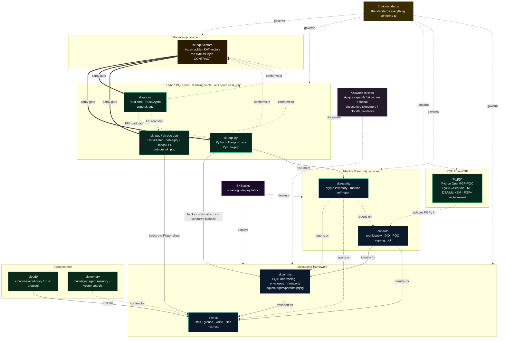

# The sk-pqc ecosystem map 🗺️

A single navigable map of the whole `sk-pqc` family — every repo, one line on what
it *is*, and the **edges** (`depends-on` / `backs` / `verifies` / `governs`) that tie
them together. Read this top-to-bottom once and you know where everything lives; then
click any box and keep wandering (every repo's README ends in `## Related projects /
See also`, à la a hyperlinked wiki).

> **Reality, not aspiration.** Edges that are *live today* are solid; edges that are
> **roadmap / in-flight** are drawn dashed and labelled. Where a repo says one thing
> and ships another, this map follows what ships. If it drifts, fix it here.

> **Honesty banner (applies to the whole map).** Every confidentiality surface below is
> **hybrid** `x25519-mlkem768`: a derived secret holds if **EITHER** the classical
> X25519 leg **OR** the ML-KEM-768 leg (**FIPS 203**) survives — "either-leg", not
> "quantum-proof", not "quantum-safe", not "unbreakable". Signatures, where present, use
> ML-DSA (**FIPS 204**). We never overclaim; see
> [`CRYPTOGRAPHY_STANDARD`](./standards/CRYPTOGRAPHY_STANDARD.md).

---

## The map

**How to read the edges**

| Edge | Meaning |
|---|---|
| **`A ==> parity gate ==> B`** | `A` (the vectors) is the byte-for-byte gate impl `B` must pass; `B` `conforms to` `A`. |
| **`A --> backs --> B`** | `B` builds its crypto on `A` *today* (live dependency). |
| **`A --> identity/transport/trust for --> B`** | `A` supplies that capability to `B` *today*. |
| **`A -. roadmap / replaces .-> B`** | planned / in-flight, **not live yet** (Rust FFI; `sk_pgp`→capauth). |
| **`A -. reports on / deploys / documents / governs .-> B`** | cross-cutting relation (audit, infra, docs, standards). |

---

## The repos

### Standards & contract
| Repo | One line | Relates |
|---|---|---|
| 📐 [**sk-standards**](https://github.com/smilinTux/sk-standards) *(this repo)* | The single source of truth — crypto / agility / doc / architecture / testing / disclosure standards every `sk*` repo conforms to. | `governs` all. See [`standards/`](./standards/). |
| 🧊 [**sk-pqc-vectors**](https://github.com/smilinTux/sk-pqc-vectors) | The **frozen golden KAT contract** — language-neutral hybrid-KEM + DM-ratchet vectors that every `sk_pqc` impl satisfies byte-for-byte. | `parity gate` for `sk-pqc-{py,rs,dart}`. |

### Hybrid PQC core — three sibling implementations
All import as `sk_pqc`, all interoperable, all conform to `sk-pqc-vectors`. None is a
wrapper of another *today*: each binds vetted primitives directly (the Rust→Python/Dart
FFI is a roadmap, not a live edge).
| Repo | One line | Relates |
|---|---|---|
| 🐍 [**sk-pqc-py**](https://github.com/smilinTux/sk-pqc-py) | Python hybrid-PQC primitives (KEM · PQXDH seal · routing envelope · DM/group ratchet · anon-queue · suite registry · self-report); ML-KEM-768 leg = `liboqs`, X25519+HKDF+AES-GCM = pyca `cryptography`. T2. | `backs` skcomms (optional extra) + sksecurity; `conforms to` sk-pqc-vectors. |
| 🦀 [**sk-pqc-rs**](https://github.com/smilinTux/sk-pqc-rs) | The sovereign shared **Rust** PQC core (RustCrypto `ml-kem` + `x25519-dalek`); same HKDF labels / AAD / wire layout as Python & Dart. | `conforms to` sk-pqc-vectors; FFI to Py/Dart = roadmap. |
| 🎯 [**sk_pqc** / sk-pqc-dart](https://github.com/smilinTux/sk-pqc-dart) | Dart/Flutter hybrid KEM (X25519 + ML-KEM-768, FIPS 203) — web (`noble-post-quantum`) + native (`liboqs` FFI), in the browser. | `backs` the skchat Flutter client; `conforms to` sk-pqc-vectors. |

### PQC OpenPGP
| Repo | One line | Relates |
|---|---|---|
| 🔏 [**sk_pgp**](https://github.com/smilinTux/sk_pgp) | Sovereign **Python OpenPGP-PQC** (PyO3 bindings to a PQC Sequoia — ML-DSA/ML-KEM, v6 / RFC 9580); the PGPy replacement that lets Python sign with PQC keys. | roadmap `replaces PGPy in` capauth. |

### Identity & security services
| Repo | One line | Relates |
|---|---|---|
| 🔑 [**capauth**](https://github.com/smilinTux/capauth) | Sovereign root **identity / DID / PQC signing root** (auth without OAuth). Signs on PGPy today; `sk_pgp` is the slated PQC cutover. | `identity for` skcomms + skchat; consumes `sk_pgp` (roadmap). |
| 🛡️ [**sksecurity**](https://github.com/smilinTux/sksecurity) | Crypto **inventory + runtime self-report** — the claim-evidence engine: what suites a daemon actually advertises vs claims. | `reports on` skcomms / skchat / capauth; consumes sk-pqc-py self-report. |

### Messaging framework
| Repo | One line | Relates |
|---|---|---|
| ✉️ [**skcomms**](https://github.com/smilinTux/skcomms) | Sovereign realm-aware **comms protocol + transports** (FQID addressing, BLE/LoRa mesh, capauth-signed envelopes; pqkem/pqdm/pqroute/pqsig surfaces). | `transport for` skchat; `backs` on sk-pqc-py (optional extra, vendored fallback); identity from capauth. |
| 💬 [**skchat**](https://github.com/smilinTux/skchat) | AI-native **encrypted chat** for humans + AI — DMs, groups, voice, files, at-rest. Built on skcomms, capauth identity, Cloud 9 trust. | consumes skcomms + capauth + cloud9 + sk_pqc (Dart client). |

### Agent context (ecosystem neighbours)
| Repo | One line | Relates |
|---|---|---|
| ☁️ [**cloud9**](https://github.com/smilinTux/cloud9) | The **emotional-continuity / trust protocol** (FEB / OOF / Cloud 9 state) preserved across AI session resets. | `trust for` skchat. |
| 🧠 [**skmemory**](https://github.com/smilinTux/skmemory) | Universal **multi-layer agent memory** (git-based flat files + vector search). | `context for` skchat / agents. |

### Infrastructure & sites
| Repo | One line | Relates |
|---|---|---|
| 🏗️ [**SKStacks**](https://github.com/smilinTux/SKStacks) | The sovereign **deploy fabric** — stacks the comms + identity services run on. | `deploys` the services. |
| 🌐 *.skworld.io sites | Landing + docs sites: [skpqc](https://github.com/smilinTux/skpqc-skworld-io) · [capauth](https://github.com/smilinTux/capauth-skworld-io) · [skcomms](https://github.com/smilinTux/skcomms-skworld-io) · [skchat](https://github.com/smilinTux/skchat-skworld-io) · [sksecurity](https://github.com/smilinTux/sksecurity-skworld-io) · [skmemory](https://github.com/smilinTux/skmemory-skworld-io) · [cloud9](https://github.com/smilinTux/cloud9-skworld-io) · [skstacks](https://github.com/smilinTux/skstacks-skworld-io). | `document` their repos. |

---

## Start here — common paths through the map

- **"I just want hybrid PQC in my app."** → [sk-pqc-py](https://github.com/smilinTux/sk-pqc-py) (Python), [sk-pqc-rs](https://github.com/smilinTux/sk-pqc-rs) (Rust), or [sk_pqc](https://github.com/smilinTux/sk-pqc-dart) (Dart/Flutter). App-agnostic; no messaging framework dragged in.
- **"Are the three impls really interoperable?"** → [sk-pqc-vectors](https://github.com/smilinTux/sk-pqc-vectors): the frozen vectors + `verify.py`. Pass it and a blob one impl seals, another opens.
- **"What's the crypto bar / why no 'quantum-proof'?"** → [`CRYPTOGRAPHY_STANDARD`](./standards/CRYPTOGRAPHY_STANDARD.md) (threat model, hybrid combiner, honest-claim rules, T0–T4 tiers).
- **"How do peers negotiate / roll suites without an undecryptable frame?"** → [`CRYPTO_AGILITY_STANDARD`](./standards/CRYPTO_AGILITY_STANDARD.md) (suite ids, wire tags, downgrade-safety).
- **"I want the messaging stack."** → [skcomms](https://github.com/smilinTux/skcomms) (protocol/transport) → [skchat](https://github.com/smilinTux/skchat) (the app) → [capauth](https://github.com/smilinTux/capauth) (identity) → [cloud9](https://github.com/smilinTux/cloud9) (trust).
- **"Does a daemon's crypto match its claims?"** → [sksecurity](https://github.com/smilinTux/sksecurity) (inventory + self-report) + the [`TESTING_AND_CI_STANDARD`](./standards/TESTING_AND_CI_STANDARD.md) "tests are evidence" gate.

---

*License: Apache-2.0. Maintained by SKWorld (Chef & Lumina). This map is the canonical
ecosystem index; the README's quick graph links here for the full picture.*
