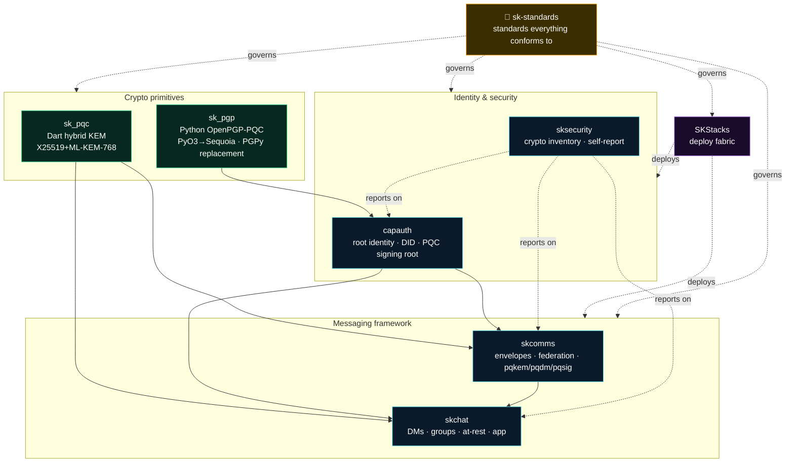

# sk-standards 📐

**The single source of truth for SKWorld sovereign engineering standards.** Every
`sk*` project — service, app, or library — conforms to what's here. If a standard
and a repo disagree, the standard wins (or the standard is wrong and we fix it here).

> One sentence: **build it so a stranger — human or AI — can learn it, trust it, and
> change it from the repo alone, and never overclaim what it does.**

---

## The standards

| Standard | What it governs |
|---|---|
| [**CRYPTOGRAPHY_STANDARD**](./standards/CRYPTOGRAPHY_STANDARD.md) | The quantum-resistance bar: HNDL/Mosca threat model, the hybrid combiner `HKDF(X25519 ‖ ML-KEM-768)`, crypto-agility (suite-ids + backend ABC + self-report), the **honest-claim rules** (never "quantum-proof"), and the T0–T4 maturity tiers. |
| [**SK_REPO_DOC_STANDARD**](./standards/SK_REPO_DOC_STANDARD.md) | The required doc set for every repo (README · SOP · SECURITY · CONTRIBUTING · CODE_OF_CONDUCT · CHANGELOG · LICENSE), the 9-section `SOP.md` template, the mermaid mandate, the **README-as-hub + cross-linking** convention, and the per-repo compliance checklist. |
| [**ARCHITECTURE_AND_DATAFLOW_STANDARD**](./standards/ARCHITECTURE_AND_DATAFLOW_STANDARD.md) | How to make a codebase *learnable fast*: the required diagram set (system context · component · **data-flow with crypto-per-hop** · sequence), the "Start here" onboarding section, and **mermaid-first** (draw.io only for hand-tuned canvases). |
| [**VERSION_LIFECYCLE**](./standards/VERSION_LIFECYCLE.md) | Version phases (Legacy v1 / Active v2 / Incubating v3 / Shared) + SemVer policy. |

**Templates** (copy into a new repo): [`templates/`](./templates/) — a README and a SOP skeleton.

---

## The project graph — wander the ecosystem

Every repo's README ends with a `## Related projects / See also` that links its
neighbours, so you can **learn the whole system by clicking through** (à la a
hyperlinked wiki). This is the master map:

### Repos
- 🦀🐍 [**sk_pgp**](https://github.com/smilinTux/sk_pgp) — sovereign Python OpenPGP-PQC (PyO3→Sequoia); the PGPy replacement that lets Python sign with v6/PQC keys.
- 🎯 [**sk_pqc**](https://github.com/smilinTux/sk-pqc-dart) — Dart/Flutter hybrid KEM (X25519+ML-KEM-768), web + native, in the browser.
- 🔑 [**capauth**](https://github.com/smilinTux/capauth) — sovereign identity, DID, the PQC signing root.
- 🛡️ [**sksecurity**](https://github.com/smilinTux/sksecurity) — crypto inventory + runtime self-report (the claim-evidence engine).
- ✉️ [**skcomms**](https://github.com/smilinTux/skcomms) · 💬 [**skchat**](https://github.com/smilinTux/skchat) — the messaging framework (KEM/DM/group/at-rest/signature surfaces).
- 🏗️ **SKStacks** — the sovereign deploy fabric.

---

## How to use this

**New `sk*` repo?**
1. Copy [`templates/README.template.md`](./templates/README.template.md) and [`templates/SOP.template.md`](./templates/SOP.template.md).
2. Work the [`SK_REPO_DOC_STANDARD` checklist](./standards/SK_REPO_DOC_STANDARD.md#6-per-repo-compliance-checklist).
3. Crypto component? Also state your **T0–T4 tier** and add the `CRYPTOGRAPHY_STANDARD` compliance line.
4. Fill the **data-flow diagram** + **"Start here"** per the architecture standard.
5. Add the `## Related projects / See also` cross-links and update the project graph above.

**The honesty gate** (applies to every release & doc): every quantum-resistance claim
cites *surface + FIPS # + hybrid-vs-classical*, backed by the self-report. Forbidden
words: "quantum-proof" / "unbreakable" / "quantum-safe". Say **"post-quantum"** /
**"quantum-resistant."**

---

*License: Apache-2.0. Maintained by SKWorld (Chef & Lumina). The skstacks copies of
these standards carry a "canonical home" pointer back here.*
