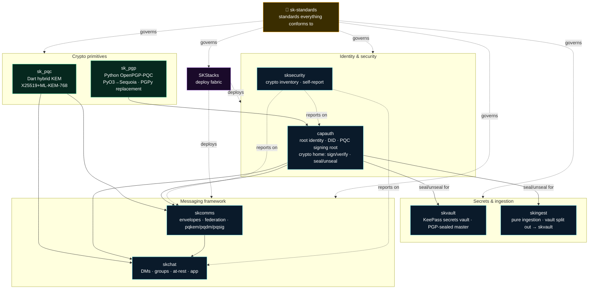

# sk-standards 📐

**The single source of truth for SKWorld sovereign engineering standards.** Every
`sk*` project — service, app, or library — conforms to what's here. If a standard
and a repo disagree, the standard wins (or the standard is wrong and we fix it here).

> One sentence: **build it so a stranger — human or AI — can learn it, trust it, and
> change it from the repo alone, and never overclaim what it does.**

---

## The standards

The operating-seat roster is [`ROSTER.md`](./ROSTER.md), governed by
[`ADR-0005`](./decisions/ADR-0005-five-operating-seats.md). It separates the
Fleet Dispatcher (`jarvis`), Integrator (`link`), and read-only Overseer
(`mero`) from application action dispatch and actuation.

| Standard | What it governs |
|---|---|
| [**CRYPTOGRAPHY_STANDARD**](./standards/CRYPTOGRAPHY_STANDARD.md) | The quantum-resistance bar: HNDL/Mosca threat model, the hybrid combiner `HKDF(X25519 ‖ ML-KEM-768)`, crypto-agility (suite-ids + backend ABC + self-report), the **honest-claim rules** (never "quantum-proof"), and the T0–T4 maturity tiers. |
| [**CRYPTO_AGILITY_STANDARD**](./standards/CRYPTO_AGILITY_STANDARD.md) | The agility thesis (the core argument): self-describing **suite ids + wire tags** (`x25519-mlkem768`, `pqdm1:`, `pqdr1`, `aqid:`, `sig_suite`/`kem_suite`), the **capability-advertisement + downgrade-safety** pattern (a peer without a capability stays on the prior path, never gets an undecryptable frame), how to **register + roll to the NEXT** KEM/signature (versioned tags · `replaces=` · dual-stack window · deprecation), and the named **anti-patterns** (hardcoded primitives, no version byte). |
| [**SK_REPO_DOC_STANDARD**](./standards/SK_REPO_DOC_STANDARD.md) | The **AI-first, then human-readable** principle (§0 — docs an agent can build→test→deploy→verify from alone), the required doc set for every repo (README · SOP · SECURITY · CONTRIBUTING · CODE_OF_CONDUCT · CHANGELOG · LICENSE), the 9-section `SOP.md` template, the mermaid mandate, the **README-as-hub + cross-linking** convention, and the per-repo compliance checklist. |
| [**DOCS_FRESHNESS_STANDARD**](./standards/DOCS_FRESHNESS_STANDARD.md) | How docs stay TRUE after the migration, so compliance is not a big bang re-run every six months. The `docs-check` gate in three tiers: **presence** (the 7 required files), **changelog-on-code-change** (a PR touching `src/**` must touch `CHANGELOG.md`, with a logged escape hatch), and the load-bearing one, a **self-verifying SOP**: `SOP.md` carries a `docs-evidence` block of hermetic commands that CI executes, so a documented port, entry point or unit name that drifts fails the build the moment it lands instead of at 2am. Plus the rollout rules every gate needs (**green on day one**, **verify it can FAIL**, a skip is not a pass, one canonical source). Validator: [`scripts/docs_check.py`](./scripts/docs_check.py) (with a built-in negative control); reusable gate: [`.github/workflows/docs-check.yml`](./.github/workflows/docs-check.yml). |
| [**ARCHITECTURE_AND_DATAFLOW_STANDARD**](./standards/ARCHITECTURE_AND_DATAFLOW_STANDARD.md) | How to make a codebase *learnable fast*: the required diagram set (system context · component · **data-flow with crypto-per-hop** · sequence), the "Start here" onboarding section, and **mermaid-first** (draw.io only for hand-tuned canvases). |
| [**TESTING_AND_CI_STANDARD**](./standards/TESTING_AND_CI_STANDARD.md) | TDD as the default, **cross-impl KAT/parity gates** (Python↔Rust↔Dart must agree byte-for-byte), the **green-bar release gate**, a GHA test-matrix sketch, the **"tests are evidence for claims"** honesty gate (incl. *measure the endpoint the config actually resolves to*), and **§6 gate integrity**: a red bar on `main` is an **incident**, because a gate red for reasons nobody caused stops being read and a real failure lands invisibly beside it. Pin your linters (an unpinned one turns `main` red with **no code change**), guard every publishing job (one unguarded job ran on branch pushes and kept a release workflow red for weeks), tell **stale red from live red** by timestamp, and monitor by **alerting on new breakage only**, never paging. Validator: [`scripts/ci_gate_check.py`](./scripts/ci_gate_check.py) (`sweep` + `audit` + `--self-test`). |
| [**SECURITY_DISCLOSURE_STANDARD**](./standards/SECURITY_DISCLOSURE_STANDARD.md) | Coordinated-disclosure contact + scope, the **experimental/unaudited reference-impl posture** every crypto lib MUST state, the embargo/advisory process, and the **honest-claims gate for advisories** (never "quantum-proof"). |
| [**UNIFIED_INGRESS_STANDARD**](./standards/UNIFIED_INGRESS_STANDARD.md) | The **one public `:443`** rule: `internet → :443 tunnel → reverse proxy (host+path+middleware) → localhost/tailnet backends`. Why a reverse proxy is required for vhosting (Funnel = one hostname + path-only), Tailscale-Funnel vs Cloudflare-Tunnel adapters, Caddy vs Traefik, SKStacks Traefik integration, the **capauth-gate** middleware (federation endpoints public-by-design, everything else gated), + copy-paste reference configs in [`reference/ingress/`](./reference/ingress/). |
| [**VERSION_LIFECYCLE**](./standards/VERSION_LIFECYCLE.md) | Version phases (Legacy v1 / Active v2 / Incubating v3 / Shared) + SemVer policy. |
| [**BACKUP_AND_RETENTION_STANDARD**](./standards/BACKUP_AND_RETENTION_STANDARD.md) | How every node backs up **sovereign state**: the **Grandfather-Father-Son** rotation (14 daily / 8 weekly / 12 monthly / 2 yearly + pruner), the **irreplaceable-vs-rebuildable** split (archive flat state, skip the vector index + transient churn), `.sha256` integrity + free-space guard + off-box **3-2-1**, and the **tested restore path incl. index rebuild**. Reference impl: skcapstone `scripts/skcapstone-gfs-backup.sh` + `docs/BACKUP.md`. |
| [**OBSERVABILITY_AND_SCHEDULING_STANDARD**](./standards/OBSERVABILITY_AND_SCHEDULING_STANDARD.md) | Nothing scheduled fails silently; nothing inbound is lost. Every cron/timer job **wrapped** (run-ledger + failure→GTD + `sk-alert`); external inputs captured through **one `gtd-ingest` sink** (sources-as-adapters, `source_ref`-deduped, one store); **notify-don't-nag** (real-time alerts for failures only + an always-sent **daily ops report**); on-demand `… status` self-report as the evidence. Reference impl: skos `gtd-ingest` + `sk-cron-run` + `sk-status`. |
| [**SERVICE_UNIT_STANDARD**](./standards/SERVICE_UNIT_STANDARD.md) | **A service that cannot start must eventually stop trying.** The limiter rule for every long-running systemd unit (`RestartSec x (StartLimitBurst-1)` MUST be `< StartLimitIntervalSec`, so the defaults `Burst=5`/`Interval=10s` silently disable the limiter for any `RestartSec >= 2.5s` and a broken unit retries **forever**), the **two-tier policy** chosen by blast radius (**A** backoff-only for infra that must never permanently die, **B** backoff + widened limiter for leaf apps so a permanent fault lands visibly in `failed`), **`ExecStart` durability** (one unit per service, no stale enabled unit pointing at a moved venv, `RequiresMountsFor=`), the **recovery-script rules** (never take a destructive action you have not proven you can undo; set `PATH` explicitly because cron's excludes `/usr/sbin` while `kill` is a builtin; preserve the pre-crash evidence), and **bounded output** (the sibling rule: a service that runs forever must not write forever, so cap container logs and journald, and verify the cap on the CONTAINER because a daemon default only applies to containers created after it). Distilled from `prb-bd79dd5f`, where a `203/EXEC` unit hit **47,187 restarts** and hung the GPU node twice for 13h. Validator: [`scripts/audit-service-units.sh`](./scripts/audit-service-units.sh); drop-ins in [`reference/systemd/`](./reference/systemd/). |
| [**ITIL_AND_RUNBOOK_OPERATING_MODEL_STANDARD**](./standards/ITIL_AND_RUNBOOK_OPERATING_MODEL_STANDARD.md) | How SKWorld runs service management, drawn as mermaid and grounded in the shipped code: the **Incident / Problem / Change / KEDB** lifecycles (the real `itil.py` states, transition tables, and fold-time CAB derivations), the **CAB voting** flow, the **operator-seat** observe→classify→propose→act loop (Atlas, safe-by-default, freeze-first), plus the **target** runbook maintenance loop (condition trips → Atlas RAG-retrieves a runbook → proposes a canon edit as a coord card + gtd-ingest capture → human ratifies in git → re-project to skmem-pg) and the **CMDB drift-reconcile** loop (wiki CI definition vs `cmdb.py` live state → `CmdbDriftBounded` → incident + GTD). Includes an explicit **implementation-vs-diagram drift register**. STATE (event-sourced, never in git) vs DEFINITION (version-controlled, never policy); one CAB gate, one gtd-ingest sink. |
| [**SKWORLD_MODULE_CONTRACT_STANDARD**](./standards/SKWORLD_MODULE_CONTRACT_STANDARD.md) | The SKWorld subapp contract (manifest schema **v1.3** + `skworld_module_api` **v0**): one capauth-signed manifest with required UI and operator facets, v1.2 install and knowledge facets, and the optional v1.3 control-plane discovery facet. v1.1 and v1.2 remain valid unchanged. The registry requires a verified detached capauth signature before mount or operator discovery. JSON Schema and worked examples live in [`reference/skworld-module/`](./reference/skworld-module/). |
| [**PROVENANCE_AND_MUTATION_STANDARD**](./standards/PROVENANCE_AND_MUTATION_STANDARD.md) | How any shared store mutates: the **Signed Provenance Envelope** (resolved actor identity + role + node + session + prior-state ref + capauth signature with a registry `suite_id`), the **append-only mutation log** (state = pure fold, one store lock, write-then-delete moves), the **reversal rule** (every destructive verb ships its inverse; undo is a reversing event, recovery never breaks the id chain), **target validation before mutation** (grep is discovery, never targeting; validate both halves of `(action, target)`), and the named anti-patterns (destructive two-file move · write/lookup universe mismatch · unlocked writer · unsigned actor claim · the "SIGNED" overclaim · grep-and-mutate). The thesis: **fast requires reversible; reversible requires attributable**; provenance empowers self-correction, it never names-and-shames. Distilled from the 2026-08-13 GTD and operator-seat incidents. |
| [**SKWORLD_AUTHORIZATION_STANDARD**](./standards/SKWORLD_AUTHORIZATION_STANDARD.md) | **One PDP, many thin PEPs.** Every subapp delegates allow/deny to the single `capauth.authz.decide(subject, capability, resource, context)`; a PEP decides nothing, fails closed, and runs one universal lifecycle (classify route → authenticate → resolve subject from the credential only → map (method, route) to a capability → decide → emit the audit obligation). The **capability taxonomy** (`<subapp>.<action>`, tiered read/write/act to TOFU/attested/verified `minimum_mode`). The load-bearing rule: **route coverage, not soak, is the enforce-safety criterion**, because **shadow mode structurally cannot see an unmapped route** (it only compares where a capability is already mapped), so "divergence == 0" is necessary and never sufficient. Hence a **CI completeness gate** over the LIVE route table, method-aware mapping, an explicit self-auth registry for token-minting routes, declared grant bundles audited by actually calling `decide()`, and reversible enforce rails. Distilled from two live CR-3 enforce-flip incidents. |
| [**MCP_TOOL_OWNERSHIP_STANDARD**](./standards/MCP_TOOL_OWNERSHIP_STANDARD.md) | **One owning repo per MCP tool name.** When the same tool name is defined independently in more than one server, the behavior an agent gets depends on which server answered and a bug fixed in one is missed in the others. The owner holds the canonical implementation; a non-owner MAY re-expose it only as a **thin delegate** calling the owner's library (same name, same `inputSchema`, no second copy of the logic, no second authorization rule), and **drop is preferred over delegate** where no consumer needs it. Carries the domain-assignment rule so new tools land right (messaging → skchat · memory → skmemory · telegram bridge → skcapstone · coordination/ITIL → skcoord · identity → capauth) and a dated ownership inventory of the duplicated names. |
| [**AUTONOMY_STANDARD**](./standards/AUTONOMY_STANDARD.md) | **The estate's first verb stratum:** every other standard governs a noun, this one governs what must be true before the estate *acts*. Seven cross-cutting invariants (one approval store; the actuator's inputs are closed; registered-and-gated or not shipped; provisioned before active; observation never carries control weight; machine-written code merges only through the twin gate; a human and only a human holds the freeze), and the **actuation-surface registry** that turns kill-switch coverage from a prose belief into a checked property. Ships with its two ungoverned surfaces honestly listed, because green-by-omission is worse than no standard, and with a baseline set so deleting an embarrassing row fails the build instead of fixing it. FRAMEWORK, ACCRETING: six constituent standards land as their own PRs and flip their own rows. Distilled from the 2026-08-25 estate review that found approval causing no action and two live actuation surfaces with no gate at all. |
| [**ACTUATION_READINESS_AND_FREEZE_STANDARD**](./standards/ACTUATION_READINESS_AND_FREEZE_STANDARD.md) | The provisioned-before-active rule: `is_frozen` keeps absent-as-not-frozen and corrupt-as-frozen semantics, while every effect additionally passes the shared readiness and freeze guard. An absent valid store refuses as `unprovisioned`; status is tri-state; only a human operator provisions or changes freeze state; audit after an effect is not a gate. Validator: [`scripts/check_actuation_readiness_standard.py`](./scripts/check_actuation_readiness_standard.py), including red self-tests for absent, corrupt, and collapsed-status failures. |
| [**ACTION_AUTHORIZATION_STANDARD**](./standards/ACTION_AUTHORIZATION_STANDARD.md) | The ITIL change fold is the one approval store. The action ledger is durable evidence and the dispatch queue, never authorization. Only the dispatcher appends `AUTHORIZED` after re-reading an approved fold, checking readiness and freeze, and reclassifying against the current catalog. Its input set excludes model and activity streams. Gate relaxation requires a reviewed catalog edit backed by ledger lineage. Validator: [`scripts/check_action_authorization_standard.py`](./scripts/check_action_authorization_standard.py), with red controls for forged authorization and a dispatcher brain import. |
| [**ACTUATION_SURFACE_GOVERNANCE_STANDARD**](./standards/ACTUATION_SURFACE_GOVERNANCE_STANDARD.md) | Registered and gated, or not shipped. Every effect-capable surface remains in the append-only registry, including removed historical ids with explicit retirement reasons. MCP tools check readiness and freeze, then approved-change or deployed CapAuth authorization before effect; unreachable PDP denies, and post-effect audit is not a gate. Validator: [`scripts/check_actuation_registry.py`](./scripts/check_actuation_registry.py), with red controls for row deletion and a newly detected unregistered MCP effect tool. |
| [**AUTOCODE_MERGE_GATE_STANDARD**](./standards/AUTOCODE_MERGE_GATE_STANDARD.md) | The sole merge bar for machine-authored change: every path imports the same `twin_gate_passed` function; the grader class is pinned; the protected manifest fails closed and its floor only grows; all four diff-coverage anti-gaming checks remain; activity authority stays observation-only; and every Ralph or `ratify()` verdict writes a hash-verifiable RunRecord. Validator: [`scripts/check_autocode_merge_gate_standard.py`](./scripts/check_autocode_merge_gate_standard.py), with red controls for reimplemented gate logic, floor deletion, and a verdict without a required RunRecord. |
| [**CODING_LANES_STANDARD**](./standards/CODING_LANES_STANDARD.md) | Two coding drivers with one merge bar: lane 1 is the human-driven, versioned Pi pane cluster; lane 2 is the managed skharness task plane. Three booleans route work deterministically: executable acceptance, no mid-flight steering, and enrolled repository. Both lanes share the card, imported twin gate, and RunRecord vocabulary, while driver, confinement, loop, and context remain distinct. Decision: [`ADR-0002`](./decisions/ADR-0002-two-coding-lanes.md). Validator: [`scripts/check_coding_lanes_standard.py`](./scripts/check_coding_lanes_standard.py), including a red maintained-brief vocabulary fixture. |
| [**SELF_HEALING_TIERS_STANDARD**](./standards/SELF_HEALING_TIERS_STANDARD.md) | Three bounded healers: the five executable per-agent doctor repairs within one home and process, node-local converge start or restart under readiness, opt-in, policy, and backoff, and same-entry ErrorQueue replay capped at three attempts. A retry mints no authority; effectful handlers revalidate current gates. No healer may touch its own gate, the freeze, protected manifest, or any S5 floor path. Validator: [`scripts/check_self_healing_tiers_standard.py`](./scripts/check_self_healing_tiers_standard.py), with red controls for own-gate and protected-floor repair. |
| [**IDENTITY_NAMING_STANDARD**](./standards/IDENTITY_NAMING_STANDARD.md) | The one canonical **fqid** grammar every subject string matches on: five entity classes (humans, agents, services, nodes, device seats), the ASCII-lowercase regex, and the rule that the PGP primary-key fingerprint is the root identity, the subject string a bound label. **Normative rules**: `fqid` canonical + the `capauth:` wire form deprecated, ASCII-only with non-ASCII REJECTED (never folded, a security-boundary anti-pattern), normalization confined to ONE validator (never inside the authorization decision function), alias mappings as a closed enumerated table only. Records **why the local/federated suffix split was rejected** (spelling must never change on promotion, the operator tier already isolates, `.local` collides with mDNS + an existing fake-identity marker, product-keyed tiers age badly) so it is not re-proposed. |
| [**INFERENCE_FEDERATION_STANDARD**](./standards/INFERENCE_FEDERATION_STANDARD.md) | How estates pool GPU capacity **without pooling their credit cards**. The two lanes: a **subscription lane** (paid third-party keys, estate-private, billed to the key holder) and a **pool lane** (donated local inference, federated, **zero paid credentials, ever**), because one gateway process naturally holds both and the unguarded version lets one estate's subscription silently fund everyone with no receipt. **Mesh, not a central pool**, because routing preference is a local policy decision: every estate wants to exhaust its own GPU before spending a peer's, and under a central pool that ordering belongs to whoever runs it. **Membership is static, availability is runtime**: declare contributors in config and let health/quarantine handle who is actually up, since adding a backend needs a full gateway restart and dynamic registration would bounce it for every consumer. Plus the three different things called **"free"** (open endpoints and real free tiers, both allowed; **web-session replay forbidden**, since the credential at risk is a human's personal account rather than a capped API key), the rule that **free-tier eligibility is decided by DATA CLASS and never by cost** (free tiers are paid for in training data, so a purely cost-ranked router will eventually send soul files and client work to one), and what is worth reimplementing from an aggregator: cost-tier fallback laddering, per-provider quota tracking with rotation on exhaustion, and ranking free providers by independent quality scores rather than treating "free" as one bucket. |
| [**SITE_AND_HOST_NAMING_STANDARD**](./standards/SITE_AND_HOST_NAMING_STANDARD.md) | How physical sites and the hosts in them are named, one layer below the fqid grammar (`zerap08` here, `zerap08@lumina.skworld.io` there). The rule a site name answers **what is this place** before **where is it**, so geography is metadata and never the name, and the named anti-pattern this exists to kill: **the incrementing site** (`chi2`), which tells you a site is the second one and nothing else, not its role, not its trust posture, not whether it may hold the only copy of something. A closed three-character vocabulary claimed in a registry before first use (`zio` Zion home, `zer` Zero One compute, `ion` IO expansion; reserved `meg` Mega City for rented infra so a hosted node states its own sovereignty posture in its own name, `mob` Mobil Ave for transit). The load-bearing rule: a site's **name** and its **addresses** change on separate schedules, because **CMDB CI ids are keys, not labels**, so renaming a CI is a delete plus a create that destroys the event log `cmdb show` folds. Hence alias-first migration (`legacy_prefix` resolves both spellings), never a flag day, and a host that is never renamed is not out of compliance. **Federation:** the vocabulary is estate-local by design, so every estate having its own Zion is correct, not a collision; a code is never respelled on federation (that re-proposes the split `IDENTITY_NAMING_STANDARD` §3 overruled) and cross-estate reference rides the fqid's existing `<operator>.<org-domain>`, with registries declaring an `estate` and resolvers keying by `(estate, code)`. **Hostnames are bare** (`zioap01`) and identical in every estate: the estate belongs in the resolution suffix and the fqid (`zioap01@cakjr.skworld.io`), never in the host label, because inside an estate an estate marker carries zero information on every host you will ever type. So a runbook saying `ssh zioap01` is literally correct everywhere. This needs each estate to own its resolution namespace, which Tailscale enforces for free: a device shared from another tailnet resolves ONLY as `<host>.<tailnet>.ts.net` and never by short name, so two estates can both hold a `zioap01` forever. `zio` is reserved and automatic per estate, like `root`; every other code is claimed only when a site exists to claim it. Estate identity defaults to an **operator segment under a shared org-domain** rather than a purchased one, because the PGP primary key is the root identity and the domain is a bound label: sovereignty lives in the key, not the suffix. That default's one real cost is paid explicitly, a **permanent non-revocable delegation**, with `IDENTITY_NAMING_STANDARD` §2.6 dated aliases as the documented exit, so choosing a subdomain forecloses nothing. Tags are `[a-z0-9]{2,12}` and hyphen-free so the first hyphen is always the delimiter. Plus the rule the estates already follow: a shared ops account **name** is fine, shared **credentials** are not. Estates then reach each other through **bridge nodes, never a full mesh**: Tailscale shares devices one at a time with no bulk option and shared machines cannot advertise subnet routes, which reads as a constraint but is the right default, since a peer should never be able to enumerate your whole fleet. Bridges are **user-owned, not tag-owned** (shares are accepted by users and a shared machine is visible only to the recipient user), carry an enumerated application-layer exchange rather than general reachability, and are listed in the registry because they are the estate's entire federation surface. Cost is `N(N-1)` one-time shares, six for three estates, and does not grow with machine count. |

**Templates** (copy into a new repo): [`templates/`](./templates/) — a README and a SOP skeleton.

**Public sites.** Every `<name>-skworld-io` static site (GitHub Pages) SHOULD ship the
**repo-docs viewer** as a default — a drop-in `docs.html` that renders the source
repo's `docs/*.md` live, in the SKWorld house style, with a committed
`docs-manifest.json` as the API-rate-limit fallback. Template + adoption SOP live in
the sovereign `site-repos/_seo-templates/` (`docs.html.tmpl` + `docs-manifest-gen.py`);
reference implementation: [skcomms.skworld.io/docs.html](https://skcomms.skworld.io/docs.html).

---

## The project graph — wander the ecosystem

> 🗺️ **Full navigable index: [ECOSYSTEM.md](./ECOSYSTEM.md)** — every repo in the
> `sk-pqc` family (the three sibling crypto impls + vectors contract, `sk_pgp`,
> capauth, sksecurity, skcomms, skchat, cloud9, skmemory, SKStacks, the sites) with a
> one-line purpose, the `depends-on` / `backs` / `verifies` / `governs` edges, and a
> bigger mermaid graph. The quick graph below is the at-a-glance version.

Every repo's README ends with a `## Related projects / See also` that links its
neighbours, so you can **learn the whole system by clicking through** (à la a
hyperlinked wiki). The standards govern the whole map: the
[crypto](./standards/CRYPTOGRAPHY_STANDARD.md) and
[architecture](./standards/ARCHITECTURE_AND_DATAFLOW_STANDARD.md) standards say how
each box is *built and drawn*; the
[testing/CI](./standards/TESTING_AND_CI_STANDARD.md) standard is the **cross-impl
parity gate** that keeps the multi-language crypto libs (`sk_pqc` in Python/Rust/Dart)
byte-for-byte interoperable along every edge; the
[security-disclosure](./standards/SECURITY_DISCLOSURE_STANDARD.md) standard governs how
a vuln in any box is reported, embargoed, and honestly described. This is the master map:

```mermaid
flowchart TD
    STD[📐 sk-standards<br/>standards everything conforms to]:::std

    subgraph crypto[Crypto primitives]
      SKPQC[sk_pqc<br/>Dart hybrid KEM<br/>X25519+ML-KEM-768]:::lib
      SKPGP[sk_pgp<br/>Python OpenPGP-PQC<br/>PyO3→Sequoia · PGPy replacement]:::lib
    end

    subgraph identity[Identity & security]
      CAP[capauth<br/>root identity · DID · PQC signing root<br/>crypto home: sign/verify · seal/unseal]:::svc
      SEC[sksecurity<br/>crypto inventory · self-report]:::svc
    end

    subgraph secrets[Secrets & ingestion]
      SKVAULT[skvault<br/>KeePass secrets vault · PGP-sealed master]:::svc
      SKINGEST[skingest<br/>pure ingestion · vault split out → skvault]:::svc
    end

    subgraph comms[Messaging framework]
      SKCOMMS[skcomms<br/>envelopes · federation · pqkem/pqdm/pqsig]:::svc
      SKCHAT[skchat<br/>DMs · groups · at-rest · app]:::svc
    end

    INFRA[SKStacks<br/>deploy fabric]:::infra

    SKPGP --> CAP
    CAP -->|seal/unseal for| SKVAULT
    CAP -->|seal/unseal for| SKINGEST
    SKPQC --> SKCHAT
    SKPQC --> SKCOMMS
    CAP --> SKCOMMS
    CAP --> SKCHAT
    SKCOMMS --> SKCHAT
    SEC -. reports on .-> SKCOMMS
    SEC -. reports on .-> SKCHAT
    SEC -. reports on .-> CAP
    INFRA -. deploys .-> comms
    INFRA -. deploys .-> identity
    STD -. governs .-> crypto
    STD -. governs .-> identity
    STD -. governs .-> secrets
    STD -. governs .-> comms
    STD -. governs .-> INFRA

    classDef std fill:#3a2d00,stroke:#ffa500,color:#fff;
    classDef lib fill:#06281e,stroke:#34d399,color:#fff;
    classDef svc fill:#0a1a2a,stroke:#67e8f9,color:#fff;
    classDef infra fill:#1a0a2a,stroke:#c084fc,color:#fff;
```

### Repos
- 🦀🐍 [**sk_pgp**](https://github.com/smilinTux/sk_pgp) — sovereign Python OpenPGP-PQC (PyO3→Sequoia); the PGPy replacement that lets Python sign with v6/PQC keys.
- 🎯 [**sk_pqc**](https://github.com/smilinTux/sk-pqc-dart) — Dart/Flutter hybrid KEM (X25519+ML-KEM-768), web + native, in the browser.
- 🔑 [**capauth**](https://github.com/smilinTux/capauth) — sovereign identity, DID, the PQC signing root; the crypto home (sign/verify + seal/unseal).
- 🛡️ [**sksecurity**](https://github.com/smilinTux/sksecurity) — crypto inventory + runtime self-report (the claim-evidence engine).
- 🔐 [**skvault**](https://github.com/smilinTux/skvault) — sovereign secrets vault (KeePass, master PGP-sealed to the sovereign identity → gpg-agent); seals via `capauth`. Split out of skingest.
- 📥 [**skingest**](https://github.com/smilinTux/skingest) — pure ingestion (mxbai + skmem-pg); seals via `capauth`. No longer owns the vault (→ skvault).
- ✉️ [**skcomms**](https://github.com/smilinTux/skcomms) · 💬 [**skchat**](https://github.com/smilinTux/skchat) — the messaging framework (KEM/DM/group/at-rest/signature surfaces).
- 🏗️ **SKStacks** — the sovereign deploy fabric.

---

## How to use this

**New `sk*` repo?**
1. Copy [`templates/README.template.md`](./templates/README.template.md) and [`templates/SOP.template.md`](./templates/SOP.template.md).
2. Work the [`SK_REPO_DOC_STANDARD` checklist](./standards/SK_REPO_DOC_STANDARD.md#6-per-repo-compliance-checklist).
3. Crypto component? Also state your **T0–T4 tier**, add the `CRYPTOGRAPHY_STANDARD` compliance line, document your **wire tags + suite registry + negotiation surface** per [`CRYPTO_AGILITY_STANDARD`](./standards/CRYPTO_AGILITY_STANDARD.md), and the **experimental/unaudited reference-impl** posture from [`SECURITY_DISCLOSURE_STANDARD`](./standards/SECURITY_DISCLOSURE_STANDARD.md).
4. Fill the **data-flow diagram** + **"Start here"** per the architecture standard.
5. Wire the [`TESTING_AND_CI_STANDARD`](./standards/TESTING_AND_CI_STANDARD.md) gate: TDD where there's logic, shared `vectors/` + **cross-impl parity** check, green-bar release gate, GHA matrix.
6. Enable GitHub **private vulnerability reporting** + fill `SECURITY.md` (contact + scope + embargo) per [`SECURITY_DISCLOSURE_STANDARD`](./standards/SECURITY_DISCLOSURE_STANDARD.md).
7. Holds sovereign state? Wire a **GFS backup rotation** + document the tested restore path per [`BACKUP_AND_RETENTION_STANDARD`](./standards/BACKUP_AND_RETENTION_STANDARD.md) (archive the irreplaceable, skip the rebuildable index).
8. Runs scheduled jobs or takes external inputs? **Wrap every job** (run-ledger + failure→GTD + `sk-alert`), capture inputs through the **`gtd-ingest` sink** (`source_ref`-deduped), and ship a **daily ops report** + on-demand `… status` per [`OBSERVABILITY_AND_SCHEDULING_STANDARD`](./standards/OBSERVABILITY_AND_SCHEDULING_STANDARD.md).
9. Add the `## Related projects / See also` cross-links and update the project graph above.

**This repo, held to its own standard.** `sk-standards` hosts the `docs-check` gate, so
it runs it against itself: `.github/workflows/docs-check-self.yml` calls the reusable
workflow by its local path on every push and pull request. The required doc set lives at
the root: [SOP.md](./SOP.md) (operational source of truth, with a 12-check
`docs-evidence` block) · [SECURITY.md](./SECURITY.md) (threat model, disclosure, and an
honest account of the supply-chain surface a repo whose CI runs inside other repos'
CI actually has) · [CONTRIBUTING.md](./CONTRIBUTING.md) ·
[CODE_OF_CONDUCT.md](./CODE_OF_CONDUCT.md) · [CHANGELOG.md](./CHANGELOG.md) ·
[LICENSE](./LICENSE). Maturity tier: **T0 - N/A (no key material)**; this repo governs
the crypto standards, it does not implement them.

**The honesty gate** (applies to every release & doc): every quantum-resistance claim
cites *surface + FIPS # + hybrid-vs-classical*, backed by the self-report. Forbidden
words: "quantum-proof" / "unbreakable" / "quantum-safe". Say **"post-quantum"** /
**"quantum-resistant."**

---

*License: Apache-2.0. Maintained by SKWorld (Chef & Lumina). The skstacks copies of
these standards carry a "canonical home" pointer back here.*
