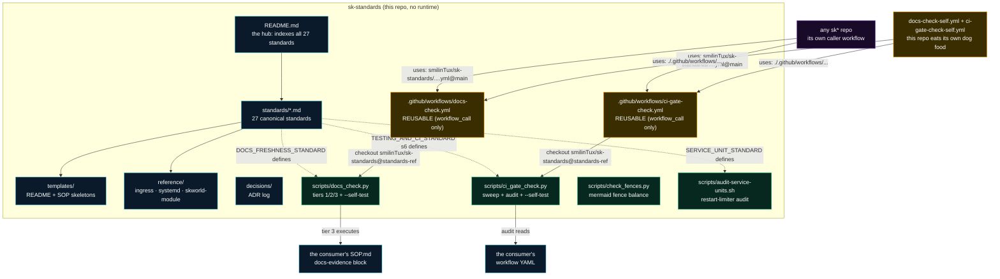
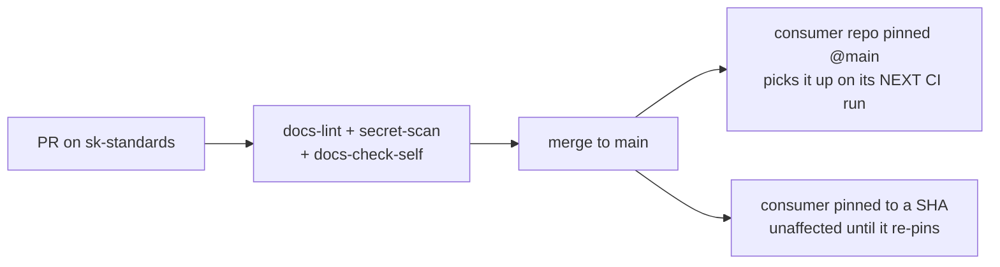

# sk-standards - Standard Operating Procedures

`sk-standards` is the canonical home of the SKWorld engineering standards: 27 standards
documents, two accepted ADRs, the README/SOP templates, copy-paste reference configs,
eleven validators, and two **reusable GitHub Actions workflows** that other `sk*` repos call.
It is a **docs-and-reference repo**: nothing here installs, listens, or runs as a
service. Its only executable surface is CI.

**Canonical-home:** <https://github.com/smilinTux/sk-standards>
**Maturity-tier:** T0 - N/A (no key material)
**Version:** unversioned, consumed by git ref (see [section 9](#9-maturity-tier--version-reference))
**Status:** active

---

## 1. Overview

### Purpose

One place where a rule is written down, so thirty repos do not each keep their own
drifting copy. The repo answers two questions: *what is the bar?* (the documents in
`standards/`) and *is this repo actually meeting it?* (the validators in `scripts/` and
the reusable gates in `.github/workflows/`).

### Scope: what it owns

| Surface | Path | What it is |
|---|---|---|
| The standards | `standards/*.md` | 27 canonical documents. Every `sk*` repo conforms to these. Indexed from `README.md`. |
| Decision log | `decisions/ADR-*.md` | Three accepted architecture decisions: ADR-0001 (skos / skharness / skcode layering), ADR-0002 (two coding lanes with one merge bar), and ADR-0005 (five operating seats, and gates relaxed by catalog rather than by prompt). ADR-0006 (the dispatcher handoff to Niobe, Tank, and Seraph) is open for architecture review as Proposed; it joins this row when Accepted. |
| Operating seats | `ROSTER.md`, `decisions/ADR-0005-five-operating-seats.md`, `decisions/ADR-0006-dispatch-handoff-niobe-tank-seraph.md` | Jarvis is Fleet Dispatcher, Link is Integrator, and Mero is the read-only Overseer. Fleet dispatch is distinct from application action dispatch. ADR-0005 follows the open-PR ordering that reserves ADR-0003 for PR 34 and ADR-0004 for PR 36. ADR-0006 proposes the evidence-gated transfer of dispatch from Jarvis to Niobe, with Tank on release and install, Seraph verification-only, and Link arbitrating technical conflicts. |
| Templates | `templates/README.template.md`, `templates/SOP.template.md` | Skeletons a new repo copies. `SOP.template.md` carries the `docs-evidence` block stub. |
| Reference configs | `reference/ingress/`, `reference/systemd/`, `reference/skworld-module/` | Copy-paste artifacts for the ingress, service-unit, and module-contract standards. Includes a JSON Schema and two worked manifest examples. |
| Validators | `scripts/` | Eleven validator scripts, including docs, CI, fences, module schema, service units, actuation registry, readiness, authorization, merge gate, coding lanes, and self-healing tiers. |
| The reusable gates | `.github/workflows/docs-check.yml`, `.github/workflows/ci-gate-check.yml` | Both `workflow_call`-only. Other repos consume them with `uses:`. These are the repo's most-called surfaces. |

### What it explicitly does NOT do

- **No installable package.** No `pyproject.toml`, no `setup.py`, no `package.json`, no
  published artifact on PyPI, npm, or pub.dev. Nothing to `pip install`.
- **No runtime, no ports, no systemd units, no daemon, no entry point.** The scripts are
  invoked ad hoc or by CI. See section 5, Front-end / Exposure.
- **No state.** Nothing is written back into this repo by a machine.
- **No enforcement of its own accord.** `sk-standards` cannot make another repo comply.
  A consumer repo must add a workflow that *calls* the gate. A standard nobody wires up
  is a suggestion.
- **Not a crypto component.** It governs `CRYPTOGRAPHY_STANDARD` and
  `CRYPTO_AGILITY_STANDARD`; it holds no key material and performs no crypto
  operations, so it declares tier T0 and has no PQC posture of its own.

### Operating-seat runtime procedure

The normative placement, scheduling, health, and cold-standby rules for Link,
Mero, and the Jarvis fenced consumer are in
[`ROSTER.md`](./ROSTER.md#runtime-placement-and-scheduling). `sk-standards`
documents the contract only. SKCapstone owns the executable, user units, timers,
locking, revision fencing, evidence writer, installation, and rollback.

Operational changes follow this order:

1. Change and independently review SKCapstone source and tests.
2. Install Link and Mero on `chiap08` with both timers initially disabled.
3. Pin `active_host=chiap08`, then run one dry cycle per seat and verify exact
   evidence and zero mutation.
4. Enable only the `chiap08` timers and observe one normal cycle per seat.
5. Install byte-identical Link and Mero standby units on `chiap01` but leave
   both disabled. Do not change its ordinary fleet rotation.
6. Record active-host, standby-host, hashes, timer state, health, and rollback.

Rollback disables the affected timer, restores exact prior bytes, runs one
read-only health check, and preserves all evidence. It does not promote the
standby automatically.

The Link service runtime limit is 120 seconds and the Mero service runtime
limit is 180 seconds. Before any operational read, both validate the
revision-pinned active-host record and refuse an inactive host. Failures emit a
typed append-only alert to Jarvis with the unit, host, seat, cycle, timestamps,
active-host revision, result, exit status, evidence hash, and redacted tail.
After a fresh matching readback, Jarvis stops and disables only the affected
timer.

---

## 2. Architecture

There are two flows through this repo. A **human/agent reading flow** (README as hub to
a standard to a reference config or template) and a **CI enforcement flow** (a consumer
repo's workflow calls a reusable gate, which pulls the matching validator back out of
this repo and runs it against the consumer's tree).



### Start here

The five files to open first, in this order:

1. **`README.md`** - the hub. A one-line "what it governs" for each of the 27 standards,
   plus the ecosystem project graph. If you read one file, read this.
2. **`standards/SK_REPO_DOC_STANDARD.md`** - what every repo's docs must *contain*: the
   7 required files (section 1), the 9-section `SOP.md` template (section 2), the mermaid
   mandate (section 3), and the honest-claims gate (section 5).
3. **`standards/DOCS_FRESHNESS_STANDARD.md`** - how those docs stay *true*: the
   three-tier `docs-check` gate and the `docs-evidence` block schema (section 1.3).
4. **`scripts/docs_check.py`** - the validator that implements those three tiers. Read
   `REQUIRED` (the 7 filenames), `parse_evidence()` (the hand-rolled block parser, no
   PyYAML on purpose), and `self_test()` (the negative control).
5. **`.github/workflows/docs-check.yml`** - the reusable gate itself. Its two inputs
   (`tiers`, `standards-ref`) are the whole consumer-facing API. Its sibling
   `.github/workflows/ci-gate-check.yml` follows the identical shape for
   `TESTING_AND_CI_STANDARD` section 6.

---

## 3. Build

**There is no build.** No compiler, no bundler, no artifact. The repo is Markdown, YAML,
JSON, eleven validators, and a JSON Schema.

The only toolchain a contributor needs locally:

```bash
git clone https://github.com/smilinTux/sk-standards
cd sk-standards
python3 --version   # 3.12 is what CI uses (actions/setup-python 3.12)
bash --version      # audit-service-units.sh is bash, not sh
```

**Dependencies, precisely.** `docs_check.py` and `check_fences.py` are **stdlib-only**.
`docs_check.py` deliberately hand-rolls its `docs-evidence` parser rather than depending
on PyYAML, so the gate cannot fail for the wrong reason on a minimal runner
(`scripts/docs_check.py`, docstring on `parse_evidence`). `ci_gate_check.py` is the one
exception: it **requires PyYAML** to parse workflow files (its `import yaml` is wrapped
in a `try`, and `ci-gate-check.yml` installs `pyyaml==6.0.2`), and its `sweep` mode
additionally shells out to `gh`. Its `audit` mode needs only PyYAML.

Run the validators locally:

```bash
python3 scripts/docs_check.py --repo . --tier 1 --tier 3   # this repo against the standard
python3 scripts/docs_check.py --self-test                  # negative control
python3 scripts/ci_gate_check.py audit --repo .            # needs PyYAML
python3 scripts/ci_gate_check.py --self-test               # negative control
python3 scripts/check_fences.py README.md ECOSYSTEM.md standards/*.md templates/*.md
bash scripts/audit-service-units.sh --quiet                # needs a host with systemd
```

`audit-service-units.sh` is the one script that is **not** hermetic: it shells out to
`systemctl` and reports on the host it runs on. That is why it appears in CI only as a
syntax check (`bash -n`), never as an executed audit.

---

## 4. Test

**Honest position: this repo has no test suite and no test command.** There is nothing
to unit-test in a Markdown corpus. What blocks a merge is the CI lint and gate set below.

### What actually runs in CI

| Workflow | Trigger | What it enforces | Can it fail? |
|---|---|---|---|
| `docs-lint.yml` (job `link-check`) | push to `main` / PR, paths-filtered to `README.md`, `ECOSYSTEM.md`, `standards/**`, `templates/**` | lychee with `--offline`: relative and file links only, no network. `fail: true`. | Yes. It went red on main and was fixed in `d6d2d71` ("repair the five broken relative links"). |
| `docs-lint.yml` (job `fence-check`) | same | `scripts/check_fences.py`: every ` ``` ` fence closed, every ` ```mermaid ` block terminated. Exit 1 on any imbalance. | Yes. A half-open diagram fence is exactly the failure a docs-only repo has no runtime to catch. |
| `secret-scan.yml` | every push and PR | `gitleaks` **8.28.0** binary (pinned), `gitleaks detect --source . --redact --exit-code 1` over the **full history** (`fetch-depth: 0`). | Yes. History recorded clean 2026-08-14; a red run means a secret was *added*. |
| `docs-check-self.yml` | every push and PR | Calls this repo's own reusable `docs-check` gate with `tiers: "1,2"`. Presence of the 7 required docs, plus changelog-on-code-change. | Yes, and it is proven so on every run: the reusable workflow's last step is `docs_check.py --self-test`. |
| `ci-gate-check-self.yml` | every push and PR | Calls this repo's own reusable `ci-gate-check` gate. `TESTING_AND_CI_STANDARD` section 6 structural rules: duplicate YAML keys, unpinned linters, an unguarded publishing job. `soft-fail` left at its `false` default. | Yes, and the reusable workflow runs `ci_gate_check.py --self-test` **before** the audit, deliberately, so a rotted checker cannot make a clean audit look like a passing one. |

None of these use `|| true`. There is no step in this repo that swallows a nonzero exit.

### The negative control (this is the real test)

`python3 scripts/docs_check.py --self-test` builds a throwaway repo in a temp directory
that is constructed to fail **all three tiers**: 6 of the 7 required files missing, a
`src/app.py` change with no `CHANGELOG.md`, and three `docs-evidence` checks that exit
3, fail a `test -f`, and run `false`. It then asserts every tier returned `False` and
prints `BROKEN (a tier passed when it must not)` if any tier passed.

```
$ python3 scripts/docs_check.py --self-test
negative control: PASS (the gate can fail)
```

The reusable workflow runs this on every invocation, in every consumer repo, so the
validator cannot silently rot into a no-op. A gate that passes everything is worth no
more than one that never ran.

### Known gap: an unexecuted test file

`reference/ingress/test_capauth_gate.py` (12 tests, plus `conftest.py`) exists in the
tree and **is not run by any workflow**. Verified 2026-08-14: no workflow on `main`
invokes `pytest`. It passes locally (`python3 -m pytest reference/ingress/ -q` gave
`12 passed`), but that is a local observation and **not CI coverage**. Do not read its
presence as a green bar. Wiring it up is a tracked follow-up, not a claim.

---

## 5. Release / Deploy

**There is nothing to deploy and nothing to publish.** No package index, no container,
no host. Distribution is git.

### How a change reaches consumers



A merge to `main` is the release. Because the reusable workflow defaults
`standards-ref: main` and consumers call it as
`uses: smilinTux/sk-standards/.github/workflows/docs-check.yml@main`, **a change to
`scripts/docs_check.py` on `main` takes effect in every consumer repo on their next CI
run, with no action on their part.** Treat a validator change as a fleet-wide change:
tighten a rule and thirty repos can go red at once.

### Rollback

Revert the commit on `main` and merge. There is no artifact to unpublish and no host to
roll back. A consumer that needs to freeze can pin
`standards-ref: <sha>` on the reusable-workflow call, or pin the `uses:` line to a SHA
instead of `@main`.

### Tags

**This repo has never been tagged** (`git tag` returns nothing, verified 2026-08-14).
Do not create one casually: introducing a tag creates a pinning surface that consumers
will start depending on, and that is a fleet decision, not a repo decision.

### Front-end / Exposure

**N/A - no network surface.** No listener, no bind address, no `:443` route, no ingress
tier. The repo has no runtime. The `reference/ingress/` directory contains *reference
configs for other services* (Caddyfile, Traefik dynamic config, cloudflared config,
a Tailscale Funnel script, and a capauth-gate middleware sketch); none of it is deployed
from here.

---

## 6. Configuration / Usage

### Adopting the gate in a consumer repo

Create `.github/workflows/docs-check.yml` in the **consumer** repo:

```yaml
name: docs-check
on: [push, pull_request]
permissions:
  contents: read
jobs:
  docs:
    uses: smilinTux/sk-standards/.github/workflows/docs-check.yml@main
    with:
      tiers: "1,2"     # while adopting; move to "1,2,3" once the SOP evidence block lands
```

Adoption order matters, per `DOCS_FRESHNESS_STANDARD` section 2 (**green on day one**):
land the compliance pass and the gate in the **same** PR, so the gate is never merged
red. A red check is triaged as known-broken within days and routed around thereafter.

### How this repo checks itself

Both reusable gates in this repo declare `on: workflow_call:` **and nothing else**, so
neither ever self-triggers. Until `docs-check-self.yml` and `ci-gate-check-self.yml`
existed, the repo that hosts the gates had never once run them against itself. Each
self-caller invokes its gate by the **local** path:

```yaml
# .github/workflows/docs-check-self.yml
jobs:
  docs:
    uses: ./.github/workflows/docs-check.yml
    with:
      tiers: "1,2"
```

```yaml
# .github/workflows/ci-gate-check-self.yml
jobs:
  ci-gates:
    uses: ./.github/workflows/ci-gate-check.yml
```

The local `./` form is required here, because a `workflow_call`-only workflow is
invocable only via `uses:`. **Do not add `push`/`pull_request` triggers to
`docs-check.yml` or `ci-gate-check.yml`** and do not overwrite either with a caller;
they are the artifacts other repos consume. A local `uses: ./` reference resolves
against the caller's own commit, so a PR that changes a gate is checked by the changed
gate.

### Secrets

None. This repo consumes no secret, provisions no secret, and needs no repo or org
secret to run its CI. `secret-scan.yml` runs the gitleaks **binary** rather than
`gitleaks-action` precisely so that no paid org license and no secret is required (see
the header comment in that file for the incident that motivated it).

### Environment variables

| Variable | Where | Value | Purpose |
|---|---|---|---|
| `GITLEAKS_VERSION` | `secret-scan.yml`, job env | `8.28.0` | Pins the scanner so a new upstream rule cannot redden CI without a deliberate bump. |

No other environment variable is read anywhere in this repo.

---

## 7. API / Reference

### The reusable workflow: `.github/workflows/docs-check.yml`

| Input | Type | Default | Meaning |
|---|---|---|---|
| `tiers` | string | `"1,2,3"` | Comma-separated tiers to enforce. Use `"1,2"` while adopting. |
| `standards-ref` | string | `"main"` | Ref of `sk-standards` the validator is taken from. Pin to a SHA to freeze. |

Permissions requested: `contents: read`. Runner: `ubuntu-latest`, Python 3.12. The job
checks out the repo under test at `fetch-depth: 0` (the changed-file diff needs history),
checks out `sk-standards` into `.sk-standards`, computes the PR diff, honours the
changelog escape hatch, runs `docs_check.py`, then runs `--self-test`.

**Escape hatch:** a `docs-exempt` label or `[skip-changelog]` in the PR title waives the
tier-2 changelog requirement. The workflow emits a GitHub `::warning` when it is used.
An unlogged escape hatch becomes the default path within a quarter.

### `scripts/docs_check.py`

```
docs_check.py [--repo PATH] [--tier 1|2|3] [--changed-files FILE]
docs_check.py --self-test
```

| Flag | Meaning |
|---|---|
| `--repo PATH` | Repo root to validate. Default `.`. |
| `--tier N` | Repeatable. Omit to run all of 1, 2, 3. |
| `--changed-files FILE` | A file with one changed path per line. Without it, tier 2 reports "skipped (no diff context; not a PR)". |
| `--self-test` | Negative control. Ignores every other flag. |

Exit `0` = all selected tiers pass, `1` = at least one failure. Prints `RESULT: pass` or
`RESULT: FAIL` as the last line.

Module constants that consumers depend on:

| Constant | Value | Meaning |
|---|---|---|
| `REQUIRED` | `README.md`, `SOP.md`, `SECURITY.md`, `CONTRIBUTING.md`, `CODE_OF_CONDUCT.md`, `CHANGELOG.md`, `LICENSE` | Tier 1. Must stay identical to `SK_REPO_DOC_STANDARD` section 1. |
| `CODE_GLOBS` | `src/`, `pyproject.toml` | Tier 2 trigger prefixes. |
| `MIN_CHECKS` | `3` | Tier 3 minimum number of `docs-evidence` checks. |

### The `docs-evidence` block (tier 3 input format)

An HTML comment placed anywhere in the consumer's `SOP.md`, conventionally at the end.
Copy the literal, copy-pasteable block from
[`templates/SOP.template.md`](./templates/SOP.template.md). Its body looks like this:

```
verified: 2026-08-16
checks:
  - name: entry point exists
    run: skcode-hostd --help
  - name: documented port matches config
    run: grep -q '"port": 8420' config/default.json
  - name: unit file present
    run: test -f systemd/skcode-hostd.service
```

> **Why the opening marker is not reproduced here.** `docs_check.py` uses
> `EVIDENCE_RE.search()`, which takes the **first** match in the file. Writing a second
> literal opening marker anywhere above the real block, even inside a fenced example or
> inline code, would shadow the real one and the gate would validate the example
> instead. This SOP therefore shows the body only. The same trap applies to any repo
> that documents the format inside its own `SOP.md`.

Parsing is line-based, not YAML: `verified:` takes the rest of its line, `- name:` opens
a check, `run:` supplies its command. A check without a `run:` is dropped silently, so
**always pair them**. Each `run:` is executed with `bash -lc`, `cwd` = repo root, 120s
timeout. Any nonzero exit fails the tier. Checks must be hermetic (no network, no live
host, no `systemctl`, no `ssh`, no `curl`) and cheap, because they run on every push.

### The reusable workflow: `.github/workflows/ci-gate-check.yml`

| Input | Type | Default | Meaning |
|---|---|---|---|
| `standards-ref` | string | `"main"` | Ref of `sk-standards` the validator is taken from. |
| `soft-fail` | boolean | `false` | Report findings as a CI warning without failing, while adopting. Log-only. |

It installs `pyyaml==6.0.2`, runs `ci_gate_check.py --self-test` **first**, then
`ci_gate_check.py audit --repo .`.

### `scripts/ci_gate_check.py`

```
ci_gate_check.py sweep --repos a,b,c [--owner O] [--state PATH]
ci_gate_check.py audit [--repo PATH]
ci_gate_check.py --self-test
```

Backs [TESTING_AND_CI_STANDARD section 6](./standards/TESTING_AND_CI_STANDARD.md).
`audit` is the preventive half: it reads workflow YAML and flags the shapes that produce
always-red gates (duplicate YAML keys, which GitHub rejects in about 0 seconds with zero
jobs; an unpinned linter, which turns `main` red with no code change; a publishing job
with no `needs:`/`if:` on a workflow that fires on branch pushes). `sweep` is the
detective half and runs on a schedule **outside** CI, because a repo cannot notice from
inside its own red build that it has been red for ten hours; it alerts on **new**
breakage only, carrying known-red in a state file (default
`~/.skcapstone/state/ci-gate-health.json`).

Exit `0` = clean, `1` = finding, `2` = the check itself could not run. **Exit 2 is not
success:** a monitor that cannot run is not a green monitor.

Requires PyYAML. `sweep` additionally needs `gh` on PATH. Neither belongs in a
`docs-evidence` block: `sweep` is not hermetic, and `audit` needs a pip-installed
package the docs-check runner does not have.

### `scripts/check_fences.py`

```
check_fences.py <file.md> [file.md ...]
```

Exit `0` = balanced, `1` = at least one unterminated fence, `2` = no arguments given.
Counts and reports ` ```mermaid ` blocks separately so a broken diagram is obvious.

### `scripts/audit-service-units.sh`

```
audit-service-units.sh [--quiet] [--system-only] [-h|--help]
```

Validator for `SERVICE_UNIT_STANDARD`. Flags every enabled unit where
`RestartSec x (StartLimitBurst - 1) >= StartLimitIntervalSec` (the limiter can never
engage) **and** no backoff is configured. Exit `0` = clean, `1` = exposed units found,
`2` = usage or environment error (including `systemctl` not on PATH). It reads the live
host, so it is not hermetic and does not belong in a `docs-evidence` block.

### The reference tree

| Path | What it is |
|---|---|
| `reference/ingress/` | `Caddyfile`, `traefik-dynamic.yml`, `cloudflared-config.yml`, `tailscale-funnel.sh`, `capauth_gate.py` (+ its unexecuted tests). Backs `UNIFIED_INGRESS_STANDARD`. |
| `reference/systemd/` | `tier-a-backoff-only.conf` (infra that must never permanently die) and `tier-b-backoff-and-limiter.conf` (leaf apps that should land visibly in `failed`), plus a README on installing them as drop-ins rather than editing the unit. Backs `SERVICE_UNIT_STANDARD`. |
| `reference/skworld-module/` | `skworld.module.schema.json` plus two worked examples (`skworld.module.example.json`, `skworld.module.pack-example.json`). Backs `SKWORLD_MODULE_CONTRACT_STANDARD`. |

---

## 8. Troubleshooting

| Symptom | Check |
|---|---|
| A consumer repo's `docs-check` job is skipped or never appears. | The consumer's own workflow file exists and has `on: [push, pull_request]`. The reusable workflow here declares `workflow_call` **only**, so it never self-triggers. `grep -n "on:" .github/workflows/docs-check.yml` in the consumer. |
| `docs-check` fails with `missing required doc: X`. | Tier 1. That filename is in `REQUIRED` in `scripts/docs_check.py` and in `SK_REPO_DOC_STANDARD` section 1. Create the file; do not weaken the list. |
| `docs-check` fails with `code under src/ or pyproject.toml changed but CHANGELOG.md did not`. | Tier 2. Add a `CHANGELOG.md` entry. Only if the change is genuinely trivial, use the `docs-exempt` label or `[skip-changelog]` in the PR title, and expect the waiver to be logged as a CI warning. |
| `docs-check` fails with `docs-evidence has N check(s); the standard requires >= 3`. | `MIN_CHECKS` in `scripts/docs_check.py`. Also confirm every `- name:` has a paired `run:`: the parser silently drops a check with no `run:`, so a stray indent reads as a *missing* check. |
| Tier 3 runs checks you do not recognise, or reports `>= 3` when your block clearly has more. | The parser takes the **first** `docs-evidence` opening marker in the file. An example block documented earlier in the same `SOP.md` shadows the real one. Keep exactly one opening marker per file; see section 7, "Why the opening marker is not reproduced here". |
| A `docs-evidence` check passes locally but fails in CI. | The runner has a clean Python 3.12 from `actions/setup-python` with **no** third-party packages. A check that shells out to `pytest`, `ruff`, or any pip-installed tool will fail there. Keep evidence checks to shell builtins, coreutils, and stdlib Python. |
| A `docs-evidence` check is flaky. | It is not hermetic. Anything touching the network, a live service, `systemctl`, `ssh`, or `curl` belongs in that service's health endpoint, not here. A flaky gate gets disabled, and a disabled gate is worse than none. |
| `docs-lint` fails on a link that clearly resolves in a browser. | lychee runs with `--offline`: it validates **relative and file** links only. A broken relative path is a real failure; an `https://` URL is not checked at all. `.github/workflows/docs-lint.yml`. |
| `docs-lint` fence-check fails after adding a diagram. | An unterminated fence. Run `python3 scripts/check_fences.py <file>` locally; it names the file and the line the fence opened on. |
| `secret-scan` goes red. | A secret was **added**, because the full history scanned clean on 2026-08-14. Rotate it and purge it. Do **not** weaken the scan to an incremental one. `.github/workflows/secret-scan.yml`. |
| A standard exists in `standards/` but nobody can find it. | `README.md` is the hub and must link it. The `docs-evidence` block below enforces this: every `standards/*.md` filename must appear in `README.md`. |
| A local checkout disagrees with this repo, or a branch looks like it holds unmerged standards. | **`origin/main` is the source of truth, not any working tree.** The historical case (coord card `4be7825f`) was `feat/module-manifest-v1.2-install-knowledge-facets`, which carried `SKWORLD_AUTHORIZATION_STANDARD.md` and `MCP_TOOL_OWNERSHIP_STANDARD.md` and nothing else main lacked. **Both landed on `main` 2026-08-16**, reconciled against `IDENTITY_NAMING_STANDARD` (subject spelling) and the shipped module schema version. Everything else on that branch is a stale copy of a file `main` has since rewritten, and the module-manifest v1.2 work it is named for reached `main` by another route. Verify the same way before trusting any such branch: `git diff --stat origin/main <branch>` and read which side the insertions are on. |
| `ci-gate-check` fails with `ModuleNotFoundError: yaml`. | `ci_gate_check.py` is the one validator here that is not stdlib-only. The reusable workflow installs `pyyaml==6.0.2`; locally, `pip install pyyaml`. Do not add it to a `docs-evidence` block, whose runner has no pip-installed packages. |
| `ci_gate_check.py` exits **2**. | The check could not run (no `gh`, no PyYAML, no workflows directory). **This is not a pass.** A monitor that cannot run is not a green monitor. Fix the environment, do not read exit 2 as clean. |
| `audit-service-units.sh` exits 2 with `systemctl not found`. | Expected on a container or a non-systemd host. The script audits a live host; there is nothing to audit. This is why CI only syntax-checks it. |

---

## 9. Maturity-tier + Version reference

| Field | Value | Basis |
|---|---|---|
| **Maturity-tier** | **T0 - N/A (no key material)** | `SK_REPO_DOC_STANDARD` section 4: non-crypto repos state `T0 - N/A`. This repo generates, exchanges, signs, verifies, wraps, and stores nothing. |
| **VERSION_LIFECYCLE phase** | **N/A - single flat trunk** | `VERSION_LIFECYCLE` phases (Legacy `v1/` · Active `v2/` · Incubating `v3/` · Shared `shared/`) describe a versioned source tree. This repo has no such tree; `main` is the only line. |
| **Version** | **None. Consumed by git ref.** | `git tag` is empty (verified 2026-08-14) and there is no packaging manifest to carry a version string. The identity of a given state of this repo is its commit SHA. Consumers pin `@main` (default) or a SHA. |
| **CRYPTOGRAPHY_STANDARD compliance** | **N/A - not a crypto component** | It *governs* `CRYPTOGRAPHY_STANDARD` and `CRYPTO_AGILITY_STANDARD`; it does not implement them. No suite-ids, no combiner, no self-report, because there is no crypto surface to report on. |

### Honest-claims note

Per `SK_REPO_DOC_STANDARD` section 5, the claims this SOP makes are scoped and backed:
"no runtime" is backed by the absence of any packaging manifest, unit file, or listener
in the tree; "the gate can fail" is backed by `docs_check.py --self-test`, which runs on
every invocation of the reusable workflow; the CI table in section 4 names the workflow
file behind each row. The one thing this repo does **not** claim is test coverage: see
section 4, "Known gap: an unexecuted test file".

---

## Unverified / needs an operator pass

- **Consumer adoption count.** Grepping `main` on 2026-08-14 found the only reference to
  `docs-check.yml@` anywhere in this repo's YAML was a comment in the reusable
  workflow's own header, and the same held for `ci-gate-check.yml@`. How many `sk*`
  repos have actually wired either gate is not determined here and is not claimed.
- **`ci_gate_check.py sweep`.** Only `audit` was exercised during this pass (clean
  against this tree on 2026-08-14). `sweep` needs `gh` and network access to a real
  repo list, so it was not run and nothing is claimed about it here. It is also not
  wired to any schedule inside this repo; `TESTING_AND_CI_STANDARD` section 6.4 places
  the monitor outside CI, and where it actually runs was not verified.
- **The security contact's PGP fingerprint.** `SECURITY.md` points at the org profile
  rather than publishing a fingerprint inline, because no fingerprint for this repo's
  disclosure channel was verified during this pass. See `SECURITY.md`, "Reporting a
  vulnerability".
- **Whether GitHub private vulnerability reporting is enabled** on
  `smilinTux/sk-standards`. It is a repo setting, not visible from the tree.
  `SECURITY_DISCLOSURE_STANDARD` section 1.1 requires it on every `sk*` repo; confirming
  the toggle needs an operator with repo admin.

<!-- docs-evidence
     Executed by the docs-check gate (DOCS_FRESHNESS_STANDARD section 1.3).
     Every `run:` exits 0 while the documented fact holds, and NONZERO when it drifts.
     All hermetic: shell builtins, coreutils, and stdlib Python 3 only. No network,
     no live host, no pip-installed tool (the CI runner has none).
verified: 2026-08-16
checks:
  - name: the gate can still fail (docs_check negative control)
    run: python3 scripts/docs_check.py --self-test
  - name: validator required-doc list still matches SK_REPO_DOC_STANDARD section 1
    run: sed -n '/^REQUIRED = /,/\]$/p' scripts/docs_check.py | grep -oE '"[^"]+"' | tr -d '"' | while read -r f; do grep -q "| \`$f\`" standards/SK_REPO_DOC_STANDARD.md || exit 1; done
  - name: validator still requires exactly 7 documents (section 7 table)
    run: test "$(sed -n '/^REQUIRED = /,/\]$/p' scripts/docs_check.py | grep -oE '"[^"]+"' | wc -l)" = 7
  - name: validator still enforces the documented MIN_CHECKS of 3
    run: grep -q '^MIN_CHECKS = 3$' scripts/docs_check.py
  - name: docs-check.yml is still workflow_call-only with the documented tier default
    run: grep -q '^  workflow_call:' .github/workflows/docs-check.yml && grep -q 'default: "1,2,3"' .github/workflows/docs-check.yml
  - name: this repo still calls its own gate by the local path
    run: grep -q 'uses: ./.github/workflows/docs-check.yml' .github/workflows/docs-check-self.yml
  - name: ci-gate-check.yml is still workflow_call-only and still self-called
    run: grep -q '^  workflow_call:' .github/workflows/ci-gate-check.yml && grep -q 'uses: ./.github/workflows/ci-gate-check.yml' .github/workflows/ci-gate-check-self.yml
  - name: every script documented in section 7 is present and executable-by-interpreter
    run: for s in docs_check.py ci_gate_check.py check_fences.py check_actuation_registry.py check_actuation_readiness_standard.py check_action_authorization_standard.py check_autocode_merge_gate_standard.py check_coding_lanes_standard.py check_self_healing_tiers_standard.py; do python3 -c "import ast,sys;ast.parse(open(sys.argv[1]).read())" "scripts/$s" || exit 1; done
  - name: every standard in standards/ is linked from the README hub
    run: ls standards/*.md | while read -r f; do grep -q "$(basename "$f")" README.md || exit 1; done
  - name: the standards count claimed throughout this SOP still matches the tree
    run: test "$(ls standards/*.md | wc -l)" = 27
  - name: the accepted ADR count claimed in this SOP still matches the tree
    run: test "$(grep -l '^\*\*Status:\*\* Accepted$' decisions/ADR-*.md | wc -l)" = 3
  - name: the module schema still has NO authz facet, as SKWORLD_AUTHORIZATION_STANDARD section 7 states
    run: if grep -q '"authz"' reference/skworld-module/skworld.module.schema.json; then exit 1; fi
  - name: the shipped module schema version matches what the authz standard cites
    run: grep -q 'schema v1.3' reference/skworld-module/skworld.module.schema.json && grep -q 'schema is \*\*v1.3\*\*' standards/SKWORLD_AUTHORIZATION_STANDARD.md
  - name: PROVENANCE actor.id still requires the canonical fqid, never the capauth: wire form
    run: grep -q 'carried as the canonical fqid form' standards/PROVENANCE_AND_MUTATION_STANDARD.md && if grep -q 'wire form, .capauth:' standards/PROVENANCE_AND_MUTATION_STANDARD.md; then exit 1; fi
  - name: a failed operator observe still reports Unknown, never healthy
    run: grep -q 'report `Unknown`, never' standards/SKWORLD_MODULE_CONTRACT_STANDARD.md && if grep -q 'fail \*safe\* and report healthy' standards/SKWORLD_MODULE_CONTRACT_STANDARD.md; then exit 1; fi
  - name: the S4 actuation registry, retirement, and MCP amendment are consistent
    run: python3 scripts/check_actuation_registry.py --repo .
  - name: the S4 registry and MCP detector can still fail (negative controls)
    run: python3 scripts/check_actuation_registry.py --self-test
  - name: the S2 readiness contract is internally consistent and indexed once
    run: python3 scripts/check_actuation_readiness_standard.py --repo .
  - name: the S2 readiness gate can still fail (negative controls)
    run: python3 scripts/check_actuation_readiness_standard.py --self-test
  - name: the S3 action-authorization contract and ITIL amendment are consistent
    run: python3 scripts/check_action_authorization_standard.py --repo .
  - name: the S3 action-authorization gate can still fail (negative controls)
    run: python3 scripts/check_action_authorization_standard.py --self-test
  - name: the S5 merge-gate contract is internally consistent and indexed once
    run: python3 scripts/check_autocode_merge_gate_standard.py --repo .
  - name: the S5 merge-gate check can still fail (negative controls)
    run: python3 scripts/check_autocode_merge_gate_standard.py --self-test
  - name: the S6 coding-lanes contract, ADR, and brief vocabulary are consistent
    run: python3 scripts/check_coding_lanes_standard.py --repo .
  - name: the S6 coding-lanes gate can still fail (negative controls)
    run: python3 scripts/check_coding_lanes_standard.py --self-test
  - name: the S7 self-healing tiers and universal ceiling are consistent
    run: python3 scripts/check_self_healing_tiers_standard.py --repo .
  - name: the S7 self-healing ceiling can still fail (negative controls)
    run: python3 scripts/check_self_healing_tiers_standard.py --self-test
  - name: no standard reintroduces the deprecated operator-prefixed subject as canonical
    run: if grep -rn 'operator:<device_fp>' standards/; then exit 1; fi
  - name: secret-scan still pins the documented gitleaks 8.28.0
    run: grep -q 'GITLEAKS_VERSION: 8.28.0' .github/workflows/secret-scan.yml
  - name: all markdown fences balanced, including standards and ADR diagrams
    run: python3 scripts/check_fences.py README.md ECOSYSTEM.md SOP.md SECURITY.md CONTRIBUTING.md CODE_OF_CONDUCT.md CHANGELOG.md standards/*.md decisions/*.md templates/*.md
  - name: the SERVICE_UNIT_STANDARD validator still parses
    run: bash -n scripts/audit-service-units.sh
-->
