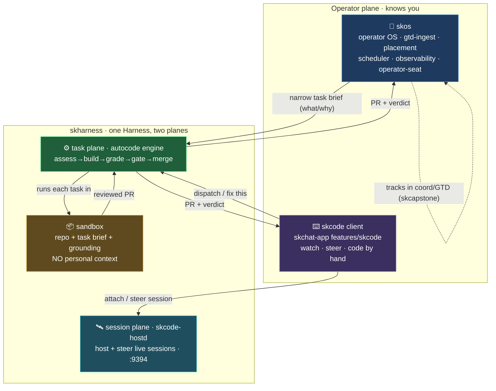
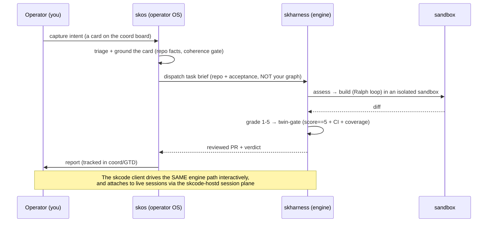

# ADR-0001: skos / skharness / skcode layering (one engine, two planes, two front doors)

**Status:** Accepted
**Date:** 2026-08-02
**Deciders:** Chef, Lumina
**Extends:** `docs/superpowers/specs/2026-07-25-autocode-engine-extraction-architecture.md` (the engine-extraction spine ADR) and `docs/superpowers/specs/2026-07-25-skcode-remote-control-dispatch-design.md` (the skcode ADR).
**Purpose:** settle the skos / skharness / skcode naming so nobody builds the engine twice, and record the as-built reality (this is an assertion of what ships, not a plan).

## Context

Three names had overlapping, unstated scopes and the recurring worry was
duplicated effort. An audit of the current code settled it:

- **skharness** already **is** the autocode engine. The loop (claim → build →
  grade → gate → merge) lives in `skharness/src/skharness/autocode/`
  (`engineering.py`, `orchestrator.py`, `grounding.py`, `ci.py`, `sandbox.py`,
  adapters). Extraction is **clean**.
- **skos** does **not** contain a second engine. Every `skos/src/skos/autopilot/*`
  module is a ~500-byte re-export shim (`from skharness.autocode.X import *`);
  the `skos autopilot` CLI is a thin **driver**. skos's real weight is the
  operator OS: gtd-ingest, placement, scheduler, observability, secrets, brain,
  ports/adapters, the operator-seat. skos imports skharness; skharness never
  imports skos.
- **skcode** is **not unbuilt.** Its session-plane host daemon already ships
  **inside skharness** by deliberate design (`skcode-hostd` = `skharness.serve:main`,
  Tailscale-only, port 9394, P0 read-only session-control MVP complete, 36 tests).
  Its Flutter client pane exists in `skchat-app/lib/features/skcode/`, and its
  operator adapter in `skcapstone/.../operator_seat/skcode_adapter.py`. There is
  **no standalone skcode package** yet, the code is distributed. Only the
  interactive "Code + Dispatch" P2 is still roadmap.

So the duplication risk is already largely retired in code. This ADR records the
layering as-built and fixes the two documentation gaps the audit found
(`ECOSYSTEM.md` never mentions skharness/skcode; the older skos autopilot docs
predate the extraction).

## Decision

**One engine, two planes, two front doors. Personal context flows DOWN as a
narrow task brief; it never flows UP into a build sandbox.**

`skharness` is a single **Harness** with two planes:
- **Task plane** = the autocode engine (assess → build → grade → twin-gate →
  merge). Input: a repo + a task. Output: a reviewed PR.
- **Session plane** = the `skcode-hostd` daemon (remote read-only control of live
  agent sessions today; gated dispatch later). skharness hosts it as the thin
  deployment shell; the routes can lift into a skcode repo later without
  touching the engine.

| Layer | Repo(s) | Responsibility | Knows the operator? |
|---|---|---|---|
| **Engine (task plane)** | `skharness` (`autocode/`) | The autocode loop. Context-lean, sandboxed. | **No** |
| **Session daemon (session plane)** | `skharness` (`serve/daemon/harnesses`) | `skcode-hostd`: host + steer live sessions. | Session-scoped only |
| **Operator OS** | `skos` (+ `skcapstone`, `skmemory`) | Single pane of glass: gtd-ingest/placement/scheduler/observability/operator-seat (skos); coord board + ITIL (skcapstone); memory (skmemory). Decides *what*/*why*, drives the engine. | **Yes** |
| **Coding client** | `skchat-app` (`features/skcode`), future skcode repo | The human front door: watch/steer sessions, code by hand, dispatch to the engine. Thin client. | Session-scoped only |

### The one-line rule

> **skos knows you. skharness builds code (and hosts your sessions). skcode is
> where you code by hand.** Personal context enters a build only as a distilled
> task brief (what + acceptance + coherence constraints), never the whole graph.

### Binding constraints

1. **Single engine.** The assess/build/grade/gate/merge loop lives in
   `skharness.autocode` and nowhere else. skos and the skcode client are
   *drivers*, not forks. The `autopilot doctor` "shim-delegation" check guards
   this, keep it green.
2. **Lean sandbox.** A build sandbox receives only the target repo, the task
   brief, and repo-grounded facts (`grounding.py`). Never the operator's MCP
   servers, memory, GTD, calendar, or soul. Rationale: security (minimal blast
   radius), speed/cost (no 40-server load), focus.
3. **skcode dispatch is a thin call.** When the interactive dispatch (P2) lands,
   its gate/ratify MUST call `skharness.autocode` (ratify/twin-gate), never
   re-implement it.
4. **hostd stays in skharness for now.** The `skcode-hostd` daemon is skharness's
   deployment shell; a future carve-out into a skcode repo is allowed but must
   not pull engine logic with it.

## Architecture

### The autocode workflow (where you are in the system)

## Consequences

**Positive:** one engine (verified in code); minimal-privilege, fast sandboxes;
the operator graph has one home (skos/skcapstone/skmemory); the skcode client can
grow without re-litigating scope.

**Refactor / follow-up items** (from the audit):

- **Docs (do now):** add skharness (Layer-0 execution engine) + skcode to
  `ECOSYSTEM.md` (it currently omits both); add a note to the older
  `skos/docs/skos-autopilot-*` docs that the engine moved to `skharness.autocode`.
- **Shim retirement:** `skos.autopilot.*` shims exist only for out-of-tree
  callers; retire on the Phase-D gate from the extraction ADR.
- **Naming trap:** two `claude_code` harnesses are intentional (a Docker
  task-plane adapter + a tmux session-plane harness). Do not "dedupe" them.
- **Port:** `skcode-hostd` is 9394 (moved off 9390 to avoid the skcomms broker);
  verify nothing still assumes 9390.
- **hostd carve-out:** optional later, into a `hostd/` subpackage or skcode repo.

## Related

- `docs/.../2026-07-25-autocode-engine-extraction-architecture.md` (spine ADR)
- `docs/.../2026-07-25-skcode-remote-control-dispatch-design.md` (skcode ADR)
- `ECOSYSTEM.md`, `standards/SKWORLD_MODULE_CONTRACT_STANDARD.md`, `standards/ARCHITECTURE_AND_DATAFLOW_STANDARD.md`
- coord card `22731c0d` (skcode P0, reconciled to this ADR)
