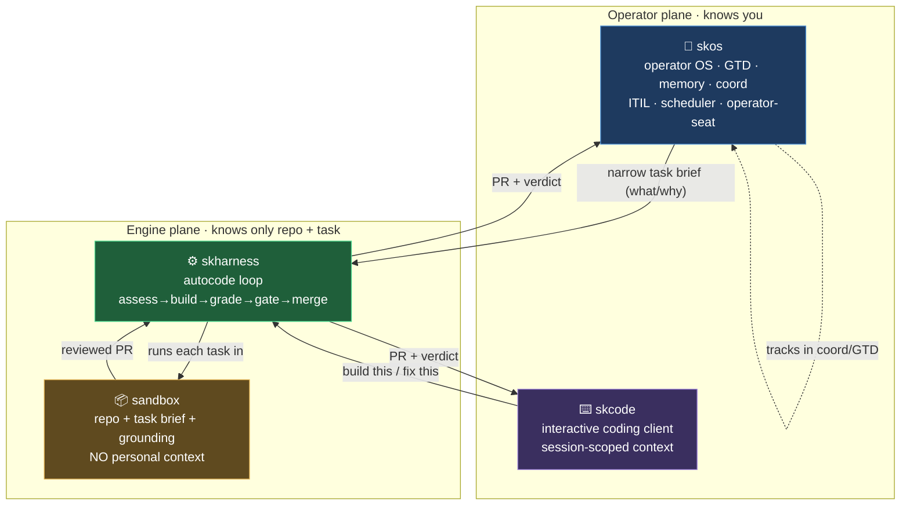
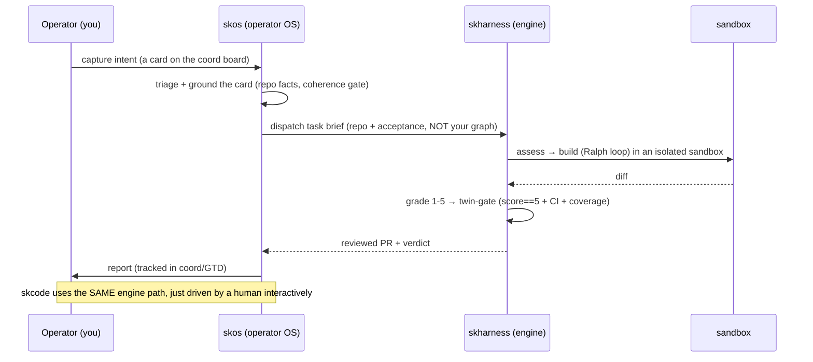

# ADR-0001: skos / skharness / skcode layering (one engine, two front doors)

**Status:** Accepted
**Date:** 2026-08-02
**Deciders:** Chef, Lumina
**Supersedes:** the ambiguous "skcode vs skos" framing that risked two build engines.

## Context

Three names had overlapping, unstated scopes, and the risk was building the
**autocode loop twice**:

- **skos** grew a real autocode engine (`skos autopilot`, ~499 tests) AND is the
  operator's single pane of glass (GTD, memory, coordination, ITIL, scheduler,
  the AI-operator seat). It knows *everything about the operator*.
- **skharness** is the autocode engine extracted into a reusable, standalone
  package (`skos autopilot` already delegates to `skharness.autocode`).
- **skcode** was planned (P0 card `22731c0d`) as "the coding thing" without a
  crisp boundary against the above. No skcode code exists yet.

Left unreconciled, skcode would re-implement the assess → build → grade → gate →
merge loop that skharness already owns, and worse, a coding surface might load
the operator's entire personal graph (GTD, memory, 40+ MCP servers, soul) into
every build, which is slow, expensive, and a security blast-radius problem.

## Decision

**One engine, two front doors. Personal context flows DOWN as a narrow task
brief; it never flows UP into a build sandbox.**

| Layer | Repo | Responsibility | Knows the operator? | Runs where |
|---|---|---|---|---|
| **Engine** | `skharness` | The autocode loop: assess → build → grade → twin-gate (score==5 + CI + coverage) → finalize/merge. Input: *a repo + a task*. Output: *a reviewed PR*. Context-lean. | **No** | Isolated sandboxes |
| **Operator OS** | `skos` | Single pane of glass: GTD, memory, coord board, ITIL, scheduler, observability, the AI-operator seat. Decides *what* and *why* to build, feeds cards to the engine, tracks the work. | **Yes** (fully) | Operator host |
| **Coding client** | `skcode` | Interactive, human-facing coding surface (CLI/IDE-like). Invokes `skharness` for heavy lifts. A thin client, **not** a second engine. | **Minimally** (session-scoped only) | Operator host / dev |

### The one-line rule

> **skos knows you. skharness builds code. skcode is where you code by hand.**
> Personal context enters a build only as a distilled task brief (what to build +
> acceptance + coherence constraints), never as the whole graph.

### Binding constraints

1. **Single engine.** The assess/build/grade/gate/merge loop lives in
   `skharness` and nowhere else. `skos` and `skcode` are *consumers* of it.
   Neither may fork or re-implement the loop.
2. **Lean sandbox.** A build sandbox receives only: the target repo, the task
   brief, and the repo-grounded context (`grounding.py` facts). It does **not**
   receive the operator's MCP servers, memory store, GTD, calendar, or soul.
   Rationale: security (minimal blast radius), speed/cost (no 40-server load),
   focus (irrelevant context degrades the model).
3. **skos owns operator context.** GTD, memory, coord, operator-seat, scheduler
   stay in `skos`. `skos` is the *driver*: it decides what to build and passes
   the narrow brief down.
4. **skcode is a client, not an engine.** When skcode is built, it MUST call
   `skharness` for autonomous builds rather than growing its own loop. It may
   hold session-scoped context (the open project) but not the operator graph.

## Architecture

### The autocode workflow (where you are in the system)

## Consequences

**Positive:** no duplicated engine; sandboxes are minimal-privilege and fast;
the operator graph has one home (skos); skcode can be built later as a thin
client without re-litigating scope.

**Refactor items** (verified against current code):

- Confirm `skos autopilot` delegates to `skharness.autocode` with no residual
  loop logic in skos (the `autopilot doctor` "shim-delegation" check asserts
  this; keep it green as a guard).
- When skcode is scoped, its build path MUST import `skharness`, and its spec
  must state the lean-sandbox constraint. Card `22731c0d` is reconciled to this
  ADR.
- Site/docs: `skos.skworld.io`, `skharness.skworld.io`, `skcode.skworld.io` each
  state their layer and link to this ADR + the ecosystem map.

## Related

- `ECOSYSTEM.md` (the family map; this layering is reflected there)
- `standards/SKWORLD_MODULE_CONTRACT_STANDARD.md`
- `standards/ARCHITECTURE_AND_DATAFLOW_STANDARD.md`
- coord card `22731c0d` (skcode P0, reconciled to this ADR)
