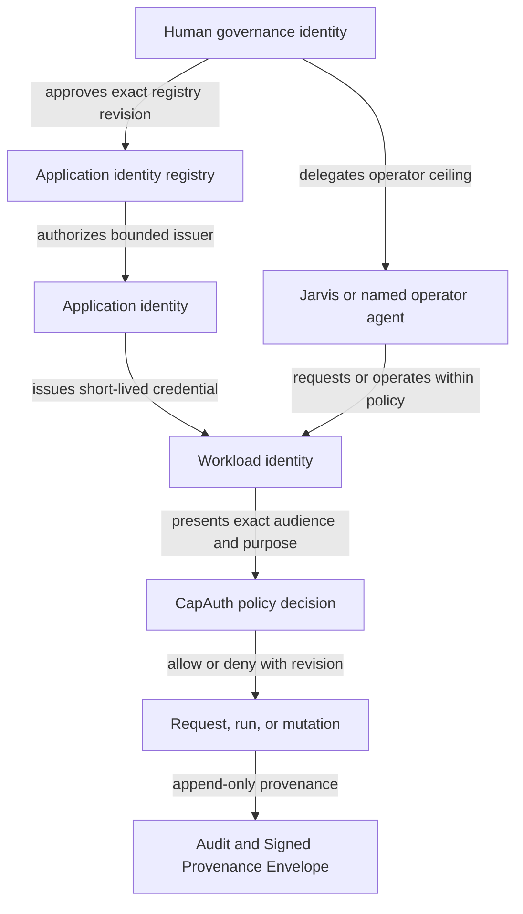

# Application Identity and CapAuth Key Management Blueprint

**Status:** PROPOSED FOR HUMAN REVIEW, NOT NORMATIVE
**Date:** 2026-08-25
**Card:** `b298a763`
**Scope:** SKWorld application, human, agent, service, workload, node, device,
credential, custody, delegation, and provenance architecture
**Mutation authority:** none

This proposal does not authorize enrollment, key creation, key import or
export, key movement, rotation, revocation, synchronization, service restart,
deployment, provider access, protected-data access, or external action.

## 1. Decision requested

Adopt one stable logical application registration and create additional
long-lived CapAuth principals or credentials only at independently revocable
security boundaries. Do not create one long-lived private key per process,
container, worker, queue, database connection, or internal module.

The central distinction is:

> An application ID is a stable product registration. A CapAuth principal is
> an authorization subject bound to an exact public fingerprint. A key is the
> credential for that principal, not the application itself.

This preserves the understandable 2000s-era concept of one application ID
without returning to one powerful shared application secret.

### 1.1 Current-standard conflict that must not be hidden

`standards/IDENTITY_NAMING_STANDARD.md` currently says the PGP primary-key
fingerprint is the root identity and the fqid is a label bound to it. Therefore
the current normative model does not permit this proposal to claim that a
cryptographic identity remains unchanged through key rotation.

This proposal keeps the stable object at the application-registration layer.
Under the current standard, rotation creates a new credential-bound principal
revision while the application ID and its append-only lineage remain stable. A
future normative card must define exact `(fqid, fingerprint)` overlap and
retirement semantics before any implementation treats credentials as
interchangeable under one subject.

## 2. Executive recommendation

Use a three-layer application pattern:

1. **Application registration:** one stable ID for the product in one environment.
2. **Workload identities:** logical principals for independently authorized
   runtime boundaries, normally using short-lived credentials issued by the
   application authority.
3. **Credential slots:** purpose-bound, replaceable credentials attached to
   the application or workload identity only when cryptographic proof is
   required.

For a normal internal application, the default durable credential count is:

| Credential | Default | Reason |
| --- | --- | --- |
| Human governance credential | Existing shared governance root, not one per app | Approves the application registry and exceptional changes |
| Application authority credential | One per issuing application and environment | Issues or validates narrowly scoped workload authority |
| Offline release or manifest credential | Optional | Required only when release verification must survive runtime compromise |
| Node credential | Optional | Required only when the node itself is an authorization subject |
| Workload private keys | Usually zero | Prefer short-lived delegated credentials and workload attestation |

This is a ceiling, not a quota. A small local application can begin with one
application authority credential. A high-risk connector or offline release
surface can be split later without renaming the application registration.

## 3. Why the former seven-identity question was premature

The superseded SKLegal Phase 3 roster expected seven node or service entries,
but the approved non-secret records did not define seven authoritative
application boundaries. They define:

- four SKLegal audiences: API, connector, model, and tool;
- one local SKDashboard read-only candidate;
- legacy Jarvis and broad issuer records that are explicitly not scoped
  application issuers.

An audience is not automatically an identity, and an identity is not
automatically a long-lived key. Approving seven key-bearing identities merely
to satisfy a count would create management work without proving that seven
independent revocation or custody boundaries exist.

The reviewed card amendment replaced the fixed count with a boundary-derived
roster. Logical identity count and durable credential count remain separate
results of that derivation.

### 3.1 Estate findings by product

The following table separates current evidence from this proposal's
recommendations. A service name, audience, process, OS role, database role,
TLS key, OIDC key, client secret, node, or session is not automatically a
CapAuth identity.

| Product or layer | Current evidence | Architecture consequence |
| --- | --- | --- |
| SK Standards | Defines canonical human, agent, service, node, and device-seat fqids; makes node identity conditional; uses one CapAuth PDP and thin PEPs | Reuse the grammar and authorization owner; add an application lifecycle and split test instead of another identity system |
| CapAuth | Has structural ceilings for operator, agent, node, and edge-device, but not service or connector; delegated capabilities already support short TTL, attenuation, replay checks, and bounded depth | Add fail-closed service and connector semantics before activating new app principals; use delegation instead of keys per daemon |
| SKCapstone | Separates agent seat, role, node, and process; some bootstrap and signer paths still permit placeholders or broad fallback | Treat profile and process context as metadata, never authentication proof |
| SKDashboard | Uses one OIDC client and audience, server-side sessions, and file-backed deployment credentials; legacy security prose still describes older self-asserted actor behavior | Keep it a separate application boundary; do not create identities per route or adapter; reconcile the stale security contract |
| SKLegal | Has four audiences, a dedicated application issuer contract, and separate principal UUID versus authentication subject; current broad issuer spans materially different capability ceilings | Four audiences do not require four keys; narrow issuance by risk boundary and keep external dispatch distinct when enabled |
| SKCoord | New protected records distinguish subject principal, acting principal, node, and authorization; legacy CardStore actors remain caller-supplied text | Reuse the protected invocation shape for provenance; never promote free text to an authenticated actor |
| SKGateway | Mixes agent labels, optional fingerprints, bearer mappings, and deprecated aliases; governed SKLegal qualification is stricter than default posture | Bind governed entries to canonical principals and policy revisions; use a separate durable principal only if cross-host custody or revocation requires it |
| SKHarness | Uses verified audience tokens for authority and contextual session-agent IDs for ephemeral workers | Adopt its contextual child-agent pattern instead of permanent swarm keys |
| SKOS | Explicitly is not the identity or cryptographic root; schedules use injected runtime credentials | Keep scheduling and installation separate from identity ownership |
| SKMemory | Profile selection and data ownership are separate from authentication | A persona or memory profile never becomes a credential |
| Nodes and machines | Existing standards make node identity conditional and limit node authority | Record host as provenance metadata by default; create a node principal only for host-scoped policy or attestation |

### 3.2 Current contradictions and prerequisites

These are observed gaps, not authority to repair them:

1. `PROVENANCE_AND_MUTATION_STANDARD.md` formerly permitted either a canonical
   fqid or the deprecated `capauth:` wire alias in `actor.id`, while
   `IDENTITY_NAMING_STANDARD.md` required the canonical fqid. PR #22 resolved
   the standards contradiction in favor of the canonical fqid. Live CapAuth,
   SKGateway, SKHarness, and SKLegal alias paths remain migration targets.
2. CapAuth lacks registered `service` and `connector` capability-ceiling
   classes. These are ceiling classes over service-spelled fqid subjects, not
   additional identity classes in the five-class grammar. A subject that
   resolves to no ceiling class currently skips that layer instead of denying.
3. The former seven-entry roster had one identified candidate and six
   unresolved entries. Seven was not derived from a ratified split rule. The
   card now requires a boundary-derived roster instead.
4. A public roster field described as opaque contains a literal local custody
   path. Public metadata must use a typed, non-path handle.
5. Jarvis is variously treated as service, agent, legacy trust anchor, and
   runtime selector. Its canonical role must be `agent`, not application issuer.
6. Atlas attribution is unresolved. Current documentation and runtime do not
   consistently establish a separate authenticated principal.
7. Provenance records do not consistently join authenticated actor, workload,
   node, delegation chain, policy revision, and authorization decision.
8. The signed SKWorld module manifest lacks runtime principal, owner, custody,
   revocation, rotation, recovery, and delegation fields.
9. One module-contract sentence said a failed observation should report
   healthy, contradicting the Unknown-first, fail-closed rule. PR #23 resolved
   the contradiction by requiring `Unknown`, never healthy.
10. SKDashboard and SKGateway security documentation lags their current OIDC,
    TLS, and authorization paths.

No new service or connector principal should become active until item 2 and
the exact application-specific policy ceiling are resolved and tested.

## 4. Canonical identity classes

This proposal retains the five subject grammar classes in
`standards/IDENTITY_NAMING_STANDARD.md`. Application registration is a
separate metadata layer above that grammar. It is never a policy-decision
subject and does not add a sixth grammar class.

| Metadata layer | What it represents | Credential relationship | Authorization role |
| --- | --- | --- | --- |
| Application registration | One stable product and environment record | Owns purpose-bound credential slots and their public fingerprints | Owns the approved subject roster, policy ceiling, custody references, and lineage; never appears as a decision subject |

When an application authority or workload is a policy subject, it uses the
Service grammar row. The `service` and `connector` distinction belongs to the
separate CapAuth capability-ceiling registry on the enrollment record.

| Entity class | What it represents | Durable key default | Authority ceiling |
| --- | --- | --- | --- |
| Human | The accountable sovereign root, locally Casey | Existing protected root | Approve registries, delegations, recovery, and exceptional changes |
| Agent | Jarvis, Atlas, or another attributable software actor | Durable for long-lived agents; none for ephemeral runs | Only explicitly delegated capabilities |
| Service | An application authority or a workload such as an API, connector, model gateway, tool gateway, worker, or broker | One credential for a durable application boundary; no durable key for workloads by default | The exact registered ceiling, audience, and purpose set |
| Node | A host that must itself receive a host-scoped grant | No subject or key by default | Host operations only, never human or application authority |
| Device seat | A human login device or browser authenticator | Device-bound credential | Establish a session for one human subject |

Nodes remain provenance metadata unless policy must decide about the node
itself. Ephemeral subagents remain run-scoped delegates unless they need an
independently revocable, durable identity.

## 5. Human, agent, application, and workload authority chain

The human root should not sign every request and should not remain online for
routine application work. It approves a durable authority registry. Runtime
credentials then form a verifiable chain back to that decision.



Every protected event should be reconstructible as:

`human-approved registry revision -> application authority -> workload or
agent credential -> capability and policy decision -> request or run ->
effect and receipt`.

Human approval is an authority source, not an excuse to reuse the human
private key inside services.

## 6. Agent model

This delegated, keyless workload model is implemented and proven at SKLegal.
It is a migration target, not a current fleet-wide claim, at SKGateway.
SKGateway's `subjectFromIdentity()` does not inspect `identity.verified`, and
its authorization path does not parse `capauth.delegated` chains. Until those
gaps are repaired and qualified, caller attribution there is not evidence of
the authenticated delegation model described below.

### 6.1 Jarvis

Jarvis is a long-lived attributable agent. It should have its own canonical
agent FQID and credential lifecycle. It may receive delegated application
capabilities, but its key must not become the fleet-wide application issuer.

Audit must record both Jarvis as the actor and the application or workload
authority under which the action was accepted.

### 6.2 Atlas

Atlas needs distinct actor attribution, but it does not need a durable key
merely because it is a named workload. While it is frozen and report-only, use
the authenticated parent agent principal plus `workload=atlas`, exact run and
session IDs, and a short-lived observation capability. Policy must deny
approval, allocation, mutation, completion, executor selection, and external
action.

Promote Atlas to a separate credential-bound principal only if it later gains
independently revocable authority, separate custody, or a distinct accountable
owner. Consequential execution must still link the controller actor and exact
human approval. Freeze state is an additional operational gate, not identity
or authority.

### 6.3 General and ephemeral agents

A durable key for every spawned agent would create inventory and rotation
work without increasing useful accountability. The default should be:

- parent agent FQID;
- unique run or session ID;
- model and agent specification revision;
- short-lived, attenuated capability;
- exact purpose, audience, resource, and expiry;
- no durable private key.

Create a durable agent identity only when the agent persists across runs,
holds independently revocable authority, has a distinct accountable owner,
or must sign artifacts that outlive its parent session.

## 7. Application and workload model

The rules in this section describe the proven SKLegal model and the normative
migration target for SKGateway. They do not claim that SKGateway currently
authenticates keyless workloads. Its current `subjectFromIdentity()` path does
not require `identity.verified` and does not validate delegated capability
chains before producing a subject.

### 7.1 One stable application registration

Each product and environment gets one stable application registration record.
Examples include SKLegal qualification and SKLegal production registrations.
Environment is metadata on the registration and policy, not a reason to change
the canonical FQID grammar.

The application registration owns:

- accountable owner;
- approved audiences and purposes;
- maximum capability ceiling;
- workload identity registry;
- credential slots and public fingerprints;
- opaque custody references;
- policy and revocation revisions;
- rotation and recovery policy;
- approved failover identities;
- application manifest and source provenance.

### 7.2 Logical workloads, keyless by default

API, connector, model, tool, worker, scheduler, and database broker roles are
logical workload identities when they need separate policy decisions or audit
attribution. They should normally authenticate through short-lived credentials
issued to the exact workload, not by reading the application private key.

A process split, container split, queue split, or scale-out replica does not
create a new identity by itself. All replicas of the same workload may use the
same logical workload identity when they share owner, purpose, audience,
policy ceiling, custody mechanism, and revocation boundary.

### 7.3 When a separate durable credential is required

Split a credential when at least one of these is true:

1. Independent revocation or emergency isolation is required.
2. The workload can cause external effects or provider egress.
3. The workload handles a higher data classification or separate ethical wall.
4. It crosses a host, tenant, organization, or custody trust boundary.
5. It signs durable artifacts or must operate while the application issuer is unavailable.

Do not split merely because code lives in another repository, process,
container, port, queue, or database pool.

## 8. Recommended SKLegal shape

The following is a proposal for review, not an enrollment roster.

| Logical identity | Long-lived private credential | Purpose |
| --- | --- | --- |
| SKLegal application authority | Yes, one per environment | Bounded application issuer and registry anchor |
| SKLegal API workload | No by default | Authenticated API processing inside exact Tenant and Matter policy |
| SKLegal model workload | No by default | Model requests inside route, classification, rights, and purpose policy |
| SKLegal tool workload | No by default | Typed tool calls with argument and result validation |
| SKLegal connector workload | No until dispatch is enabled; then review a separate issuer | External-effect boundary with exact approval and receipt requirements |
| SKLegal context broker | No by default | Mint one-use database context leases using short-lived authority and no application-table access |
| SKLegal runtime pool | No signing key | Consume one-use database context leases; cannot choose a Principal |

Applying the section 7.3 boundary split test produces one durable SKLegal
credential today: the application authority has independent revocation and
issuer-availability requirements. The API, model, tool, context-broker, and
runtime-pool workloads remain keyless because no separate custody, external
effect, classification, or durable-signature boundary is established. The
connector remains keyless while dispatch is disabled and becomes a separate
durable issuer when external dispatch creates that boundary.

SKDashboard remains a separate application because it has a separate product
boundary, audience, session surface, release cycle, and read-only policy. It
should not be counted as an internal SKLegal workload merely to complete an
SKLegal roster.

SKDashboard adds one durable credential because its product, revocation, and
custody boundaries are separate. SKGateway adds none today; a durable gateway
credential remains conditional on a later decision to make it a
self-authenticating service rather than a thin policy-enforcement point.
Across the currently reviewed SKLegal and SKDashboard qualification surfaces,
the durable credential count is therefore exactly two today. The derivation
and its future triggers are:

1. one SKLegal application issuer;
2. one SKDashboard OIDC client or workload credential;
3. one SKLegal connector issuer only when external dispatch is enabled;
4. optionally one SKGateway service principal only when cross-host custody or
   independent revocation proves it is a separate trust boundary.

That count becomes three when dispatch is enabled, or four only if SKGateway
becomes a self-authenticating service with independent custody. Logical
workload records are not used to manufacture a credential quota.

## 9. Node and machine identities

A host name in provenance is not automatically an authorization subject.
Create a node identity only for host-scoped operations such as node enrollment,
fleet reconciliation, host attestation, or a capability that must be denied on
every other machine.

Node identity rules:

- bind it to one host inventory record and accountable operator;
- prefer TPM-backed or host-bound custody where available;
- prohibit application, human, and cross-node authority;
- do not copy the same node private credential to another host;
- rotate or retire it on rebuild, ownership transfer, or trust loss;
- keep node health, freeze, and lifecycle state outside the identity spelling.

Containers and virtual environments inherit the host as provenance metadata
unless they cross a real trust or custody boundary.

## 10. Credential and custody rules

### 10.1 Opaque references only

An identity registry may store an opaque reference such as a `vault:` handle,
systemd credential name, TPM envelope ID, or named CapAuth custody handle. It
must not store:

- a passphrase or private key;
- an environment variable value;
- a literal bearer or capability;
- a user-home or temporary filesystem path that reveals local custody layout;
- a reversible representation of secret material.

The current SKLegal roster contains a literal local passphrase path in a field
named `secret_store_reference`. That is not an opaque reference and should be
replaced in a separately reviewed metadata repair. This proposal does not
authorize that mutation.

### 10.2 Credential slots

One stable application registration may reference purpose-bound credential
slots:

| Slot | Online | Typical use |
| --- | --- | --- |
| `application-issuer` | Yes, bounded | Short-lived workload credentials |
| `release-signing` | Prefer no | Manifests and durable release artifacts |
| `recovery` | No | Recovery or revocation ceremony |
| `transport` | Yes | Mutual authentication where tokens are unsuitable |

Each slot names an exact canonical fqid and public fingerprint. The slots may
use separate keys while remaining attached to one stable application ID.
Under the current naming standard, rotation changes the cryptographic identity
revision and fingerprint, while the application ID and provenance chain remain
stable.

### 10.3 Failover

Failover should use a distinct, pre-registered secondary identity or
credential. Never copy one private key to several hosts and call the copies
failover.

The secondary must be disabled by default, same or narrower in scope, separately
revocable, custody-verified, and activated only through an attributable policy
change. Unknown or unavailable failover state remains unavailable.

## 11. Ownership model

Every application registration record must name these responsibilities even when
one person temporarily fills several roles:

| Responsibility | Accountable for |
| --- | --- |
| Governance owner | Approves the identity, authority ceiling, and exceptional changes |
| Application owner | Owns product intent, workloads, audiences, and purpose boundaries |
| Custody owner | Protects credential material and validates storage controls |
| Revocation owner | Can disable compromised authority immediately |
| Recovery custodian | Holds and tests recovery material under separate procedure |
| Deployment owner | Installs approved public policy and credential references |

For the current sovereign deployment, Casey may be the human governance owner
while Jarvis performs bounded operator work. Jarvis must not self-approve a
broader ceiling, designate itself as recovery authority, or silently replace
the human root.

### 11.1 Minimum default key budget

For one application and environment, start with:

- one application registration;
- one active application issuer credential only if the application issues
  delegated capabilities;
- zero per-daemon, per-replica, per-queue, and per-job keys;
- zero hot-failover credentials by default;
- one separate dispatch issuer only when external actions are enabled and the
  application issuer must not be able to mint dispatch authority.

`failover: none` with a documented recovery-time objective and tested offline
recovery is valid. Requiring a hot secondary for every primary would double
the live credential lifecycle without evidence that availability justifies it.

## 12. Minimum application identity manifest

Each application should ship one non-secret, versioned manifest with this
conceptual shape:

```json
{
  "schema": "sk-application-identity/v1",
  "app_id": "<stable-product-registration-id>",
  "environment": "qualification",
  "owners": {
    "governance": "<human-fqid>",
    "application": "<human-or-team-id>",
    "custody": "<custodian-id>",
    "revocation": "<revocation-owner-id>",
    "recovery": "<recovery-custodian-id>",
    "deployment": "<operator-id>"
  },
  "authority_ceiling": {
    "audiences": [],
    "purposes": [],
    "capabilities": []
  },
  "workloads": [],
  "principals": [
    {
      "fqid": "<canonical-service-fqid>",
      "identity_class": "service",
      "public_fingerprint": "<public-fingerprint>",
      "credential_reference": "<opaque-non-path-handle>",
      "purpose": [],
      "audiences": [],
      "capability_ceiling": [],
      "custody_class": "<typed-custody-class>",
      "rotation_generation": 1,
      "predecessor_fingerprint": null
    }
  ],
  "policy_revision": "<opaque-revision>",
  "revocation_revision": "<opaque-revision>",
  "approved_failovers": [],
  "source": {
    "repo": "<repo-id>",
    "manifest_sha256": "<sha256>",
    "approval_event_id": "<event-id>"
  }
}
```

The manifest contains public metadata only. It references custody but cannot
resolve secret values.

The lowest-overhead implementation should maintain one canonical identity
manifest. An SKWorld module manifest may reference its exact hash or include a
schema-governed identity block, but the same fields must not be copied into two
independently editable sources.

## 13. Lifecycle

Application-registration status and credential-bound principal status must be
recorded separately. The following lifecycle applies to each principal:

```text
proposed -> approved -> enrolled -> shadow -> active -> suspended -> retired
```

Rules:

- proposed and approved records hold no runtime authority;
- enrollment binds public credentials and custody evidence;
- shadow verifies without becoming an issuer;
- active requires exact policy and revocation revisions;
- suspended denies issuance and new sessions without destroying evidence;
- retired remains in append-only history and requires verified recovery custody;
- rotation adds a credential revision and overlap window, never rewrites history;
- unknown, unavailable, stale, or unauthorized state never becomes active.

## 14. Automation that reduces management overhead

The standard should eventually be supported by four tools, each fail closed:

1. `capauth app plan`: generate a metadata-only manifest from a product template.
2. `capauth app lint`: reject broad scopes, secret-like values, host paths, missing owners, and invalid FQIDs.
3. `capauth app doctor`: verify public fingerprint, custody reference health, revocation revision, expiry, backup, and failover readiness without printing secrets.
4. `capauth app diff`: show the exact authority change and required human gate before enrollment or cutover.

Routine rotation may later be automated inside a pre-approved policy envelope,
but initial enrollment, authority expansion, failover activation, root recovery,
and retirement remain explicit human decisions.

## 15. Application onboarding profile

Future products such as another legal application should answer these questions
in order:

1. What is the one stable application registration and accountable owner?
2. Which workload boundaries need separate policy decisions or audit attribution?
3. Which of those boundaries truly require a durable private credential?
4. What exact audience, purpose, capability, expiry, and revocation ceiling applies?
5. How is authority traced to a human-approved registry revision and recovered?

The default answer to question 3 is none. A new persistent key requires a
recorded justification from the split criteria in section 7.3.

## 16. Migration from current practice

No key operation is part of this proposal. A later plan should proceed in this
order:

1. Inventory logical identities and credentials separately using public metadata.
2. Replace literal custody paths with opaque references.
3. Classify current shared credentials as human, agent, application, workload, node, or legacy.
4. Design the target application and workload registry and run a metadata-only conflict simulation.
5. Approve exact enrollment, shadow verification, cutover, and legacy retirement as separate changes.

Legacy Jarvis and broad issuer credentials remain trust records during the
transition. They must not be silently reclassified as application issuers.

## 17. Current external best-practice cross-check

This review was checked against primary sources current on 2026-08-25. The
goal is to adopt their security properties, not to add an infrastructure
product merely because it exists.

| Primary source | Current practice | SK application |
| --- | --- | --- |
| [NIST SP 800-207A](https://csrc.nist.gov/pubs/sp/800/207/a/final) | Do not trust users, services, or devices merely because of network location or ownership; enforce identity-tier application policy | Keep CapAuth as PDP, verify service identity at each PEP, and treat a host name as metadata unless policy explicitly authorizes the node |
| [IETF RFC 9700, OAuth 2.0 Security BCP](https://www.rfc-editor.org/info/rfc9700/) | Restrict token audience and privilege, use PKCE for authorization code flows, and sender-constrain tokens where practical | Keep exact audience, purpose, and capability ceilings; prefer short-lived delegated capabilities; evaluate mTLS or DPoP for high-risk token replay boundaries |
| [SPIFFE concepts and SVID model](https://spiffe.io/docs/latest/spiffe/concepts/) | Give workloads stable logical IDs and short-lived, frequently rotated identity documents without shipping bootstrap secrets in the application | Use CapAuth's existing delegation to obtain the same low-overhead property; evaluate SPIFFE or SPIRE only if multi-host attestation needs outgrow local CapAuth |
| [SPIFFE trust-domain specification](https://spiffe.io/docs/latest/spiffe-specs/spiffe_trust_domain_and_bundle/) | Keep trust domains isolated, allow several rotating keys behind one domain, and avoid authoritative-key reuse across domains | Separate qualification and production trust; do not share one human, agent, or application key across environments |
| [Kubernetes Service Accounts](https://kubernetes.io/docs/concepts/security/service-accounts/) | Prefer automatically expiring, bound service-account tokens over persistent credentials | Inject short-lived CapAuth credentials into jobs, replicas, and workers instead of provisioning durable keys |
| [NIST SP 800-57 Part 1 Rev. 5](https://doi.org/10.6028/NIST.SP.800-57pt1r5) | Define cryptoperiods, key states, lifecycle transitions, metadata, access controls, and event records | Keep principal and credential lifecycle explicit, rotate additively, record transitions, and distinguish retirement from compromise revocation |
| [NIST SP 800-63B-4](https://csrc.nist.gov/pubs/sp/800/63/b/4/final) | Manage human authenticators as authenticators for a subscriber, with assurance and lifecycle controls | Treat passkeys, browser credentials, and device seats as authenticators linked to Casey, not as replacement human or application identities |

The resulting hybrid is consistent with current practice: stable logical
registration, short-lived workload proof, least privilege, proof of possession
where replay risk justifies it, isolated trust domains, and explicit key
lifecycle. It deliberately does not require one credential per microservice.

## 18. Required tests for a future normative standard

The eventual standard and tooling need sensitive negative controls:

- a process split does not create a new durable identity;
- an external-effect or custody boundary does require an independent credential;
- a workload cannot exceed the application ceiling;
- delegation, attenuation, identity spoofing, wrong purpose, stale policy,
  revocation, expiry, and unavailable state deny;
- an application ID survives rotation while the old and new exact
  credential-bound principal revisions remain distinguishable;
- a node credential cannot become human, agent, or application authority;
- an ephemeral agent run cannot reuse its parent capability outside its exact run;
- provenance reconstructs the human-approved registry through the final effect;
- secret-looking values, local custody paths, private material, and bearer values
  are rejected from manifests, logs, evidence, and tests.

Tests must use synthetic credentials and prove sensitivity by breaking each
guard and observing failure.

## 19. Open human decisions

The following decisions remain open:

| Decision | Recommended default |
| --- | --- |
| Release signing | Keep optional and offline only when durable release verification requires a separate compromise boundary |
| Connector credential | Create only when external dispatch is enabled and the application issuer must not be able to mint dispatch authority |
| Context broker credential | Start with short-lived injected authority; add a durable credential only if custody or availability proves necessary |
| Secret-reference namespace | Define a typed union of approved opaque handle schemes and reject filesystem paths |
| Manifest location | Keep one canonical identity manifest; reference its hash from the module manifest rather than duplicate mutable fields |
| Casey and Jarvis roles | Casey retains governance and exceptional approval; Jarvis receives bounded operator delegation and cannot issue app identity |
| Credential rotation | Ratify additive `(fqid, fingerprint)` overlap and retirement semantics before implementation |
| Atlas identity | Keep Jarvis-attributed workload and session provenance while frozen; promote only with independently revocable authority |
| Node identity | Keep conditional; create only when the node is itself a policy subject or attestation boundary |
| SKGateway identity | Keep separate only if cross-host custody, revocation, or exposure is independently managed |
| Recovery availability | Default to tested offline recovery; add hot failover only when an approved recovery-time objective requires it |

Recommendation: approve the architecture principle and review the manifest
schema before approving any identity count or credential operation. The
fixed-count roster has already been superseded by the boundary split test.

## 20. Source and provenance ledger

The proposal distinguishes current facts from recommendations.

Three independent read-only review lanes were synthesized: existing SK
standards and CapAuth contracts, product-by-product estate inventory, and
human-to-agent-to-workload authority provenance. No reviewer changed files,
read private keys or passphrases, resolved secret-store values, or mutated
runtime state.

| Source | Current fact supported | Evidence status |
| --- | --- | --- |
| `sk-standards/standards/IDENTITY_NAMING_STANDARD.md` | Canonical human, agent, service, node, and device-seat subject classes; key fingerprint roots identity; nodes are subjects only when policy requires it | Ratified standard |
| `sk-standards/standards/SKWORLD_AUTHORIZATION_STANDARD.md` | One CapAuth PDP, thin PEPs, exact credential-derived subjects, capability and audience mapping, fail-closed decisions | Ratified standard |
| `sk-standards/standards/PROVENANCE_AND_MUTATION_STANDARD.md` | Attributable actor, role, node, session, target, prior state, signature, and append-only mutation history; `actor.id` now requires the canonical fqid | Ratified standard; live alias migration remains open |
| `sk-standards/standards/SKWORLD_MODULE_CONTRACT_STANDARD.md` and `reference/skworld-module/skworld.module.schema.json` | One signed application manifest and audience-scoped auth context; identity lifecycle fields are absent | Ratified standard and schema |
| `sk-standards/standards/MCP_TOOL_OWNERSHIP_STANDARD.md` | One authoritative semantic owner with thin delegates; CapAuth owns identity and authorization semantics | Ratified standard |
| `sk-standards/standards/CRYPTOGRAPHY_STANDARD.md` and `CRYPTO_AGILITY_STANDARD.md` | Crypto agility, suite identifiers, additive migration, bounded overlap, and rollback | Ratified standards |
| `capauth/src/capauth/identity_class.py` | Enforced operator, agent, node, and edge-device ceilings; service and connector classes absent | Current implementation |
| `capauth/src/capauth/delegated.py` and `docs/DELEGATED_CAPABILITIES.md` | Short-lived, attenuated, bounded-depth delegation with replay and freshness checks | Current implementation and documentation |
| `capauth/src/capauth/agent_identity.py`, `subject.py`, and `estate.py` | Legacy and manufactured identity forms coexist with public estate metadata | Current implementation |
| `skcapstone/src/skcapstone/pillars/identity.py`, `fleet/signing.py`, and `fleet/store.py` | Bootstrap placeholders, signer fallback, and best-effort provenance remain possible | Current implementation |
| `skcapstone/docs/fleet/runbook-node-identity.md` | Node identity is host-owned, narrow, and appropriate only for node-scoped authorization | Current documentation |
| `skdashboard/src/skdashboard/session_adapter.py` and `read_only.py` | OIDC client, PKCE, session, scope, and deployment-credential boundaries | Current implementation |
| `skdashboard/SECURITY.md` and `SOP.md` | Some security prose and persona configuration predate current OIDC behavior | Current documentation with recorded drift |
| `skcoord/src/skcoord/authorized_card_policy.py`, `authorized_card_snapshot.py`, and `portfolio_invocation.py` | Protected flows distinguish subject, acting principal, node, service, and authorization | Current implementation |
| `skcoord/src/skcoord/card_store.py` and `SECURITY.md` | Legacy CardStore actor attribution is not cryptographic proof | Current implementation and documentation |
| `skgateway/src/identity/capauth.mjs`, `policy/authz_routes.mjs`, and `config.mjs` | Optional fingerprints, deprecated aliases, bare IDs, and deployment-dependent enforcement coexist; `subjectFromIdentity()` does not inspect `identity.verified`, and delegated-chain parsing is absent | Current implementation and named migration gap |
| `skharness/src/skharness/auth.py`, `activity.py`, and `docs/architecture/live-agent-observation-and-control.md` | Verified audience authority is separate from contextual ephemeral worker IDs | Current implementation and documentation |
| `skmemory/skmemory/profile_registry.py` and `agents.py` | Profile selection and data ownership are distinct from authentication | Current implementation |
| `skos/SECURITY.md`, `SOP.md`, and `src/skos/secrets/capauth.py` | SKOS is not an identity root; the CapAuth secret backend is incomplete | Detached local HEAD, not verified against origin/main |
| `sklegal/packages/capauth/src/sklegal_capauth/issuer.py`, `authorization.py`, and `models.py` | Human and agent roots are excluded from application issuance; audiences, principal kinds, ceilings, and delegation are explicit | Current implementation |
| `sklegal/deploy/chiap01/issuer-policy/trusted-issuers.json` | Current broad issuer spans four SKLegal audiences and materially different capabilities | Current committed policy metadata |
| `sklegal/docs/architecture/POSTGRES-PRINCIPAL-SCALING.md` | Shared runtime pool plus separate context broker, database-owned one-use leases, and rejection of caller-selected identity | Current architecture |
| `sklegal/docs/security/THREAT-MODEL.md` | Least-privilege service identity, secret references, short-lived capabilities, provenance, and fail-closed dependency behavior | Current architecture |
| `sklegal/config/capauth/fleet-signer-phase1-design.json`, `fleet-signer-migration.json`, and `docs/evidence/capauth/SKL-CAPAUTH-SIGNER-P3P-ROSTER-2026-08-25.json` | Design-only one-per-node-or-service rule, exact-seven expectation, unresolved entries, and a non-opaque custody-path defect | Uncommitted working-tree evidence, not normative |

Live agent profile and fleet observations are discovery inputs only. They do
not override versioned standards, policy, CardStore authority, or human
approval.

## 21. Proposed approval boundary

An approval of this document should authorize only the architecture direction:

- stable application registrations;
- boundary-derived logical workloads;
- durable credentials only where justified;
- human-rooted authority provenance;
- opaque custody references;
- fail-closed lifecycle and delegation;
- future schema and tooling work under separate cards.

It should not approve any actual identity ID, owner assignment, fingerprint,
secret reference, enrollment, rotation, revocation, deployment, restart,
provider request, protected-data access, or external action.

### 21.1 Suggested architecture-only decision text

```text
I approve replacing the exact-seven identity assumption with a
risk-boundary identity model. Casey remains the human governance root and is
never a runtime issuer. Each application and environment has one stable app
registration. Long-lived principals or credentials are added only for
credential issuance, external dispatch, distinct custody or exposure,
materially different authority, or independent revocation. Ordinary services,
replicas, jobs, and subagents use short-lived attenuated CapAuth capabilities
and explicit workload, run, session, and node provenance. Node identities are
required only when a node is itself a policy subject. This approval authorizes
architecture and normative-schema work only. It does not authorize identity or
key creation, enrollment, import, export, rotation, revocation, deployment,
restart, runtime mutation, protected-data access, provider traffic, or external
action.
```
