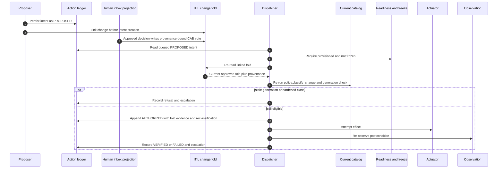

# Action Authorization Standard

**Status:** RATIFIED. This is constituent S3 of the
[`AUTONOMY_STANDARD`](./AUTONOMY_STANDARD.md). It sharpens the change-management
contract in
[`ITIL_AND_RUNBOOK_OPERATING_MODEL_STANDARD`](./ITIL_AND_RUNBOOK_OPERATING_MODEL_STANDARD.md)
and applies after the readiness and freeze gate in
[`ACTUATION_READINESS_AND_FREEZE_STANDARD`](./ACTUATION_READINESS_AND_FREEZE_STANDARD.md).

**Why:** On 2026-08-25, `skoperator decide --approve` wrote a decision record and
stopped. The decisions module described itself as record I/O, not a guardrail,
and no consumer re-read a resolved decision, so every escalated proposal ended
at the human inbox instead of reaching a governed dispatcher. The CLI also
recorded the caller-typed approver string `human`, which cannot establish the
resolved actor required by
[`PROVENANCE_AND_MUTATION_STANDARD`](./PROVENANCE_AND_MUTATION_STANDARD.md).
Approval had neither an attributable authority object nor a path to action.

---

## 1. Normative rules

### R1. The ledger is evidence and queue, never authorization

A proposed action MUST become durable at proposal time as an action-ledger
intent with schema `skcapstone.atlas.action-intent/v1`. Its frozen identity MUST
bind the target, action, current catalog generation, and linked ITIL change.
The ledger records what wants to happen and supplies the dispatch queue. A
ledger state, signature, decision record, model statement, or caller-provided
`approved` field does not authorize an effect.

The ITIL change fold is the one approval store. Only the dispatcher MAY append
`AUTHORIZED`, and only after it independently re-reads the linked change and
finds its current fold approved. The `AUTHORIZED` event detail MUST carry:

- `itil_change_id`, identifying the re-read change;
- `approval_provenance`, copied from the approved fold and including its folded
  status and approval lineage;
- `reclassification`, the dispatch-time classification against the current
  catalog.

A parked decision is only a projection for the human inbox. Approval of that
projection MUST write through as a provenance-bound CAB vote on its linked
change. A decision with no linked change authorizes nothing. An approver MUST
be a resolved actor identity, never a caller-typed role literal.

**Incident:** The ledger already had a `PROPOSED` to `AUTHORIZED` edge, but no
code was entitled to traverse it on a human's behalf. The separate decision
record ended the flow and its hard-coded approver did not prove who approved.

**Check:** `scripts/check_action_authorization_standard.py` validates the
contract and rejects an `AUTHORIZED` fixture unless the dispatcher actor,
approved-fold evidence, linked change, and dispatch classification are all
present. The negative control hand-forges `AUTHORIZED` without fold evidence
and proves rejection.

### R2. Dispatcher inputs are closed

The dispatcher's complete authority-bearing input set is:

1. the action-ledger intent core and event stream;
2. the independently folded ITIL change;
3. freeze and actuation-readiness state;
4. the current ratified action catalog;
5. live postcondition observation after an attempted effect.

The list is exhaustive. Model output, the brain, briefs, proposals, adapter
propose paths, chat, and activity streams MUST be structurally absent from the
dispatcher's inputs. Observation may verify a postcondition; it does not grant
permission. A proposal reaches the dispatcher only after its relevant fields
are frozen into the durable intent.

**Incident:** The active controller logic had existed inside a model session.
Had that text been accepted as a dispatch input, the authority-bearing decision
would have been unversioned and unreviewable.

**Check:** The validator can parse a supplied runtime `dispatch.py` with the
Python standard library AST and rejects imports of `brain`, `brief`, or
`proposer`. Its negative control inserts a brain import into a temporary
runtime source file and proves the boundary fails.

### R3. Dispatch reclassifies against current policy

After finding an approved fold and before causing an effect, the dispatcher
MUST call `policy.classify_change` again against the current ratified catalog.
It MUST compare the intent's bound `catalog_generation` with the current
catalog generation. Either of these conditions refuses the effect and
escalates with evidence:

- the generation differs;
- the current classification is more restrictive than the classification the
  approved change relied on.

A stale approval never crosses a changed policy boundary. The dispatcher does
not honor first and report drift afterward.

**Incident:** The intent identity already bound `catalog_generation` because an
approval under catalog N must not actuate under catalog N+1, but before the
dispatcher there was no consumer enforcing that binding.

**Check:** Current skcapstone tests
`test_stale_catalog_generation_refuses_and_escalates` and
`test_hardened_classification_refuses_and_escalates` exercise both refusal
paths and assert the actuator is never called.

### R4. Human-gate relaxation is a catalog change

Relaxing the human gate for an action class MUST be a reviewed, versioned change
to the ratified action catalog. It MUST NOT be an alternate code branch, hidden
flag, caller exception, or model-selected path. The catalog edit's
justification MUST cite ledger lineage for that action class so the reviewer
can inspect the outcomes that support relaxation.

The citation is evidence for a human decision. It does not let the ledger
self-authorize and it does not bypass the ITIL fold for an action that still
requires approval under the new catalog.

**Incident:** The intended path was to relax a gate after the record proved the
action class safe. Without a required catalog edit and lineage citation, that
policy decision could become an unaudited `if` statement.

**Check:** The machine-readable contract requires `catalog_change`, forbids a
code-branch relaxation, and requires `ledger_lineage_citation`. The validator's
self-test removes the citation requirement and proves the contract fails.

---

## 2. Authorization sequence



No arrow from the human inbox, model, brief, proposal, chat, or activity stream
reaches the actuator.

---

## 3. Machine-readable contract and enforcement

```action-authorization-contract
{
  "schema": "skworld.action-authorization/v1",
  "intent": {
    "schema": "skcapstone.atlas.action-intent/v1",
    "durable_at": "proposal_time",
    "ledger_roles": ["evidence", "queue"],
    "ledger_authorizes": false,
    "binds": ["target", "action", "catalog_generation", "itil_change_id"]
  },
  "approval": {
    "sole_store": "itil_change_fold",
    "decision_store_role": "projection_write_through",
    "resolved_actor_required": true
  },
  "authorized_event": {
    "sole_appender": "dispatcher",
    "requires_approved_fold": true,
    "required_detail": ["itil_change_id", "approval_provenance", "reclassification"]
  },
  "dispatcher_inputs": {
    "closed": true,
    "allowed": ["action_ledger", "itil_fold", "freeze_readiness", "ratified_catalog", "postcondition_observation"],
    "excluded": ["model_output", "brain", "brief", "proposal", "activity_stream"]
  },
  "dispatch_reclassification": {
    "function": "policy.classify_change",
    "catalog": "current_ratified",
    "generation_mismatch": "refuse_and_escalate",
    "hardened_class": "refuse_and_escalate"
  },
  "human_gate_relaxation": {
    "mechanism": "catalog_change",
    "code_branch_allowed": false,
    "required_justification": "ledger_lineage_citation"
  }
}
```

Run the repository-local checks with:

```bash
python3 scripts/check_action_authorization_standard.py --repo .
python3 scripts/check_action_authorization_standard.py --self-test
```

For read-only structural verification of a runtime checkout:

```bash
python3 scripts/check_action_authorization_standard.py \
  --repo . \
  --dispatch-source /path/to/skcapstone/src/skcapstone/operator_seat/dispatch.py
```

The optional runtime-source check parses but does not modify the supplied file.
Runtime behavior remains owned by skcapstone's focused dispatcher tests.

---

## 4. Compliance checklist

- [ ] Proposal time creates a linked `skcapstone.atlas.action-intent/v1` intent.
- [ ] The ledger is consumed only as evidence and queue.
- [ ] A projected decision approval writes a provenance-bound CAB vote.
- [ ] Only the dispatcher appends `AUTHORIZED`, after an independent fold read.
- [ ] Every `AUTHORIZED` detail contains change id, fold provenance, and current classification.
- [ ] Dispatch imports no brain, brief, proposer, model, or activity control path.
- [ ] Dispatch reclassifies and compares catalog generation before effect.
- [ ] Hardened or stale approvals refuse and escalate without calling the actuator.
- [ ] Human-gate relaxation is a reviewed catalog edit with ledger lineage citation.

---

## Related standards

- [AUTONOMY_STANDARD](./AUTONOMY_STANDARD.md): owns the cross-cutting one-store
  and closed-input invariants.
- [ITIL_AND_RUNBOOK_OPERATING_MODEL_STANDARD](./ITIL_AND_RUNBOOK_OPERATING_MODEL_STANDARD.md):
  owns the change fold and CAB lifecycle.
- [ACTUATION_READINESS_AND_FREEZE_STANDARD](./ACTUATION_READINESS_AND_FREEZE_STANDARD.md):
  owns the before-effect readiness and freeze predicate.
- [PROVENANCE_AND_MUTATION_STANDARD](./PROVENANCE_AND_MUTATION_STANDARD.md): owns
  resolved actor attribution and mutation evidence.
- [SKWORLD_AUTHORIZATION_STANDARD](./SKWORLD_AUTHORIZATION_STANDARD.md): owns
  caller capability decisions at policy enforcement points; those decisions do
  not replace the ITIL fold required here.

---

*License: Apache-2.0. Part of [sk-standards](../README.md).*
