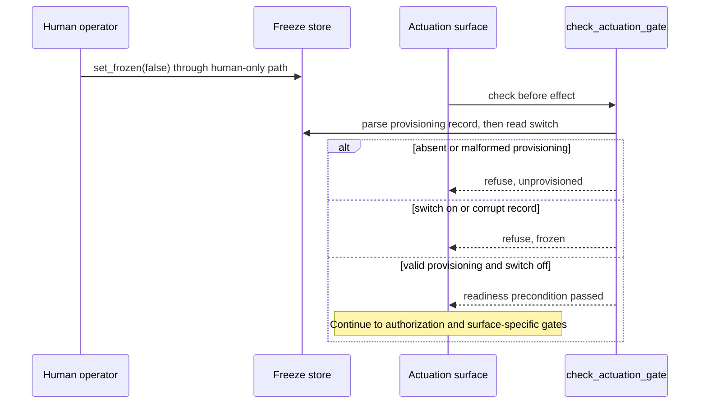

# Actuation Readiness and Freeze Standard

**Status:** RATIFIED. This is constituent S2 of the
[`AUTONOMY_STANDARD`](./AUTONOMY_STANDARD.md). It describes the readiness
predicate and provisioning ceremony shipped by skcapstone PR 198.

**Why:** On 2026-08-25, `skoperator status` reported `active (freeze off)` on
chiap08 even though `_freeze.json` had never existed. Nothing actuated only
because `skoperator.timer` was not installed. The estate was safe by accident,
and status could not distinguish a deliberately inactive kill switch from a
kill switch nobody had provisioned.

---

## 1. Normative rules

### R1. Preserve the switch semantics

`is_frozen` read semantics MUST remain asymmetric:

- a corrupt freeze store fails closed as frozen;
- an absent freeze store reads as not frozen.

Missing MUST NOT mean frozen. Otherwise, deleting the freeze file would flip the
kill switch, and a kill switch that defaults to on would be an outage rather
than a switch.

### R2. Require readiness in addition to not-frozen

Every actuation path MUST call the canonical readiness and freeze guard before
causing an effect. Actuation is allowed only when both conditions hold:

1. the freeze store exists, parses, and has the shape written by the human-only
   toggle path; and
2. the freeze switch is off.

An absent or malformed provisioning record is `unprovisioned`, not active.
Actuation MUST refuse with that reason. A corrupt freeze record is `frozen` and
MUST refuse with that distinct reason.

The shipped skcapstone interface is:

```python
store.check_actuation_gate(paths) -> ActuationGate(allowed: bool, reason: str | None)
store.REASON_FROZEN == "frozen"
store.REASON_UNPROVISIONED == "unprovisioned"
```

A consumer MUST import this guard or an explicitly shared successor. It MUST NOT
rederive readiness from file existence or call `is_frozen` alone.

### R3. Provisioning is a human ceremony

Provisioning requires a human operator to write `_freeze.json` in the off
position through the existing human-only toggle path. A file that merely exists,
or a parseable file with the wrong shape, does not establish readiness. This
ceremony proves the kill switch exists before anything it governs can run.

The shipped reader verifies schema shape, not a cryptographic signature. A
process with raw write access could fabricate a matching record. That is an
explicit trust boundary until the signing plane is enforced, not evidence that
arbitrary file creation is safe.

Only a human operator may freeze or unfreeze. An agent, service, or actuation
adapter MUST NOT provision, freeze, or unfreeze itself.

### R4. Status is tri-state

Every status surface MUST render exactly one of these states:

| State | Meaning | Actuation |
|---|---|---|
| `unprovisioned` | no valid human-provisioned freeze store | refuse |
| `frozen` | valid store, switch on | refuse |
| `active` | valid store, switch off | eligible for later authorization gates |

Rendering `unprovisioned` as `active` is a standards violation. `active` means
only that the readiness and freeze precondition passed. It does not bypass
policy, authorization, or a surface-specific gate.

### R5. Audit is not a gate

Readiness and freeze checks run before the effect. A record written after an
action is audit evidence and does not satisfy this standard.

---

## 2. Provisioning and actuation sequence



---

## 3. Enforcement and negative fixture

The normative machine-readable truth table is:

```actuation-readiness-contract
{
  "schema": "skworld.actuation-readiness/v1",
  "is_frozen": {
    "absent": "not_frozen",
    "corrupt": "frozen"
  },
  "actuation_gate": {
    "absent": {"allowed": false, "reason": "unprovisioned"},
    "corrupt": {"allowed": false, "reason": "frozen"},
    "valid_switch_on": {"allowed": false, "reason": "frozen"},
    "valid_switch_off": {"allowed": true, "reason": null}
  },
  "status": {
    "absent": "unprovisioned",
    "corrupt": "frozen",
    "valid_switch_on": "frozen",
    "valid_switch_off": "active"
  },
  "provisioner_role": "human_operator",
  "gate_timing": "before_effect"
}
```

The implementation checks are the skcapstone PR 198 store, actuator, converge,
and CLI tests:

- `tests/fleet/test_freeze.py` proves an absent store refuses with
  `unprovisioned`, a corrupt store refuses as `frozen`, and a bare `{}` file is
  not provisioning;
- `tests/operator_seat/test_actuator.py` proves `honor` cannot act without the
  shared gate;
- `tests/fleet/test_converge.py` proves mechanical healing also observes the
  gate;
- `tests/operator_seat/test_cli.py` proves status does not collapse
  `unprovisioned` into `active`.

This standards repo enforces the S2 contract with:

```bash
python3 scripts/check_actuation_readiness_standard.py --repo .
python3 scripts/check_actuation_readiness_standard.py --self-test
```

The standard carries a machine-readable contract for absent, corrupt, frozen,
and active store states. The check compares every value to the normative S2
truth table and verifies exactly one README row and one RATIFIED umbrella row.
Its negative fixtures prove red when an absent store is allowed instead of
refusing `unprovisioned`, when a corrupt store does not refuse `frozen`, or when
status collapses `unprovisioned` into `active`.

---

## 4. Compliance checklist

- [ ] Actuation imports the canonical shared readiness and freeze guard.
- [ ] Missing provisioning refuses as `unprovisioned`.
- [ ] Corrupt freeze state refuses as `frozen`.
- [ ] Only the human toggle path provisions or changes freeze state.
- [ ] Status distinguishes `unprovisioned`, `frozen`, and `active`.
- [ ] The guard runs before the effect, not as after-the-fact audit.
- [ ] The surface appears in the autonomy registry with truthful freeze coverage.

---

## Related standards

- [AUTONOMY_STANDARD](./AUTONOMY_STANDARD.md): owns the machine-readable
  actuation-surface registry and the cross-cutting provisioned-before-active
  invariant.
- [SKWORLD_AUTHORIZATION_STANDARD](./SKWORLD_AUTHORIZATION_STANDARD.md): governs
  authorization after the readiness and freeze precondition passes.
- [MCP_TOOL_OWNERSHIP_STANDARD](./MCP_TOOL_OWNERSHIP_STANDARD.md): governs MCP
  ownership for actuation-capable tools that consume this guard.
- [PROVENANCE_AND_MUTATION_STANDARD](./PROVENANCE_AND_MUTATION_STANDARD.md):
  governs attribution and reversibility for resulting mutations.

---

*License: Apache-2.0. Part of [sk-standards](../README.md).*
