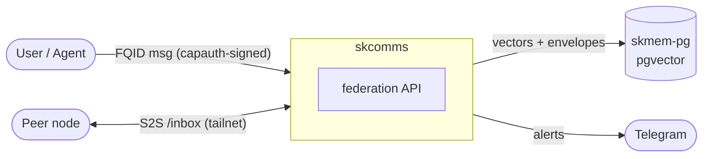
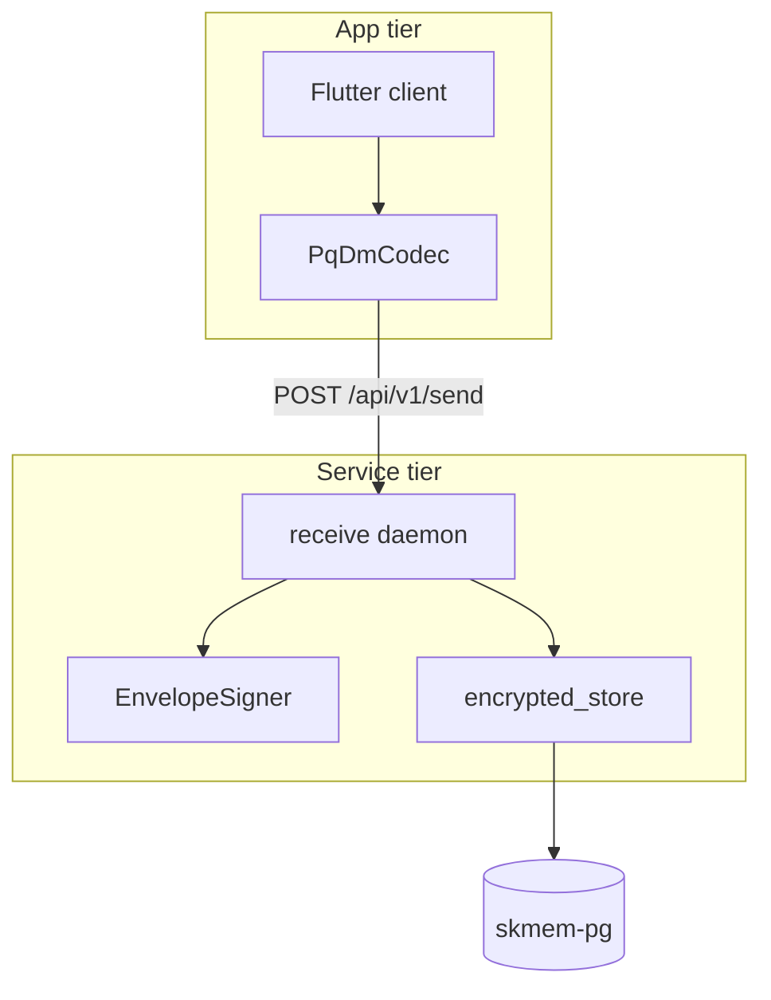
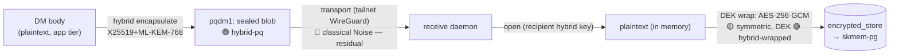
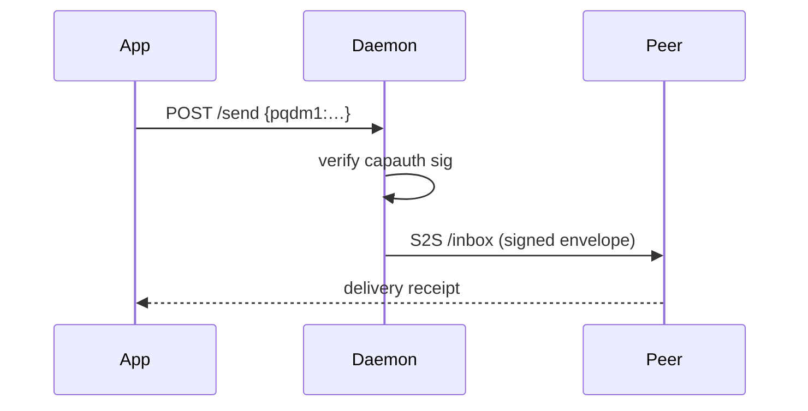

# SK Architecture & Data-Flow Standard

**Status:** Ecosystem standard for all `sk*` repos. Companion to
[`SK_REPO_DOC_STANDARD`](./SK_REPO_DOC_STANDARD.md) and
[`CRYPTOGRAPHY_STANDARD`](./CRYPTOGRAPHY_STANDARD.md).

**Why:** A new contributor — **AI agent or human** — should be able to understand
*what this service is, what data flows through it, and where to start reading* in
**under five minutes**, from the repo alone. Diagrams that live next to the code,
in text, are the cheapest way to keep that true. This standard says which diagrams
every repo owes, and how to draw them.

---

## Tooling: mermaid first, draw.io only when you must

| | mermaid | draw.io (`.drawio`) |
|---|---|---|
| Format | **text** (markdown-embedded) | XML |
| Git diff / review | ✅ line-level | ⚠️ noisy |
| Renders on GitHub / in-repo | ✅ inline | ❌ (needs export) |
| **AI can read & regenerate it** | ✅ | ⚠️ awkward |
| Stays in sync with code | ✅ (edit in the PR) | ✗ (drifts) |
| Precise hand-tuned layout | ⚠️ limited | ✅ |

**Rule:** Use **mermaid by default** — it's the SK house diagram language. Reach for
**draw.io only** for a large hand-tuned canvas that mermaid can't express; when you
do, commit the `.drawio` **and** an exported `.svg` (so it renders without the tool),
under `docs/diagrams/`. Never commit a diagram as a bare PNG with no source.

---

## The required diagram set (every service repo)

A service repo's `SOP.md` (or a dedicated `docs/ARCHITECTURE.md`) MUST contain these
four, in this order. Libraries (sk_pqc/sk_pgp) owe #1 and #2 only (no multi-tier
data flow).

### 1. System context — "who talks to this?"
The service as one box, surrounded by the external actors/systems it exchanges data
with. One glance = the blast radius.

### 2. Component view — "what are the moving parts?"
Internal modules/services + datastores, and which module owns which surface. This is
where a reader learns the **entry points**.

### 3. Data-flow — "what data goes where, transformed how, protected by what" ⭐
**The highest-value diagram.** Trace each *important data type* from where it's
created, through every service/transform, to where it rests — and **annotate every
hop with (a) the transform and (b) the crypto posture** (`hybrid-pq` / `classical`
/ `symmetric` / `plaintext`) citing the [crypto standard](./CRYPTOGRAPHY_STANDARD.md).
This is what ties "data flow" to "security claim" — a reader sees *exactly* where a
payload is plaintext, where it's hybrid-sealed, and where a classical leg remains.

> Legend: 🟢 hybrid-pq · 🟡 symmetric (Grover-acceptable) · 🔴 classical (Shor-breakable,
> documented residual). Annotate **every** hop — silence reads as "covered" when it isn't.

**Data classification:** label each data type (public / internal / sensitive /
secret) on the flow so its protection requirement is self-evident.

### 4. Sequence — "how does the one critical flow actually happen?"
A `sequenceDiagram` for the 1–3 load-bearing end-to-end flows (e.g. send-a-message,
authenticate, rotate-a-key). Shows ordering, round-trips, and where failures branch.

---

## "Start here" — the onboarding section (required prose)

Diagrams show structure; a reader still needs a thread to pull. Every repo's overview
MUST include:

- **What this is, in 2 sentences** — the one job this repo does.
- **Key entry points** — the 3–5 files/functions to read *first*, each with a one-line
  "this is where X happens" (e.g. `signing.py:EnvelopeSigner` — outbound signatures).
- **The data it owns** — the durable state + where it lives (DB/table, files).
- **External dependencies & integration points** — what it calls, what calls it.
- **Maturity tier** (T0–T4 per the crypto standard) + current honest posture.

A good test: *could an AI agent, given only this overview + the diagrams, correctly
answer "where would I change how DMs are encrypted?" without reading the whole tree?*
If not, the overview is incomplete.

---

## Keeping diagrams honest & fresh

- Diagrams are **reviewed like code** — a PR that changes a data path updates the
  data-flow diagram in the same PR.
- The data-flow crypto annotations are bound by the [honest-claims rule](./CRYPTOGRAPHY_STANDARD.md):
  never paint a hop `hybrid-pq` unless its live suite is — an unmigrated leg stays
  `classical` on the diagram. The diagram is a *claim*, so it carries the same evidence bar.
- Prefer a few **accurate** diagrams over many aspirational ones.
