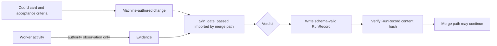

# Autocode Merge Gate Standard

**Status:** RATIFIED. This is constituent S5 of the
[`AUTONOMY_STANDARD`](./AUTONOMY_STANDARD.md). It describes the shared merge
bar and verdict evidence boundary shipped by skharness PR 62.

**Why:** The live pi fleet coined private synonyms for the engine's canonical
`twin-gate verdict` and `RunRecord content hash` concepts. At the same time, the
engine's content-addressed `RunRecord` schema had no production writer. The
estate had two coding populations and one merge bar, but no shared evidence
format at the verdict boundary. A later refactor could also have reimplemented
the gate, relaxed the protected floor, or let worker text acquire control weight
without violating any ratified standard.

---

## 1. Normative rules

### R1. One twin gate, bound by import

Machine-authored change MUST merge only through the canonical
`twin_gate_passed` function. Every merge path MUST bind to that function by
import, never by copying or reimplementing its logic. The Ralph loop and
`ratify()` MUST resolve to the same function object in an identity assertion.

**Incident provenance:** The two merge paths already called one function by
import, but that property was not normative. A second implementation could
silently drift while both paths still appeared to enforce a twin gate. The
identity assertion shipped in skharness PR 62 makes sameness structural.

### R2. Pin the grader capability

The grader capability class MUST be fixed independently of the card and build
bucket. A card, worker, or build route MUST NOT choose the model class that
grades its own output. The grader may inherit the sensitivity zone needed to
read the diff, but never the build class.

**Incident provenance:** Without the existing capability pin, a card could
select a lenient or underpowered grader and influence its own merge decision.
The shipped constant `GRADER_CAPABILITY_CLASS = "m"` closes that self-grading
path structurally.

### R3. Fail closed and only grow the protected floor

A missing, unreadable, unsigned, or empty protected manifest MUST protect
everything. The hard-coded protected floor MUST only grow. It covers these
classes of control-bearing path:

1. detector;
2. merge choke point;
3. fleet store;
4. plane files;
5. rubric;
6. guard modules;
7. coverage configuration.

Deleting or weakening any floor class is a standards violation, not a routine
refactor.

**Incident provenance:** A manifest controlled by the change being graded
could otherwise omit the detector or merge choke point and make its own guard
editable. The hard-coded floor exists because manifest absence or tampering
must narrow authority, never widen it.

### R4. Preserve all four diff-coverage anti-gaming checks

Diff-coverage certification MUST retain all four checks:

1. delete any pre-existing report before the measured run;
2. require a successful coverage command exit code;
3. require the report modification time to postdate the run;
4. refuse full certification when changed source is absent from the report.

Removing any one check is a standards violation, not test cleanup.

**Incident provenance:** A stale, pre-existing, failed, or scope-incomplete
report can all look like coverage evidence when only the final percentage is
read. The four checks were added so a worker cannot obtain a green verdict from
an artifact the measured run did not produce or that omitted its changed code.

### R5. Activity is observation, never control

Activity-stream authority MUST be pinned to `observation` at the schema level.
No merge path, controller, or dispatcher may interpret worker prose or activity
text as a control instruction. A worker can report evidence; it cannot widen
its authority by saying that it has done so.

**Incident provenance:** The manual fleet controller existed as text inside a
live model session. If worker text carried control weight, prompt-injected or
unreviewable session prose could steer the controller. The shipped schema pin
keeps the activity stream evidentiary.

### R6. Write one content-addressed RunRecord at every verdict

Every machine-authored job that reaches a verdict MUST write a schema-valid,
content-addressed `RunRecord` at the twin-gate boundary. This rule applies to
both the managed Ralph path and the manual lane's `ratify()` path. The stored
content hash MUST verify against the canonical record payload. A verdict with
no RunRecord is incomplete and MUST fail its drill.

**Incident provenance:** The engine defined a versioned, content-addressed
`RunRecord` with no production writer, while the live fleet used vocabulary not
bound to that schema. skharness PR 62 wired both verdict paths to one writer and
added hash-verifying lane drills.

---

## 2. Gate and evidence flow



The `RunRecord` is evidence for the verdict. It does not replace the gate, and
activity does not become an input that can command the gate.

---

## 3. Machine-readable contract and enforcement

```autocode-merge-gate-contract
{
  "schema": "skworld.autocode-merge-gate/v1",
  "merge_gate": {
    "symbol": "twin_gate_passed",
    "binding": "import_identity",
    "paths": ["ralph", "ratify"]
  },
  "grader": {
    "capability_class": "m",
    "card_selectable": false,
    "inherits_build_class": false
  },
  "protected_manifest": {
    "fail_closed": true,
    "floor_policy": "append_only",
    "floor_classes": [
      "detector",
      "merge_choke_point",
      "fleet_store",
      "plane_files",
      "rubric",
      "guard_modules",
      "coverage_configuration"
    ]
  },
  "diff_coverage": {
    "required_checks": [
      "delete_preexisting_report",
      "successful_exit_code",
      "fresh_report_mtime",
      "changed_source_present"
    ]
  },
  "activity": {
    "authority": "observation",
    "control_input": false
  },
  "run_record": {
    "required_at": "every_verdict",
    "content_addressed": true,
    "hash_must_verify": true,
    "paths": ["ralph", "ratify"]
  }
}
```

This standards repo enforces the contract with:

```bash
python3 scripts/check_autocode_merge_gate_standard.py --repo .
python3 scripts/check_autocode_merge_gate_standard.py --self-test
```

The validator compares every contract value to the ratified S5 truth table and
requires exactly one README row and one RATIFIED umbrella row. Its negative
fixtures prove red for a second gate implementation, deletion of a protected
floor class, and a verdict contract that does not require a RunRecord.

The runtime implementation checks shipped by skharness remain responsible for
proving symbol identity, floor monotonicity, all four coverage checks, and a
schema-valid hash-verifying RunRecord from both verdict paths.

---

## 4. Compliance checklist

- [ ] Every machine-authored merge path imports `twin_gate_passed`.
- [ ] Ralph and `ratify()` resolve to the same function object.
- [ ] The grader capability class is pinned and card-independent.
- [ ] The protected manifest fails closed and every floor class remains present.
- [ ] All four diff-coverage anti-gaming checks remain enforced.
- [ ] Activity authority is schema-pinned to `observation` and is not control input.
- [ ] Every verdict in both paths writes a hash-verifiable RunRecord.

---

## Related standards

- [AUTONOMY_STANDARD](./AUTONOMY_STANDARD.md): owns the cross-cutting twin-gate
  and observation-only invariants.
- [TESTING_AND_CI_STANDARD](./TESTING_AND_CI_STANDARD.md): governs gate integrity
  and evidence-backed claims.
- [PROVENANCE_AND_MUTATION_STANDARD](./PROVENANCE_AND_MUTATION_STANDARD.md):
  governs attributable and reversible mutation evidence.
- [ACTUATION_READINESS_AND_FREEZE_STANDARD](./ACTUATION_READINESS_AND_FREEZE_STANDARD.md):
  governs readiness for effectful actuation outside the merge boundary.

---

*License: Apache-2.0. Part of [sk-standards](../README.md).*
