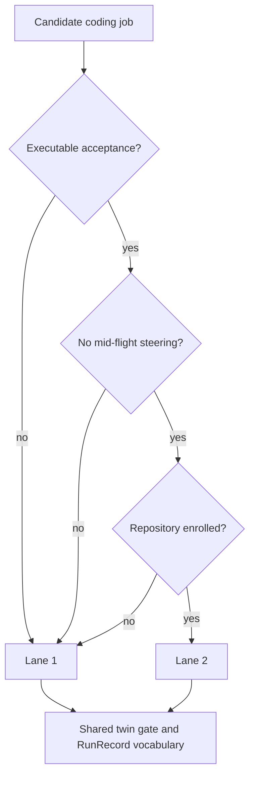

# Coding Lanes Standard

**Status:** RATIFIED. This is constituent S6 of the
[`AUTONOMY_STANDARD`](./AUTONOMY_STANDARD.md). It applies the shared merge bar
from [`AUTOCODE_MERGE_GATE_STANDARD`](./AUTOCODE_MERGE_GATE_STANDARD.md) to two
distinct coding drivers. The accepted two-lane decision is recorded in
[`ADR-0002`](../decisions/ADR-0002-two-coding-lanes.md).

**Why:** On 2026-08-25, the estate's most active coding orchestrator existed
only as instructions typed into a live tmux session. It was registered on the
coordination board, but no controller artifact existed on disk, so it could not
be reviewed, restarted, or recovered if the session died. Its briefs also used
private provenance synonyms instead of the engine's canonical twin-gate verdict
and RunRecord content hash vocabulary. A manual human-driven tool and a managed
autocode engine both existed, but no standard separated their drivers, context,
confinement, or routing rules.

---

## 1. Normative rules

### R1. Lane 1 is the manual pane cluster

Lane 1 MUST use a versioned pool controller in the session plane. The controller
drives guarded spawns as tmux panes and delegates lifecycle operations to the
injected session harness. It MUST NOT duplicate or bypass the four fail-closed
spawn guards:

1. profile validation;
2. canonical repository allowlist, with an empty list meaning deny all;
3. git ref-format validation;
4. session-name validation.

Every task uses its own worktree. Teardown MUST persist the transcript before
stopping the window. Pane activity authority MUST remain `observation`. The
human is the loop: lane 1 has no Ralph loop, no autonomous scale policy, and no
independent authority to merge.

Orchestration logic typed into a live session is not a controller. A controller
exists in a versioned repository or it does not exist.

**Incident provenance:** The live inline controller proved the workflow was
useful while also proving it was unrecoverable and unreviewable. skharness PR 61
landed the versioned `PoolController`, and PR 64 landed `PiHarness` over the
existing guarded spawn and transcript-first archive path.

### R2. Lane 2 is the managed task plane

Lane 2 MUST use the skharness task plane: claim, isolated worktree, fresh Ralph
rounds, independent pinned grader, twin gate, RunRecord, and pull request. An
ATLAS-dispatched coding job rides the action-authorization contract before the
dispatch causes work.

`live_execution` and `automerge_repos` are operator-controlled flags outside
this standard's authority. This standard MUST NOT turn either on or add a
repository to an automerge list. ATLAS may dispatch a governed coding job, but
it does not edit code or grant itself merge authority.

**Incident provenance:** The managed engine was built and gated but switched
off, while the active manual fleet improvised its own driver. Without a lane
boundary, enabling managed execution could inherit assumptions from the manual
session and blur who controlled the loop.

### R3. Routing is exactly three predicates

A job routes to lane 2 if and only if all three predicates are true:

1. **Executable acceptance:** the card has acceptance criteria that tests, CI,
   and the coverage floor can judge without subjective taste.
2. **No mid-flight steering:** no human will type into or steer the worker
   session while it runs.
3. **Enrolled repository:** the target repository is worktree-capable, has the
   required external CI verdict and coverage instrumentation, and is enrolled
   for the managed engine.

If any predicate is false, the job routes to lane 1. If the work is not ready
even for lane 1, it remains a card-quality problem rather than receiving an
invented route. Exploratory work, spike work, and "look at this with me" work
are lane 1 because predicate 2 is false. Two evaluators given the same three
booleans MUST produce the same route. Taste never enters.

**Incident provenance:** No decidable routing rule separated interactive work
from managed work. That made route selection a matter of operator intuition and
made later automation impossible to audit.

### R4. Share artifacts, never the driver

Both lanes MUST share these artifacts by import or schema:

- the coordination card as the unit of work;
- the imported twin gate from `AUTOCODE_MERGE_GATE_STANDARD`;
- the canonical twin-gate verdict and RunRecord content hash vocabulary.

The lanes deliberately do not share these properties:

| Property | Lane 1 | Lane 2 |
|---|---|---|
| driver | human | managed orchestrator |
| confinement | operator-supervised session | isolated task sandbox |
| loop | human interaction | Ralph rounds |
| context posture | operator context allowed | lean task context only |

Lane 1 panes MAY carry operator context because a human drives them. Lane 2
workers MUST follow ADR-0001's lean sandbox and receive only the repository,
task brief, and repo-grounded facts. This split resolves the bootstrap and
ADR-0001 context tension; it does not weaken ADR-0001.

Maintained coding briefs MUST use the canonical twin-gate verdict and RunRecord
content hash vocabulary. Reintroducing a retired private synonym is a gate
failure.

**Incident provenance:** The manual fleet's private vocabulary did not map to
the engine schema, and the full context ritual used by interactive panes looked
incompatible with the lean sandbox until the two drivers were separated.

### R5. `codex` has one fleet-tooling meaning

In maintained fleet tooling, `codex` refers only to the model identity routed
through skgateway. A human's interactive terminal and a stub adapter are not
fleet components and MUST NOT be selected by that name as if they were managed
workers.

**Incident provenance:** Three unrelated surfaces answered to the same word: a
stub adapter, human interactive CLI sessions, and a gateway model identity.
Without one sanctioned fleet meaning, routing and evidence could name different
things with the same label.

---

## 2. Deterministic router



The truth table is exhaustive:

| Executable acceptance | No steering | Enrolled repo | Route |
|---|---|---|---|
| false | false | false | lane 1 |
| false | false | true | lane 1 |
| false | true | false | lane 1 |
| false | true | true | lane 1 |
| true | false | false | lane 1 |
| true | false | true | lane 1 |
| true | true | false | lane 1 |
| true | true | true | lane 2 |

---

## 3. Machine-readable contract and enforcement

```coding-lanes-contract
{
  "schema": "skworld.coding-lanes/v1",
  "lane_1": {
    "driver": "human",
    "controller": "versioned_pool_controller",
    "harness": "pi",
    "guards": ["profile", "repo_allowlist_deny_all", "git_ref", "session_name"],
    "teardown": "transcript_before_stop",
    "activity_authority": "observation",
    "ralph_loop": false
  },
  "lane_2": {
    "driver": "managed_orchestrator",
    "task_plane": "skharness",
    "action_authorization_required": true,
    "operator_flags": ["live_execution", "automerge_repos"]
  },
  "router": {
    "predicates": ["executable_acceptance", "no_midflight_steering", "enrolled_repo"],
    "all_true": "lane_2",
    "otherwise": "lane_1"
  },
  "shared": ["coord_card", "imported_twin_gate", "run_record_vocabulary"],
  "context": {
    "lane_1": "operator_context_allowed",
    "lane_2": "lean_sandbox"
  },
  "fleet_codex_meaning": "skgateway_model_identity",
  "brief_globs": ["templates/*.md"]
}
```

This standards repo enforces the contract with:

```bash
python3 scripts/check_coding_lanes_standard.py --repo .
python3 scripts/check_coding_lanes_standard.py --self-test
```

The validator checks every contract value, all eight router outcomes, exactly
one README row, exactly one RATIFIED umbrella row, the accepted ADR, and the
maintained brief vocabulary. Its negative fixture writes a retired private
synonym into a temporary maintained brief and proves the vocabulary gate fails.

The runtime guard remains the implementation evidence. Current skharness main's
`PiHarness` inherits the real guarded spawn path, and its read-only test
`test_guard_2_repo_not_on_allowlist_rejects` proves an unallowlisted repository
is refused before git or tmux is touched.

---

## 4. Compliance checklist

- [ ] Lane 1 uses a versioned controller and the inherited guarded Pi spawn path.
- [ ] Lane 1 teardown persists transcripts before windows stop.
- [ ] Lane 1 activity authority remains observation-only and the human is the loop.
- [ ] Lane 2 uses the managed task plane and governed action dispatch.
- [ ] No standard or agent flips `live_execution` or broadens `automerge_repos`.
- [ ] The three router predicates alone determine the lane.
- [ ] Both lanes share the card, imported twin gate, and RunRecord vocabulary.
- [ ] Lane 1 may carry operator context; lane 2 remains lean per ADR-0001.
- [ ] `codex` in fleet tooling means only the skgateway model identity.

---

## Related standards

- [AUTOCODE_MERGE_GATE_STANDARD](./AUTOCODE_MERGE_GATE_STANDARD.md): owns the
  shared twin gate and RunRecord verdict boundary.
- [AUTONOMY_STANDARD](./AUTONOMY_STANDARD.md): owns the cross-cutting autonomy
  invariants and constituent status.
- [TESTING_AND_CI_STANDARD](./TESTING_AND_CI_STANDARD.md): governs executable
  acceptance, CI verdicts, coverage, and gate integrity.
- [PROVENANCE_AND_MUTATION_STANDARD](./PROVENANCE_AND_MUTATION_STANDARD.md):
  governs attributable mutation evidence.

---

*License: Apache-2.0. Part of [sk-standards](../README.md).*
