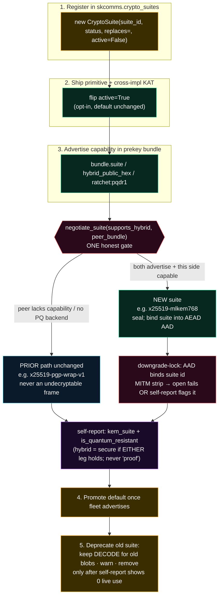

# SKStacks — Crypto-Agility Standard (swap primitives without a flag-day)

**Status:** Going-forward ecosystem standard. Companion to the
[CRYPTOGRAPHY_STANDARD](./CRYPTOGRAPHY_STANDARD.md): that one says *which* primitives
to target; **this one says how to swap them without breaking a single peer.**
**Standards anchor:** NIST CSWP 39 (crypto-agility) · FIPS 203 (ML-KEM) · FIPS 204
(ML-DSA) · FIPS 205 (SLH-DSA) · RFC 9580.
**Grounded in real code:** every wire tag below (`x25519-mlkem768`, `pqdm1:`, `pqdr1`,
`aqid:`, `sig_suite`/`kem_suite`, the `skcomms.crypto_suites` registry) is one that
already ships in `sk-pqc` / `skcomms` / `skchat` — this standard codifies the pattern
those repos arrived at, it does not invent one.

---

## The thesis (the project's core argument)

> **Agility beats any single parameter choice.** The most important property of our
> crypto is not "is it ML-KEM-768?" — it is "**can we move off whatever we chose,
> on a live network, with peers at mixed versions, without ever handing anyone a frame
> they cannot decrypt?**"

Per Mosca's inequality the migration *itself* is the long pole — primitives will be
swapped more than once over the system's life (768→1024, ML-DSA→a future scheme, a
PQ-only world someday). A design that can only do **one** migration, as a flag-day, has
already failed the next one. So we build the swap mechanism as a first-class, permanent
part of the wire format, and we **never** make a primitive choice load-bearing on the
absence of a version field.

This is not "quantum-proof" anything. A hybrid suite is secure **while either leg holds**
(X25519 *or* ML-KEM-768) — see the [honest-claim rules](./CRYPTOGRAPHY_STANDARD.md#honest-claim-rules-ecosystem-wide).
Agility is what lets us *honestly* re-state the claim each time a leg is added, rolled,
or retired.

---

## 1. Self-describing suite ids + wire tags — MANDATORY

Every crypto container (envelope, key bundle, ciphertext, at-rest blob) MUST carry a
**machine-readable suite id** that names the exact construction, so a receiver decides
how to open it **from the bytes alone** — never from out-of-band assumption.

**The tags already in use (the contract — do not break these):**

| Wire field / tag | Where | Real values shipping today |
|---|---|---|
| `sig_suite` | `skcomms.SignedEnvelope`, capauth challenge | `ed25519-v1` (default) · `rsa4096-v1` · `mldsa65-ed25519-v2` (hybrid, opt-in) |
| `kem_suite` | `skchat.group`, DM self-report | `rsa-pgp-wrap-v1` (default) · `x25519-pgp-wrap-v1` · `x25519-mlkem768` (hybrid) |
| `epoch` | group key generation | integer, bumped on rekey |
| `pqdm1:<suite>:<b64>` | `skchat` 1:1 DM one-shot seal (`crypto.PQDM_SCHEME`) | `pqdm1:x25519-mlkem768:…` |
| `pqdr1` | `skchat` DM ratchet capability + frame (`pq_prekeys.RATCHET_CAP`, RFC-0001 P1) | the wire-format **version tag** a build advertises it speaks |
| `wrap_suite` | `skchat.atrest_wrap` blob | `x25519-mlkem768` (hybrid at-rest DEK wrap) |
| `aqid:<relay>/<b64(sid)>` | `skcomms.anon_transport` no-identity address | opaque routing handle, zero identity |

**Self-describing framing rules:**

- A **binary** container starts with a **magic + version byte + suite-id-length +
  suite-id** header. Real examples: `skchat.atrest_wrap` = `WRAP_MAGIC(b"SKAW") ||
  ver(1) || suite_len(2) || suite_id || …`; `skcomms.anon_transport` =
  `ANON_MAGIC(b"SKCANON1\x00") || ver(1) || …`. The magic also lets a receiver
  *dispatch* between frame kinds (anon frame vs `pqroute1` blob vs a plain
  `SignedEnvelope` JSON, which starts with `{`).
- A **token** container is a colon-scheme: `pqdm1:<suite_id>:<base64url(body)>`. The
  scheme prefix (`pqdm1:`, `pqdr1:`) **is** the wire-format version; the embedded
  `<suite_id>` names the crypto.
- The suite id is bound into the **AEAD AAD / transcript** so it cannot be silently
  rewritten in flight (see §2, downgrade-lock).
- **Version is explicit and additive.** Old containers without a new field MUST still
  load (skchat groups serialized before `kem_suite`/`epoch` existed still deserialize,
  defaulting to the classical suite). Never reuse a tag's meaning; mint a new one.

---

## 2. Capability advertisement + downgrade safety — MANDATORY

**The invariant (state it in every negotiated surface):**

> A peer that does **not** advertise a capability stays on the **prior path** and is
> **never** handed a frame it cannot decrypt. A new wire format only engages when
> **both** sides advertise it. Downgrade is the *safe* default; upgrade is opt-in and
> mutually negotiated.

**How peers advertise (real mechanism):** the published **prekey bundle** carries
capability fields — `suite` (e.g. `x25519-mlkem768`), `hybrid_public_hex`, and a
`ratchet` capability advert (the value `pqdr1`, gated by `pq_prekeys.RATCHET_CAP`). A
client without the `pqdr1` codec (the Flutter app, an older agent) simply **omits**
`ratchet`. There is no negotiation handshake to attack — capability is *published*, and
absence is unambiguous.

**The single honest gate.** All negotiation routes through one function so no caller
hand-rolls it: `skcomms.pqdm.negotiate_suite(supports_hybrid, bundle)` /
`ChatCrypto.negotiated_suite(recipient_bundle)`. It returns the **hybrid** suite only
when *this* side supports hybrid (liboqs reachable) **AND** the recipient advertises a
hybrid prekey; otherwise it returns the **classical** suite. Three real gates stack:

1. **No PQ backend here** (no liboqs / no agent hybrid keypair) → stay classical.
2. **Peer published no hybrid prekey** → stay classical (`peer_is_hybrid()` false).
3. **Peer has a hybrid prekey but no `pqdr1` capability** → stay on the
   classical/one-shot path, so the app never receives an undecryptable ratchet frame
   (`dm_manager` capability gate, RFC-0001 downgrade protection).

**Downgrade is detectable, not just survivable.** The negotiated suite id is bound into
the AEAD **AAD** (`pqdm.downgrade_lock_aad(suite, sender, recipient)`). A man-in-the-
middle that strips the hybrid prekey to force a classical downgrade changes the suite the
sender seals under — so the recipient's AEAD open **fails** (AAD mismatch) *or* the
recorded `negotiated_suite` on the resulting object no longer says hybrid, which the
**per-conversation self-report surfaces** (`encrypted_store` reports
`wrap_status`/`quantum_resistant`; the CLI prints `(hybrid PQ)` vs `(classical)`). The
lock is the AAD binding; the **alarm** is the self-report. Neither is a silent failure.

**Sovereign vs anonymous is orthogonal.** In SOVEREIGN (attributable) mode the peer's
prekey bundle MUST carry a **valid identity signature** before the ratchet engages — a
sovereign session never downgrades to an *unattested* ratchet. In ANON mode the peer is
named only by an `aqid:` handle with a deniable HMAC `auth_tag` (never a signature); the
same suite-tag discipline applies to the frame.

---

## 3. Register + roll to the NEXT KEM / signature — MANDATORY

The migration must be a **registry entry + a negotiation**, not a code-wide find-and-
replace. The mechanism is the `skcomms.crypto_suites` registry — `sk_pqc` re-exports the
identical table, so a published-lib install and a local fallback behave the same.

**3.1 The registry (single source of truth).** Each suite is a `CryptoSuite` record:

```
CryptoSuite(
    suite_id="x25519-mlkem768",          # the value that travels on the wire
    kind=SuiteKind.KEM,                  # kem | sig | aead
    status=SuiteStatus.HYBRID_PQ,        # classical | hybrid-pq | pq | symmetric
    primitives=("X25519", "ML-KEM-768 (FIPS 203)", "HKDF-SHA256 concat-KDF"),
    fips_refs=("FIPS 203", "RFC 7748", "RFC 5869"),
    active=True,                         # is it actually wired into running code?
    replaces="x25519-pgp-wrap-v1",       # agility breadcrumb → the suite it succeeds
)
```

Two fields carry the whole migration:

- **`status`** drives the one honest predicate `is_quantum_resistant` — true only for
  `hybrid-pq` / `pq` / `symmetric`, **never** for classical asymmetric. The self-report
  reads this; no caller re-implements the over-claimable logic. `hybrid-pq` literally
  means "secure if **either** leg holds" — not "proof."
- **`active`** is the **honesty gate**: a planned suite is seeded `active=False` so the
  self-report can *describe* the migration target without ever implying it is live. It
  flips to `True` only when the implementation actually lands.

**3.2 Versioned wire tags.** The next parameter set gets a **new** tag, not a redefined
one. Real example already seeded: the LIVE primitive `x25519-mlkem768` and the *planned*
group/envelope-wired `x25519-mlkem768-v2 (active=False, replaces="rsa-pgp-wrap-v1")`
coexist in the registry. The `-vN` suffix and the `replaces=` breadcrumb let tooling
chain `… → rsa-pgp-wrap-v1 → x25519-mlkem768-v2 → (future)` without guesswork.

**3.3 The dual-stack window (how you roll without a flag-day):**

1. **Register** the new suite `active=False`. No behaviour changes; the registry can now
   *name* it and the self-report can say "planned."
2. **Ship the primitive** (cross-impl KAT green per the
   [TESTING_AND_CI_STANDARD](./TESTING_AND_CI_STANDARD.md)) and flip `active=True` — but
   it is still **opt-in / negotiated**, default suite unchanged. Both old and new peers
   interoperate: capability advertisement (§2) routes each pair to the best **mutually**
   supported suite.
3. **Advertise** the new capability in prekey bundles. Now upgraded↔upgraded pairs use
   the new suite; anyone mixed stays on the prior path. This window stays open for the
   whole fleet-rollout duration — there is no instant at which all peers must agree.
4. **Promote the default** only once the fleet has broadly advertised support.
5. **Deprecate** the old suite: mark it (keep it *decodable* for old at-rest blobs and
   stragglers), warn on its use, and **remove it only after** the self-report shows no
   live channel negotiates it. Removing a decode path is a breaking change — gate it on
   evidence, not a calendar.

Keep classical legs **additive and reversible** throughout — never delete the old key/
path while interop is in flux (CRYPTOGRAPHY_STANDARD §3).



---

## 4. Named anti-patterns (do not ship these)

| Anti-pattern | Why it kills agility | The fix (real form) |
|---|---|---|
| **Hardcoded primitive** — `if alg == "X25519"` / a bare `AESGCM(key)` with no recorded suite | The next migration becomes a code-wide flag-day; you cannot describe what a stored blob *is*. | Route all sign/verify/encrypt/decrypt through the **suite registry + one backend gate**; record the `suite_id`. |
| **No version byte** — a binary blob or token with no magic/version/suite header | You cannot evolve the format or even tell two formats apart; old at-rest data becomes undecodable after any change. | `MAGIC || ver || suite_len || suite_id` (e.g. `SKAW`, `SKCANON1\x00`) or `scheme1:<suite>:<body>` (`pqdm1:`, `pqdr1:`). |
| **Unauthenticated capability** — trusting a plaintext "I support PQ" header | A MITM forges/strips it to force a downgrade undetectably. | Advertise via a **signed** (sovereign) or transcript-bound bundle; **bind the negotiated suite into the AEAD AAD** so a strip breaks the open. |
| **Silent downgrade** — falling back to classical without recording it | The claim "this channel is hybrid" becomes unfalsifiable; you can't tell when PQ silently stopped. | Record `negotiated_suite`; surface it in the **per-channel self-report** (`is_quantum_resistant`); CLI prints `(hybrid PQ)` vs `(classical)`. |
| **Redefining an existing tag** — changing what `kem-suite-v1` means | Old and new peers disagree on identical bytes → undecryptable frames. | Mint a **new** `-vN` tag with a `replaces=` breadcrumb; run both in the dual-stack window. |
| **Hard cutover / flag-day** — remove the old suite the moment the new one ships | Every un-upgraded peer instantly breaks. | Keep the old path **decodable**; remove only after the self-report shows **zero** live negotiation of it. |
| **Over-claiming on swap** — "now quantum-proof" after enabling a PQ leg | Dishonest; a hybrid suite is secure only *while either leg holds*. | Re-state the claim from the registry `status` + FIPS ref + the exact surface (CRYPTOGRAPHY_STANDARD honest-claim rules). |

---

## 5. Compliance checklist (per crypto-bearing repo)

- [ ] Every crypto container carries a **machine-readable `suite_id`** on the wire
      (`sig_suite` / `kem_suite` / token scheme / blob header).
- [ ] Binary formats have a **magic + version byte**; tokens have a **scheme version**
      (`pqdm1:`, `pqdr1:`). Old containers without a new field still load.
- [ ] All suites resolve through the **`crypto_suites` registry** (`replaces=` breadcrumb;
      `active=False` for planned, flipped only when wired).
- [ ] Negotiation is a **single gate** (`negotiate_suite` / `negotiated_suite`); a peer
      without a capability **stays on the prior path** and never gets an undecryptable frame.
- [ ] The negotiated suite is **bound into the AEAD AAD** (downgrade-lock) and the
      fallback/upgrade is **recorded** in the per-channel self-report.
- [ ] Capability is **advertised** (prekey bundle `suite`/`ratchet`), **never** an
      unauthenticated header; sovereign mode requires a verified prekey signature.
- [ ] A new primitive ships behind the **dual-stack window** (register → ship+KAT →
      advertise → promote → deprecate-when-zero-live), classical legs additive/reversible.
- [ ] No anti-pattern from §4 is present; no swap is described as "quantum-proof."

---

## Related standards

- [CRYPTOGRAPHY_STANDARD](./CRYPTOGRAPHY_STANDARD.md) — *which* primitives (hybrid
  `HKDF(X25519 ‖ ML-KEM-768)`, ML-DSA-65+Ed25519), the suite-id mandate, and the
  honest-claim rules this standard's swaps must keep restating.
- [TESTING_AND_CI_STANDARD](./TESTING_AND_CI_STANDARD.md) — the **cross-impl KAT/parity
  gate** that must be green before a new suite flips `active=True`.
- [ARCHITECTURE_AND_DATAFLOW_STANDARD](./ARCHITECTURE_AND_DATAFLOW_STANDARD.md) — the
  data-flow-with-crypto-per-hop diagram where each hop's negotiated suite is drawn.
- [SECURITY_DISCLOSURE_STANDARD](./SECURITY_DISCLOSURE_STANDARD.md) — a downgrade/
  negotiation flaw is a reportable vuln; advisories obey the same honest-claim gate.
- [SK_REPO_DOC_STANDARD](./SK_REPO_DOC_STANDARD.md) — the README/SOP that document a
  repo's suite registry and negotiation surface.

---

*License: Apache-2.0. Part of [sk-standards](../README.md); the skstacks copies carry a
"canonical home" pointer back here.*
