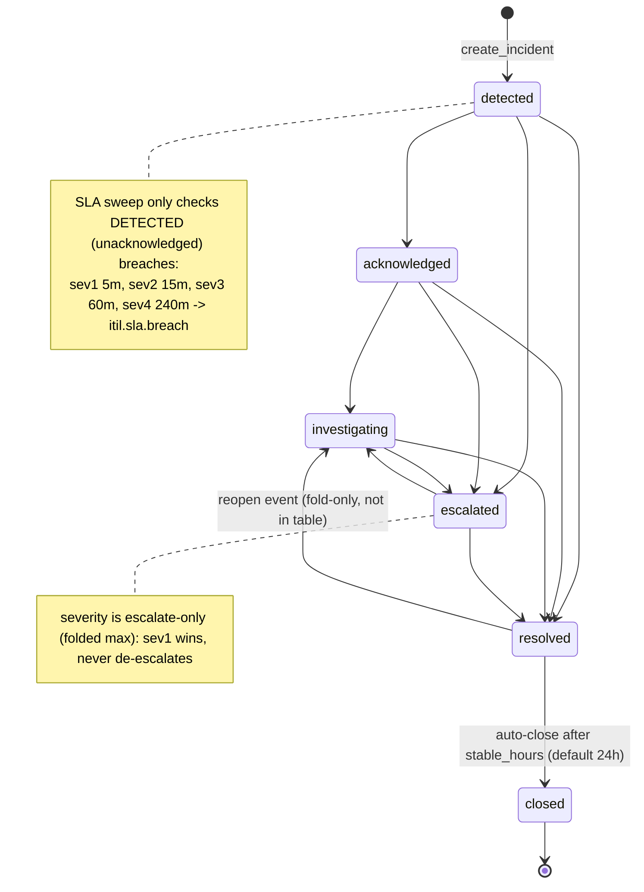
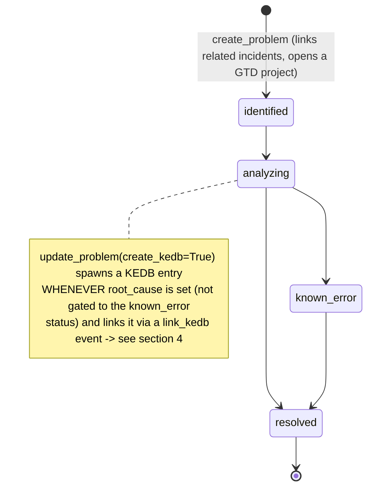
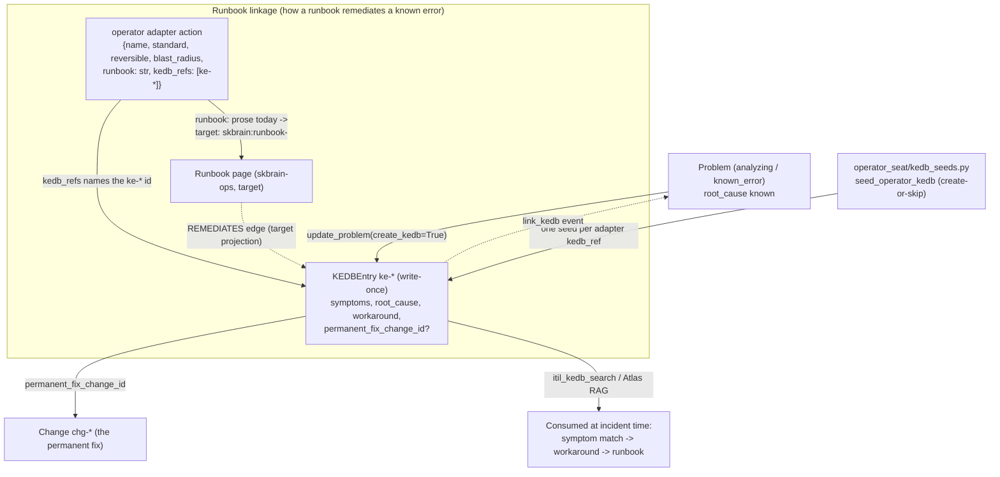
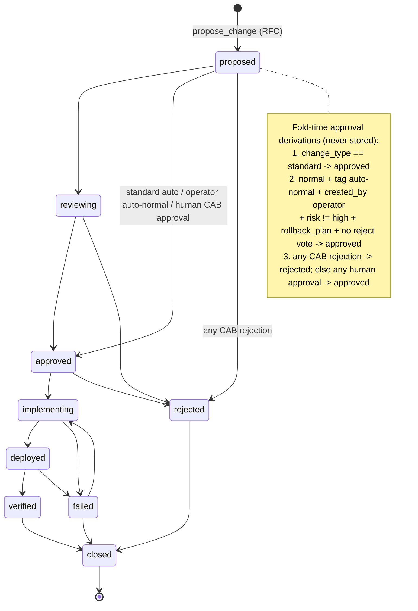
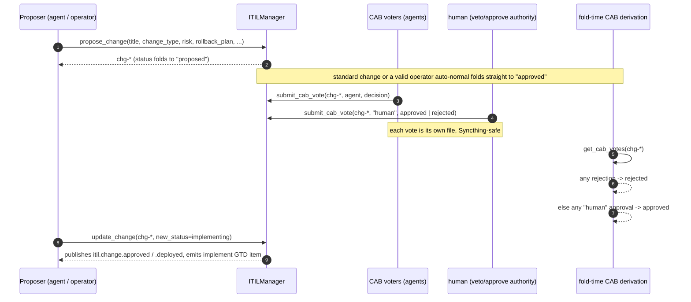
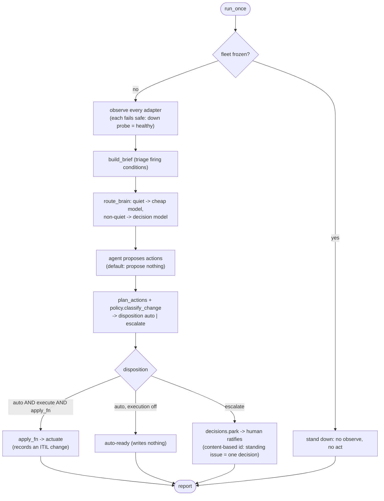
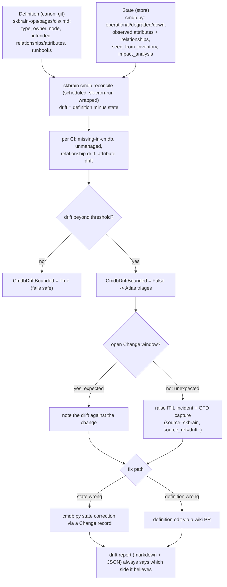

# ITIL and Runbook Operating Model Standard

How SKWorld runs service management: the **states, transitions, and actors** of
the Incident / Problem / Change / KEDB lifecycles as the code actually
implements them, plus the **runbook maintenance loop** and the **CMDB
drift-reconcile loop** that keep operational knowledge honest. This is the
operating-model contract the fleet, the operator seat (Atlas), and the ops wiki
(skbrain) all conform to, drawn as mermaid so a stranger (human or AI) can learn
it from the repo alone.

> One sentence: **ITIL records are event-sourced STATE folded from an
> append-only log; the ops wiki (runbooks + KEDB + CI definitions) is
> version-controlled DEFINITION; Atlas retrieves definition before it acts,
> proposes definition edits it never self-applies, and every actionable thing
> either flows through the one CAB gate or the one gtd-ingest sink.**

**Status:** describes the **shipped** ITIL engine (`skcapstone/src/skcapstone/itil.py`,
the MCP `itil_*` tools, `operator_seat/`) as of 2026-07-31, and the **target**
runbook/CMDB loops from the ratified skbrain ops-wiki architecture
(`2026-07-31-skbrain-ops-wiki-itil-cmdb-architecture.md`). Every diagram is
labelled shipped or target, and section 9 is an explicit
implementation-vs-diagram drift register.

**Source of truth:** the ITIL state machines are the three transition tables and
the three fold algorithms in
[`itil.py`](https://github.com/smilintux-org/skcapstone/blob/main/src/skcapstone/itil.py)
(`_INCIDENT_TRANSITIONS`, `_PROBLEM_TRANSITIONS`, `_CHANGE_TRANSITIONS`,
`_fold_incident`, `_fold_problem`, `_fold_change`). Where a diagram and the code
disagree, the code wins (or the code is wrong and we fix it there, and update
this standard). Section 9 records every disagreement found while authoring.

**Reference material:**
- ITIL engine: `skcapstone/src/skcapstone/itil.py` (`ITILManager`), the read
  layer `dashboard_itil.py`, and the MCP tools in `mcp_server.py`
  (`itil_incident_create/update/list`, `itil_problem_create/update`,
  `itil_change_propose/update`, `itil_cab_vote`, `itil_status`,
  `itil_kedb_search`), impl in `mcp_tools/itil_tools.py`.
- Operator seat (Atlas): `skcapstone/src/skcapstone/operator_seat/`
  (`loop.py`, `policy.py`, `itil_intent.py`, `adapter.py`, `kedb_seeds.py`,
  `proposer.py`, `decisions.py`).
- CMDB: `skcapstone/src/skcapstone/cmdb.py` (`CMDBManager`).
- Target loops: the skbrain ops-wiki architecture spec, sections 5 (definition
  vs state), 6 (Atlas retrieval + learning loop), and the phased epic (Sprints
  1 to 3).

---

## 1. The operating model: STATE vs DEFINITION, and the two gates

The whole model rests on one split and two gates.

**The split (state vs definition).**

- **STATE** lives in operational stores. ITIL records (Incident / Problem /
  Change) and live CI status are event-sourced: each record is a directory with
  an immutable write-once `core.json` plus append-only per-writer event logs
  (`events/<agent>@<host>.jsonl`), and the current status is *folded*
  deterministically on read by replaying every event through the transition
  table. Single-writer-per-file means Syncthing never has a conflict. State is
  **never** committed to git.
- **DEFINITION** lives in git. Runbooks, known-error pages, and CI definitions
  are the ops wiki (`skbrain-ops`), version-controlled, reviewed, and projected
  read-only into skmem-pg for RAG and backlinks. Definition is **never** the
  authority for live status.

**The two gates.**

- **The CAB gate** governs STATE that changes the fleet: a Change is not
  approved until the fold derives approval (a standard change, or a ratified
  operator auto-normal change, or a human CAB approval), and a single human
  rejection blocks it. This gate is human-final for anything major.
- **The gtd-ingest gate** governs everything actionable that is not itself a
  fleet change: incidents auto-emit GTD items, drift emits a GTD capture, a
  proposed runbook edit emits a coord card plus a GTD capture. One sink,
  `source_ref`-deduped, no parallel task lists.

**The actors** (the same names appear across every diagram below):

| Actor | Who / what | Role |
|---|---|---|
| detecting source | `service_health` probe, `heartbeat`, `daemon_error`, a human, `dreaming` | Opens incidents. `service_health` uses a deterministic id so two nodes converge on one record. |
| `managed_by` agent | the owning agent | Drives a record through its lifecycle. |
| Atlas / operator seat | `operator_seat/loop.py`, author name `operator` | Observes adapters, retrieves runbooks, proposes changes and edits, acts only when explicitly enabled and never on a frozen fleet. |
| CAB voters | any agent, plus the special `human` | Vote on changes. `human` is the veto/approve authority. `cab-system` is the synthetic fold-time voter that records the derived outcome. |
| scheduled tasks | `auto-close`, SLA sweep, `cmdb reconcile` | Time-based transitions and drift detection, running as their own writer files. |
| projector (skbrain) | target | Mirrors ITIL/CMDB state read-only into the `ops` namespace; re-embeds canon on sync. |
| human ratifier | Chef, or a reviewed harness card | Merges a wiki edit in git. Merge = ratification. |

---

## 2. Incident lifecycle (shipped)

An incident is opened by a detecting source, driven by its `managed_by` agent
through detection to resolution, and auto-closed after it has been stable. The
real transition table is `_INCIDENT_TRANSITIONS`; the fold also honours a
`reopen` event and an escalate-only severity rule that are not rows in that
table (see section 9, D1/D2).



**Contract.**

- **States** (`IncidentStatus`): `detected`, `acknowledged`, `investigating`,
  `escalated`, `resolved`, `closed`.
- **Transitions** (`_INCIDENT_TRANSITIONS`, exact): `detected` to
  `{acknowledged, escalated, resolved}`; `acknowledged` to
  `{investigating, escalated, resolved}`; `investigating` to
  `{escalated, resolved}`; `escalated` to `{investigating, resolved}`;
  `resolved` to `{closed}`; `closed` is terminal.
- **Reopen.** A `reopen` event moves `resolved` back to `investigating` and
  clears `resolved_at` / `resolution_summary`. This lives only in the fold, not
  in the transition table.
- **Conflict handling.** A losing concurrent transition is not rejected; it is
  folded into the timeline flagged `conflicted` and excluded from state.
  `update_incident` raises only when the incident does not exist.
- **Severity.** Escalate-only: the fold takes the max severity across all
  severity events (`_max_severity`, sev1 highest), so concurrent writers can
  only raise, never lower, severity.
- **Auto-side-effects.** On create, an incident auto-emits a GTD item through
  the gtd-ingest port (`next-action` for sev1/sev2, `inbox` for sev3/sev4) and
  publishes `itil.incident.created`. On resolve, linked GTD items complete.
  `auto_close_resolved` closes incidents stable for `stable_hours` (default 24)
  as the `auto-close` writer.
- **Deterministic id.** `source == "service_health"` incidents get an id hashed
  from `service|failure_class|day_bucket` so two nodes detecting the same outage
  the same day converge on one `core.json`. All other sources get a random id.

---

## 3. Problem lifecycle + KEDB creation (shipped)

A problem investigates root cause across one or more incidents. When a root
cause is known it can spawn a Known Error Database (KEDB) entry, which is the
bridge from STATE (the problem) into DEFINITION (the known-error page and its
remediating runbook).



**Contract.**

- **States** (`ProblemStatus`): `identified`, `analyzing`, `known_error`,
  `resolved`.
- **Transitions** (`_PROBLEM_TRANSITIONS`, exact): `identified` to
  `{analyzing}`; `analyzing` to `{known_error, resolved}`; `known_error` to
  `{resolved}`; `resolved` is terminal.
- **KEDB spawn.** `update_problem(..., create_kedb=True)` creates a `KEDBEntry`
  from the folded problem's `title` / `root_cause` / `workaround` and appends a
  `link_kedb` event carrying the new `ke-*` id, but only if `root_cause` is set.
  It is **not** gated to the `known_error` status (section 9, D6).
- **Auto-side-effects.** On create, a problem opens a GTD **project** through the
  port and publishes `itil.problem.created`. Root cause and workaround are set by
  `root_cause` / `workaround` events; on resolve, linked GTD items complete.
- **Linkage.** A problem carries `related_incident_ids`, `related_change_id`
  (the permanent fix), and `kedb_id`. Incidents carry `related_problem_id`.

---

## 4. KEDB known-error lifecycle + runbook linkage

The KEDB is the join between a diagnosed problem, the workaround that gets a
service back, and the runbook Atlas follows. Today a `KEDBEntry` is a
**write-once** record (section 9, D5); the runbook that remediates it is named
**on the operator adapter action**, not on the KEDB record. The target model
promotes each `ke-*` id to a canon page in `skbrain-ops/pages/known-errors/`
with an explicit runbook link.



**Contract.**

- **Fields** (`KEDBEntry`): `id` (`ke-*`, pinnable via `entry_id`), `title`,
  `symptoms[]`, `root_cause`, `workaround`, `permanent_fix_change_id?`,
  `related_problem_id?`, `managed_by`, `created_at`, `tags[]`.
- **Lifecycle.** Write-once. Created either from a problem (`create_kedb`) or by
  `seed_operator_kedb` (one entry per `ke-*` id an operator adapter action names
  in its `kedb_refs`, create-or-skip). There is no in-code update path today;
  `permanent_fix_change_id` is set at creation only.
- **Runbook linkage today.** The remediation lives on the **adapter action**
  contract (`adapter.py`): each action declares `runbook` (a prose string) and
  `kedb_refs` (the `ke-*` ids it remediates). `kedb_seeds.py` guarantees every
  referenced id resolves to a real KEDB entry, and its drift-guard test asserts
  every declared `kedb_ref` has a seed. The KEDB `workaround` text mirrors the
  adapter action's runbook.
- **Runbook linkage (target).** The `runbook` string upgrades additively to a
  canonical slug (`skbrain:runbook-<slug>`) resolving to a page in
  `skbrain-ops`; the projector writes REMEDIATES / MATCHES / RESOLVED_BY edges so
  the graph can answer "which runbooks actually resolve which conditions".
- **Consumption.** `itil_kedb_search` matches a query against
  title/symptoms/root_cause/workaround/tags. Atlas retrieves the same knowledge
  by RAG before acting (section 7).

---

## 5. Change lifecycle + CAB voting (shipped)

A change is proposed as an RFC, gated by the CAB, implemented, deployed,
verified, and closed. Approval and rejection are **pure fold-time derivations**
from per-agent vote files and the change's own metadata; no writer ever mutates
the change record to approve or reject it.



The CAB itself is conflict-free: each voter writes its own
`cab-decisions/<change_id>-<agent>.json`, and the outcome is derived when the
change is folded.



**Contract.**

- **States** (`ChangeStatus`): `proposed`, `reviewing`, `approved`, `rejected`,
  `implementing`, `deployed`, `verified`, `failed`, `closed`.
- **Transitions** (`_CHANGE_TRANSITIONS`, exact): `proposed` to
  `{reviewing, approved, rejected}`; `reviewing` to `{approved, rejected}`;
  `approved` to `{implementing, rejected}`; `rejected` to `{closed}`;
  `implementing` to `{deployed, failed}`; `deployed` to `{verified, failed}`;
  `verified` to `{closed}`; `failed` to `{implementing, closed}`; `closed` is
  terminal.
- **Change types** (`ChangeType`): `standard`, `normal`, `emergency`.
  `cab_required` is true for everything except `standard`.
- **Approval derivations** (fold-only, in order): a `standard` change
  auto-approves; a `normal` change auto-approves when it is tagged `auto-normal`,
  `created_by == "operator"`, `risk != high`, has a non-empty `rollback_plan`,
  and has no rejection vote (the operator auto-normal tier); otherwise the CAB
  rule applies (any rejection rejects, else at least one `human` approval
  approves). A single `human` rejection always blocks, including the auto-normal
  tier, preserving the standing human veto.
- **No `emergency` fast-path.** Despite the MCP tool text, there is no
  timeout-based emergency auto-approval in the fold; an emergency change follows
  the CAB path like a normal one (section 9, D3).
- **Operator-seat classification.** `policy.py::classify_change` maps a proposed
  action to `{change_class, risk, auto_approvable}`. Irreversibility (an
  irreversible `blast_radius` of `delete` / `drain_always_on` / `fleet_restart`,
  or `reversible == False`) or `risk == high` forces `major` and blocks auto
  (a `freeze` action forces `emergency`). Only actions in
  `RATIFIED_STANDARD_CATALOG` (`restart_service`, `rotate_credential`,
  `rotate_log`, `update_label`) with `standard == True` are `standard` and
  auto-approvable. `itil_intent.build_change_record` turns that into the change
  payload, tagging `auto-normal` only when the class is `normal` and
  `auto_approvable`. Note the vocabulary gap: `policy.py` emits `major`, which is
  not an itil.py `ChangeType` (section 9, D4).

---

## 6. The operator seat: observe, classify, propose, act (shipped, safe by default)

`operator_seat/loop.py::run_once` is one operator pass. It is **safe by
default**: with `execute=False` and no apply function it observes, reasons,
plans, parks escalations for a human, and writes nothing to the fleet. Freeze
wins first and absolutely.



**Contract.**

- **Fail-safe observe.** Every adapter's `observe` reports healthy when its app
  is unreachable, so a down probe never raises a false alarm; each observed
  condition is `True` / `False` / `Unknown` (`adapter.validate_observe`).
- **Disposition.** `major` and `emergency` classes and anything not
  auto-approvable escalate and park for a human; only a ratified auto class with
  execution explicitly enabled actuates.
- **Idempotent escalations.** A parked decision id is hashed from
  `action|object`, so a persistent firing is one decision a human resolves once,
  not a new one every pass.

---

## 7. Runbook maintenance loop (target: skbrain + Atlas + gtd-ingest)

This is the living-knowledge loop from the skbrain ops-wiki architecture
(sections 6.1 and 6.3), Sprint 3 of that epic. It closes the gap between what a
runbook says and what actually resolved an incident, **without ever letting
Atlas edit canon**: Atlas retrieves definition, acts on state, and proposes a
definition edit that a human ratifies by merging git.

```mermaid
sequenceDiagram
    autonumber
    participant Cond as adapter condition (fails)
    participant Atlas as Atlas (operator_seat/loop.py)
    participant Brain as skbrain (ops.hybrid_search_ops + ops_brain graph)
    participant Op as operator / human
    participant ITIL as itil.py (Incident + KEDB)
    participant GTD as coord card + gtd-ingest port
    participant Git as skbrain-ops (git canon)
    participant PG as projector -> skmem-pg (ops namespace)

    Cond->>Atlas: condition trips (observe on the non-quiet path)
    Atlas->>Brain: RAG retrieve (condition + app + runbook text; kind: runbook/known-error/postmortem)
    Brain-->>Atlas: top-k chunks + 1-hop neighborhood (remediating runbook, matched KnownError, recent incidents)
    Note over Atlas,Brain: fail-safe: retriever down = brief flows unenriched, never blocks
    Atlas->>Op: recommend / (when enabled) execute the runbook, grounded in retrieval
    Op-->>Atlas: outcome (ratify the action)
    Atlas->>ITIL: link matched ke-* on open; record the followed runbook on resolve
    Note over Atlas,Git: runbook diverged from reality? Atlas does NOT edit canon
    Atlas->>GTD: emit runbook-edit proposal = coord card (tag skbrain-edit) + GTD capture (source=skbrain, source_ref=proposal:<id>, @ops)
    Op->>Git: apply the edit in git; merge = ratification
    Git->>PG: projector re-embeds canon on next sync (MATCHES / RESOLVED_BY edges)
    PG-->>Brain: richer retrieval next time the condition fires
```

**Contract.**

- **Retrieve before acting.** On the non-quiet path only, Atlas enriches the
  brief with runbook / known-error / postmortem chunks plus the matched
  KnownError's graph neighborhood before the decision model reasons. Quiet briefs
  stay cheap. Retrieval is fail-safe: a down retriever yields an unenriched
  brief, never a page or a block.
- **Grounded linkage.** On opening an incident Atlas records the matched `ke-*`;
  on resolving it records the runbook it followed. The projector turns these into
  MATCHES / RESOLVED_BY edges, so the graph learns which runbooks actually
  resolve which conditions (the ground truth for pruning dead runbooks).
- **Propose, never self-apply.** A runbook edit is a **proposal**: a coord card
  (`skbrain-edit`) plus one deduped GTD capture through the port. A human (or a
  reviewed harness card) applies it in git; the merge is the ratification; the
  GTD item completes when the card closes.
- **Constitutional boundary.** Wiki pages are KNOWLEDGE, never POLICY.
  `policy.py`, the freeze file, `_protected.json`, and the constitution remain the
  only sources of what Atlas may do. A poisoned or mistaken runbook can misinform
  a proposal but cannot widen authority, because classification and the CAB gate
  sit downstream of retrieval. `skbrain-ops` is itself a protected path, so
  harness-driven edits to it always get human review.

---

## 8. CMDB drift-reconcile loop (target: wiki definition vs cmdb.py state)

Configuration management in the ITIL sense: CI **definitions** under version
control (what SHOULD exist), live CI **state** observed by `cmdb.py` (what IS),
and drift surfaced and governed through a change, never silently overwritten in
either direction. This is Sprint 2 of the skbrain epic (section 5.3); today
`cmdb.py` ships the state layer (`seed_from_inventory`, incident-health
reflection, `impact_analysis`) but not the reconcile or the drift condition
(section 9, D7).



**Contract.**

- **Definition is authored** (humans, and proposed by Atlas per section 7);
  **state is observed** (`cmdb.py`, unchanged). Drift is `definition - state`,
  computed per CI as missing-in-cmdb, unmanaged, relationship drift, and
  attribute drift.
- **Bounded by a condition.** Drift beyond a threshold trips a new fail-safe
  operator condition `CmdbDriftBounded` (target). Atlas triages: drift during an
  open Change window is noted against the change; unexpected drift raises an ITIL
  incident and a GTD capture.
- **Never a silent overwrite.** A fix is either a `cmdb.py` state correction
  carried by a Change record, or a definition edit carried by a wiki PR. The
  report always states which side it believes is wrong.
- **Already shipped in `cmdb.py`.** Event-sourced CIs
  (`core.json` + per-writer logs, folded on read), deterministic ids,
  relationships (`depends_on` / `runs_on` / `hosts` / `connects_to`),
  `seed_from_inventory` (reflecting open-incident severity into CI health), and
  `impact_analysis` (dependents plus open incidents affecting a CI).

---

## 9. Implementation-vs-diagram drift register

Every diagram above was cross-checked against the code. These are the
discrepancies found; each is either "diagram follows the code" (the tool text or
a spec is looser than the code) or "target, not yet shipped" (labelled as such
above). None of the shipped stateDiagrams contradict the transition tables.

| # | Where | Finding | This standard's stance |
|---|---|---|---|
| D1 | `mcp_server.py` `itil_incident_update` description | Describes a linear chain `detected->acknowledged->investigating->resolved->closed`, which understates `_INCIDENT_TRANSITIONS` (it omits `escalated` entirely and the direct edges `detected->resolved`, `detected->escalated`, `acknowledged->escalated`, `acknowledged->resolved`, and `escalated<->investigating`). | The diagram follows `_INCIDENT_TRANSITIONS`, not the tool text. The tool description should be corrected to match the table. |
| D2 | `itil.py` `_fold_incident` reopen handler vs `_INCIDENT_TRANSITIONS` | `reopen` (`resolved -> investigating`, clearing `resolved_at`) is real folded behavior but is **not** a row in the transition table, so the table alone is an incomplete picture of reachable states. | Diagram draws `reopen` as a distinct fold-only edge. Consider adding it to the table or a comment noting the fold owns it. |
| D3 | `mcp_server.py` `itil_change_propose` description | Claims "Emergency changes have a 15-min timeout before auto-approval." No emergency timeout or auto-approval exists in `_fold_change`; an `emergency` change just sets `cab_required=True` and follows the CAB (human-approval) path. | Diagram shows no emergency fast-path. The tool text is aspirational/unimplemented and should be corrected or the feature built. |
| D4 | `operator_seat/policy.py` vs `itil.py` `ChangeType` | `classify_change` emits `change_class` values `major` and `emergency`, but `ChangeType` has only `standard` / `normal` / `emergency` (no `major`). A `major` classification has no `ChangeType` to persist as; it is enforced conceptually by not tagging `auto-normal` and requiring a `human` CAB approval. | Documented as a vocabulary gap. Either add a `major` type or map `major -> normal` explicitly at the create boundary. |
| D5 | `itil.py` `create_kedb_entry` / `KEDBEntry` | KEDB is **write-once** (`atomic_write_text`, no update method); create-or-skip lives only in `seed_operator_kedb`, not in `create_kedb_entry` (which overwrites on a repeated `entry_id`). `KEDBEntry` has no `runbook` field; runbook linkage lives on the operator adapter action. `permanent_fix_change_id` is set at creation only. | Section 4 states this plainly. The skbrain target adds a create-or-update path (one REVIEW card) and a canonical runbook slug. |
| D6 | `itil.py` `update_problem(create_kedb=True)` | A KEDB entry is spawned whenever `root_cause` is set, regardless of the problem's status; it is **not** gated to the `known_error` status the diagram might imply. | Section 3 notes the decoupling explicitly (the diagram annotates it, does not gate it). |
| D7 | `cmdb.py` vs skbrain spec 5.3 | `skbrain cmdb reconcile`, the `CmdbDriftBounded` condition, and the wiki CI definition layer are **target** (Sprint 2). `cmdb.py` today has `seed_from_inventory`, incident-health reflection, and `impact_analysis`, but no reconcile and no drift condition. | Section 8 is labelled target; the shipped subset is called out. |
| D8 | `operator_seat/loop.py` vs skbrain spec 6.1/6.3 | RAG retrieve-before-act and the runbook-edit proposal loop are **target** (Sprint 3). `run_once` today is observe -> brief -> route_brain -> plan -> decide, with no retrieval enrichment and no proposer-to-canon path. | Section 7 is labelled target; section 6 documents the shipped loop as-is. |

---

## 10. Per-repo compliance checklist

An SKWorld service conforms to this operating model when:

1. It reports service health through a source that opens ITIL incidents
   (`service_health` deterministic ids for auto-detected outages), never a
   parallel alert store.
2. Its operator adapter (if it has one) declares each action with the full
   contract (`name`, `standard`, `reversible`, `blast_radius`, `runbook`,
   `kedb_refs`) and passes `adapter.validate_explain` / `validate_observe`.
3. Every `kedb_ref` it names resolves to a real KEDB entry (a `kedb_seeds.py`
   seed today, a `skbrain-ops` known-error page under the target), enforced by
   the seed drift-guard test.
4. Fleet-affecting changes go through `propose_change` and the CAB gate; nothing
   irreversible or high-risk is ever auto-approved (the operator seat forces it
   `major`/`emergency` and parks it for a human).
5. Everything actionable that is not a change (incidents, drift, runbook-edit
   proposals) flows through the one gtd-ingest sink with a real `source` and a
   stable `source_ref`, never a second list.
6. It treats runbooks and CI definitions as version-controlled DEFINITION and
   ITIL/CI status as event-sourced STATE, and never writes state into git or
   lets a wiki page become policy.

---

## 11. Related standards

- [`SKWORLD_MODULE_CONTRACT_STANDARD`](./SKWORLD_MODULE_CONTRACT_STANDARD.md) —
  the operator facet (`operator.conditions` / `proposedStandardActions`) whose
  conditions are what Atlas observes in the loop of section 6.
- [`OBSERVABILITY_AND_SCHEDULING_STANDARD`](./OBSERVABILITY_AND_SCHEDULING_STANDARD.md)
  — the one gtd-ingest sink and the `sk-cron-run` wrapping that the incident
  emit, drift capture, and reconcile schedule all ride on.
- [`ARCHITECTURE_AND_DATAFLOW_STANDARD`](./ARCHITECTURE_AND_DATAFLOW_STANDARD.md)
  — the mermaid-first diagram mandate this standard follows.
- [`SK_REPO_DOC_STANDARD`](./SK_REPO_DOC_STANDARD.md) — the AI-first, then
  human-readable doc principle a conforming repo also ships.
