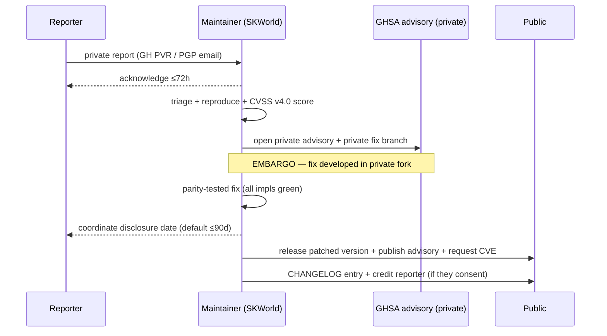

# SK Security Disclosure Standard

**Status:** Going-forward ecosystem standard for all `sk*` repos, **mandatory for
every crypto component**. Companion to
[`CRYPTOGRAPHY_STANDARD`](./CRYPTOGRAPHY_STANDARD.md),
[`TESTING_AND_CI_STANDARD`](./TESTING_AND_CI_STANDARD.md), and
[`SK_REPO_DOC_STANDARD`](./SK_REPO_DOC_STANDARD.md).

> One sentence: **we want to hear about vulnerabilities before attackers do, we tell
> the truth about what our crypto has and hasn't been through, and no advisory ever
> uses a word the evidence can't back — least of all "quantum-proof."**

**Standards anchor:** ISO/IEC 29147 (vuln disclosure) · ISO/IEC 30111 (handling
process) · CVSS v4.0 (severity) · GitHub Security Advisories (GHSA) + private
reporting. FIPS 203 (ML-KEM) / FIPS 204 (ML-DSA) for any PQ claim in an advisory.

---

## 1. Coordinated disclosure — contact & scope

Every `sk*` repo carries a `SECURITY.md` whose first job is to make **"how do I report
a problem privately?"** answerable in ten seconds.

### 1.1 Contact (required in every `SECURITY.md`)
- **Primary:** GitHub **private vulnerability reporting** for the repo
  (`Security ▸ Report a vulnerability`) — keeps the report, the fix, and the advisory
  in one place. **Enable it on every `sk*` repo.**
- **Secondary (out-of-band):** an email/contact for when GitHub is unavailable or the
  reporter prefers it, with a **PGP key fingerprint** for encrypting the report. The
  fingerprint is published in `SECURITY.md` and (per the
  [crypto standard](./CRYPTOGRAPHY_STANDARD.md)) is a sovereign
  capauth/`sk_pgp` identity — encrypt-capable, ideally with a PQC-composite subkey.
- **Acknowledge within 72 hours.** State this SLA in `SECURITY.md` so a reporter knows
  what silence does and doesn't mean.

### 1.2 Scope (required — say what's in and what's out)
- **In scope:** the code in this repo, its published artifacts (packages/images), and
  the crypto surfaces it owns.
- **Out of scope:** third-party dependencies (report upstream; we'll track and bump),
  issues already disclosed in `CHANGELOG`/advisories, and theoretical findings with no
  realisable impact on a supported config.
- **Supported versions:** a table of which versions get fixes (per
  [VERSION_LIFECYCLE](./VERSION_LIFECYCLE.md): Active v2 always; Legacy v1 = critical
  only; Incubating v3 = best-effort, **expected to break**).
- **Safe harbour:** good-faith research under coordinated disclosure will not be
  pursued — name it, so researchers act without fear. (Consistent with the sovereign
  research posture of this environment.)

---

## 2. The experimental / unaudited posture (MANDATORY for every crypto lib)

**Every `sk*` crypto component MUST state, prominently in its `README.md` and
`SECURITY.md`, that it is an experimental, self-built, reference implementation that
has not had an independent third-party security audit** (unless and until one is
commissioned, dated, and linked).

This is not modesty — it is **the honest-claims rule applied to assurance**. A passing
test suite ([TESTING_AND_CI_STANDARD](./TESTING_AND_CI_STANDARD.md)) proves *interop
and behavior*; it is **not** an audit and does not prove *absence of side-channels,
implementation flaws, or misuse-resistance*. Conflating the two is exactly the kind of
overclaim this ecosystem forbids.

**Required posture statement (paste, then tailor):**

> ⚠️ **Experimental — unaudited reference implementation.** This library is sovereign,
> self-built `sk*` software. It implements standards-based primitives (FIPS 203
> ML-KEM-768 / FIPS 204 ML-DSA-65, hybridised with X25519/Ed25519) but **has not
> undergone an independent third-party cryptographic audit**. Tests prove cross-impl
> interop and known-answer correctness, **not** the absence of side-channel or
> implementation vulnerabilities. Use it knowing that. Do not represent it as
> "audited," "production-hardened," or "quantum-proof."

State the **maturity tier** (T0–T4, [crypto standard §maturity tiers](./CRYPTOGRAPHY_STANDARD.md#maturity-tiers-self-assessment-for-any-component))
right beside it — tier is *posture*, not *assurance*; a T2 hybrid-KEM lib is still
unaudited.

---

## 3. Embargo & advisory process

Coordinated disclosure, ISO 29147/30111-shaped:

**Rules:**
- **Embargo by default** until a fix ships. Develop the fix in a **private** GHSA fork,
  not an open PR that telegraphs the bug.
- **Disclosure timeline:** target **≤90 days** from report to public advisory; sooner
  if a fix is ready, longer only by mutual agreement. **Active exploitation collapses
  the embargo** — protecting users beats a tidy timeline.
- **The fix is parity-tested before release** — a security patch to a multi-impl
  primitive lands with the cross-impl KAT/parity gate green
  ([TESTING_AND_CI_STANDARD §2](./TESTING_AND_CI_STANDARD.md)), and where possible a
  **regression test reproducing the vuln** is added (red → green).
- **Advisory contents:** affected versions, CVSS v4.0 vector + score, impact, the
  **exact surface** affected (per the data-flow diagram), remediation/upgrade path,
  workarounds, credit. Publish as a **GHSA**, request a **CVE**, and add a dated
  `CHANGELOG`/`SECURITY.md` entry.
- **Credit** the reporter by default (with consent); never retaliate against
  good-faith research.

---

## 4. The honest-claims gate for advisories (never "quantum-proof")

An advisory is a public security claim, so it carries the **same evidence bar** as the
rest of the ecosystem ([crypto standard, honest-claim rules](./CRYPTOGRAPHY_STANDARD.md#honest-claim-rules-ecosystem-wide)).
Before publishing, every advisory and `SECURITY.md` claim MUST pass:

- **Forbidden words — never appear in an advisory or fix note:**
  - ❌ "quantum-proof" / "unbreakable" / "quantum-safe" / "NSA-proof" / "uncrackable."
    Say **"post-quantum"** / **"quantum-resistant"** and **scope it to the surface**.
  - ❌ "fully audited" / "production-grade security guarantee" — not while §2 holds.
  - ❌ "this fix makes X end-to-end quantum-resistant" if any leg stays classical
    (CF→origin, tailnet Noise, LiveKit DTLS, a PGPy-signed payload). Name the residual.
- **Hybrid means either-leg, and say so.** A hybrid KEM/sig is secure if **either**
  X25519/Ed25519 **or** ML-KEM-768/ML-DSA-65 holds — that is the actual property. An
  advisory about a classical-leg weakness must explain that the hybrid construction
  *contains* the blast radius (PQ leg still stands) rather than implying total
  compromise — and vice-versa. **Cite FIPS 203 / FIPS 204** for the PQ legs.
- **Severity is evidence-backed:** the CVSS v4.0 vector is shown, not just a word. A
  finding with no realisable impact on a supported config is scored as such — don't
  inflate to look diligent, don't deflate to look clean.
- **"Fixed" requires a test.** An advisory may say "patched in vX.Y.Z" only when a
  regression test proving the fix is green in CI — link it. ("Verified" = *a named
  test ran and passed*, per [TESTING_AND_CI_STANDARD §5](./TESTING_AND_CI_STANDARD.md).)
- **The unaudited posture (§2) survives the fix.** Patching one bug does not make the
  library "audited" or "hardened." Don't let an advisory quietly upgrade the assurance
  claim.

> The reflex: an advisory should *reduce* a reader's uncertainty about exactly what is
> and isn't safe. Any sentence that makes them feel *more* secure than the evidence
> warrants is the bug.

---

## 5. Per-repo compliance checklist

- [ ] GitHub **private vulnerability reporting** enabled.
- [ ] `SECURITY.md` has: contact (GH PVR + PGP-fingerprinted email), **72h ack SLA**,
      in/out scope, supported-versions table, safe-harbour line.
- [ ] **Experimental / unaudited reference-impl** statement in `README.md` **and**
      `SECURITY.md` (crypto components), beside the T0–T4 tier.
- [ ] Embargo + **≤90d** coordinated-disclosure process documented; fixes developed in
      a private GHSA fork.
- [ ] Advisory template enforces CVSS v4.0 vector, affected surface, remediation,
      credit; published as GHSA + CVE requested.
- [ ] Security fixes ship **parity-tested** with a **regression test** for the vuln.
- [ ] No forbidden word ("quantum-proof"/"unbreakable"/"fully audited"/…) in any
      advisory; every PQ claim cites FIPS 203/204 and is scoped to a surface.

---

## Related standards

- [CRYPTOGRAPHY_STANDARD](./CRYPTOGRAPHY_STANDARD.md) — the honest-claim rules and suites an advisory must respect.
- [TESTING_AND_CI_STANDARD](./TESTING_AND_CI_STANDARD.md) — "fixed" needs a green regression test; an audit is **not** a test suite.
- [SK_REPO_DOC_STANDARD](./SK_REPO_DOC_STANDARD.md) — `SECURITY.md` is part of the required doc set.
- [VERSION_LIFECYCLE](./VERSION_LIFECYCLE.md) — which versions get security fixes.

---

*License: Apache-2.0. Part of [sk-standards](../README.md); the skstacks copies carry a
"canonical home" pointer back here.*
