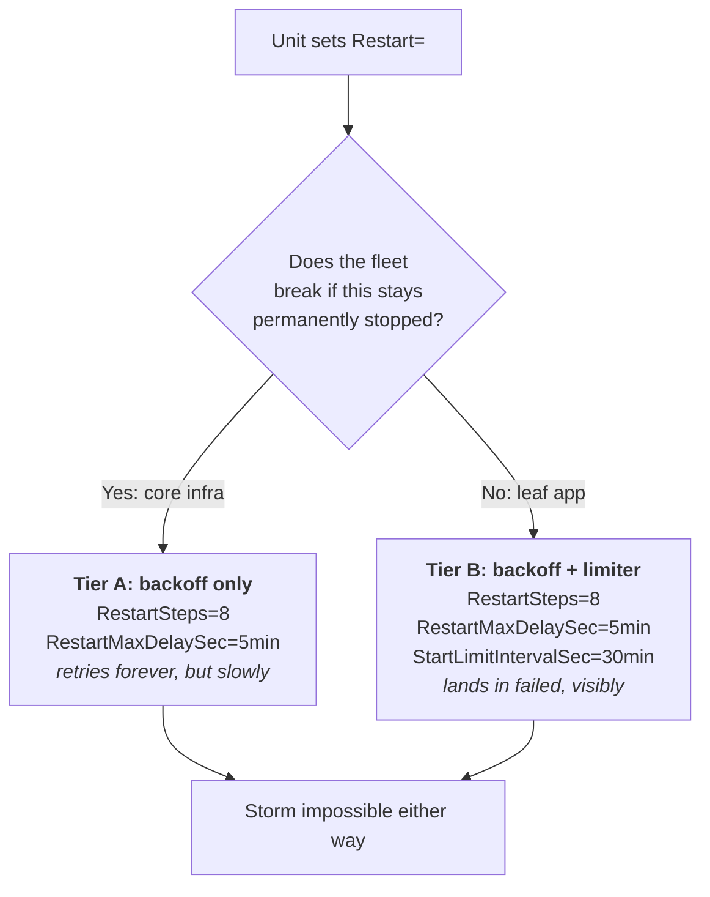

# Service Unit Standard

How every `sk*` node authors a **systemd unit for a long-running service**, so
that a permanently-broken service degrades quietly instead of hammering the host
until something else falls over.

The governing principle: **a service that cannot start must eventually stop
trying.** Retry is how we survive a transient fault; unbounded retry at a fixed
interval is a denial-of-service we ship against ourselves. A unit that restarts
forever is not resilient, it is a load generator with a `[Unit]` section.

This standard governs **long-running services** (`Restart=` set). Scheduled work
(cron, timers) is governed by
[OBSERVABILITY_AND_SCHEDULING_STANDARD](./OBSERVABILITY_AND_SCHEDULING_STANDARD.md).

Reference implementation: the `.100` remediation under problem `prb-bd79dd5f`
(drop-ins named `restart-storm.conf`), and the validator
[`scripts/audit-service-units.sh`](../scripts/audit-service-units.sh).

---

## 1. The limiter rule (the trap this standard exists to close)

systemd's start limiter engages **only** when the burst can physically occur
inside the window:

> **`RestartSec x (StartLimitBurst - 1)` MUST be `< StartLimitIntervalSec`.**

Defaults are `StartLimitBurst=5` and `StartLimitIntervalSec=10s`, which means
**any `RestartSec` of 2.5s or more silently disables the limiter.** The unit does
not fail. It does not alert. It restarts forever at a fixed interval, and the
only symptom is load.

| `RestartSec` | Burst | Interval | Span needed | Limiter engages? |
|---|---|---|---|---|
| `100ms` | 5 | `10s` | 0.4s | yes |
| `2s` | 3 | `1min` | 4s | yes |
| `3s` | 5 | `10s` | 12s | **no** |
| `5s` | 5 | `10s` | 20s | **no** |
| `10s` | 5 | `10s` | 40s | **no** |

Setting `RestartSec` without also setting `StartLimitIntervalSec` is a defect,
reviewed like a missing timeout. **Every unit that sets `RestartSec` MUST set a
`StartLimitIntervalSec` consistent with the rule above, or set backoff (§2).**

## 2. Two-tier restart policy

Do not apply one policy to everything. "Give up after 5 tries" is correct for a
leaf app and catastrophic for the node's inference engine, where it converts a
recoverable blip into a permanent outage.

Pick the tier from **what happens when this unit stays down**:



**Tier A, backoff only.** Core infra (container runtimes, inference servers,
embedding servers, node daemons). Exponential backoff caps the storm at roughly
12 attempts/hour instead of 8,640/day, while still retrying forever so a
transient fault always self-heals unattended. It never gains a new way to die
permanently.

```ini
[Service]
RestartSteps=8
RestartMaxDelaySec=5min
```

**Tier B, backoff + limiter.** Leaf apps and optional services. Same backoff,
plus a window wide enough that the limiter actually engages, so a genuinely
permanent fault lands in `failed` where monitoring can see it.

```ini
[Service]
RestartSteps=8
RestartMaxDelaySec=5min

[Unit]
StartLimitIntervalSec=30min
StartLimitBurst=5
```

`RestartSteps` and `RestartMaxDelaySec` require **systemd 254+**. On older
systemd, Tier A is not expressible: use Tier B, or raise `RestartSec` so the
fixed-interval storm is tolerable, and say which in the unit's comment.

## 3. ExecStart durability

The storm needs a permanent failure to feed on, and in practice that is almost
always `status=203/EXEC`: the interpreter moved and the unit did not.

- **One unit per service.** When a service's environment relocates, repoint or
  delete **every** unit that references it. A stale *enabled* unit pointing at a
  deleted path is the exact shape that has caused this outage twice. Check both
  scopes: `systemctl list-unit-files` **and** `systemctl --user list-unit-files`.
- **`ExecStart` is an absolute path**, and the interpreter it names is part of
  the service's contract. Moving a venv is a unit change, not just a filesystem
  change.
- If a unit depends on a mount, declare it (`RequiresMountsFor=`) so it waits
  rather than thrashing while the mount is absent.
- A unit that has been disabled because it is dead should be **deleted**, not
  left disabled-and-forgotten. Record the removal in the SOP.

## 4. Recovery scripts must be able to recover

Any watchdog or auto-heal script that **stops, kills, or restarts** a service or
VM MUST obey:

1. **Never take a destructive action you have not proven you can undo.** Preflight
   the restore tool first and abort loudly if it fails. A watchdog that can only
   kill is strictly worse than no watchdog: it converts a hang into a hard outage.
2. **Set `PATH` explicitly.** Cron runs with `PATH=/usr/bin:/bin`, which excludes
   `/usr/sbin`. Shell builtins (`kill`) keep working while every external tool
   returns `127`, which is precisely how a watchdog ends up able to kill but not
   restart. Prefer absolute paths for privileged tools.
3. **Log every outcome with its return code**, and verify recovery actually
   happened rather than assuming the restart worked.
4. **Preserve the evidence.** Capture the guest/service diagnostic state *before*
   the destructive step. Persistent journald (`/var/log/journal`) is what makes
   the pre-crash record survive a `SIGKILL`; without it a recovery destroys the
   only witness and the underlying fault stays un-root-caused forever.

## 5. Validation

`scripts/audit-service-units.sh` enumerates enabled units in both scopes and
flags any where the limiter can never engage **and** no backoff is configured.
Run it on every node; exit code is non-zero when exposed units remain.

**Audit both scopes or say you did not.** Most SK units are **user** units, and
cron/systemd start with no `XDG_RUNTIME_DIR`, so a naively scheduled audit sees
only system units and still prints a green summary. The validator therefore
derives `XDG_RUNTIME_DIR`, verifies the user manager is actually reachable, and
**fails loudly rather than reporting clean on a partial sweep**; pass
`--system-only` to declare a node that genuinely has no user scope. Schedule it
under the observability wrapper (`sk-cron-run`) so a non-zero exit becomes a GTD
item plus an alert, per
[OBSERVABILITY_AND_SCHEDULING_STANDARD](./OBSERVABILITY_AND_SCHEDULING_STANDARD.md).
Without a scheduled gate the fleet is only known-clean on the day someone looks.

Verify empirically, not by reading config back. A deliberately broken unit
(`ExecStart=/nonexistent/x`) MUST be observed backing off and then, for Tier B,
landing in `failed`. Config strings are a claim; the journal is the evidence.

---

## Compliance line (put in your SOP + README)

> **Service units:** every unit setting `RestartSec` satisfies
> `RestartSec x (Burst-1) < StartLimitIntervalSec` or sets backoff; tier chosen by
> blast radius (A: backoff only, B: backoff + limiter); no stale units referencing
> moved paths; `audit-service-units.sh` clean. Conforms to
> [SERVICE_UNIT_STANDARD](https://github.com/smilinTux/sk-standards/blob/main/standards/SERVICE_UNIT_STANDARD.md).

Not applicable (`N/A: <reason>`) only for repos that ship **no systemd units**.
