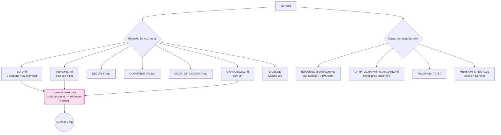

# SK Repo Documentation / SOP Standard (CANONICAL)

**Status:** Going-forward ecosystem standard. The bar **every** `sk*` repo MUST meet.
**Pattern source (ground truth):** [`v2/apps/skpayment/SOP.md`](../v2/apps/skpayment/SOP.md)
(canonical SOP shape) · [`docs/CRYPTOGRAPHY_STANDARD.md`](./CRYPTOGRAPHY_STANDARD.md)
(crypto bar + honest-claim rules + maturity tiers) · [`docs/VERSION_LIFECYCLE.md`](./VERSION_LIFECYCLE.md)
(v1/v2/v3/shared phases).
**Applies to:** all `sk*` repos — services, apps, and libraries (`sk_pqc`, `sk_pgp`, …).

> One sentence: **a repo is not "done" until its docs let a stranger build, test,
> deploy, and reason about it — and every external claim it makes is backed by
> evidence in those same docs.**

---

## 1. The required doc set (every `sk*` repo)

| File | Required | Purpose |
|---|:---:|---|
| `README.md` | ✅ all | What it is, quickstart, links into the rest. First 5 lines must state purpose + maturity tier. |
| `SOP.md` | ✅ all | Operational source of truth. **MUST contain ≥1 mermaid Architecture diagram.** Section template in §2. |
| `SECURITY.md` | ✅ all | Threat model summary, reporting channel, secret-handling, dependency posture. |
| `CONTRIBUTING.md` | ✅ all | Branch model, commit convention (`Co-Authored-By` trailer), test gate, review path. |
| `CODE_OF_CONDUCT.md` | ✅ all | Behavioral baseline. Contributor Covenant-class. |
| `CHANGELOG.md` | ✅ all | Keep-a-Changelog format, SemVer headers, dated. Every release adds an entry. |
| `LICENSE` | ✅ all | **Apache-2.0** for new/library `sk*` repos. (Note: some legacy repos carry AGPL-3 — do not relicense without owner sign-off; record the actual license here.) |

### Crypto components — additional MANDATORY docs

A repo is a **crypto component** if it generates, exchanges, signs, verifies, wraps,
or stores key material (e.g. `sk_pqc`, `sk_pgp`, `capauth`, `skchat`, `skcomms`,
`sksecurity`). These repos additionally require:

| File / field | Requirement |
|---|---|
| Crypto doc (`docs/crypto-architecture.md` or `docs/CRYPTO_SPEC.md`) | Per-surface inventory: which KEM / signature / cipher each channel uses, hybrid-vs-classical, citing FIPS 203/204/205. Per [CRYPTOGRAPHY_STANDARD.md §"Reference: per-component crypto views"](./CRYPTOGRAPHY_STANDARD.md). |
| **CRYPTOGRAPHY_STANDARD.md compliance statement** | An explicit line in `SOP.md` and `SECURITY.md` asserting conformance (suite-ids, suite registry, backend ABC, self-report, hybrid combiner `HKDF(X25519 ‖ MLKEM768)` — never XOR, never pure-PQ). |
| **Stated maturity tier (T0–T4)** | Declared in `README.md` header **and** the SOP `Maturity-tier` section. Definitions in §4. |
| **VERSION_LIFECYCLE compliance** | State the phase (Legacy v1 / Active v2 / Incubating v3 / Shared) and the SemVer line per [VERSION_LIFECYCLE.md](./VERSION_LIFECYCLE.md). |
| **Self-report / claim evidence** | The component MUST be able to report negotiated primitives per live channel (e.g. `... status` / `doctor`). This is what makes every public claim evidence-backed. |

### 1.5 The README is the hub — and the repos cross-link (the click-through web)

`README.md` is the **front door**: it is the *one* doc a reader (human or AI) is
guaranteed to open, so **everything links off it** — the SOP, the crypto doc, the
standards, and the *neighbouring projects*. A repo that doesn't link out is a dead
end; a repo that links out well lets someone **learn the whole system by wandering**
(à la a hyperlinked wiki).

Every `README.md` MUST end with a **`## Related projects / See also`** section that
cross-links the `sk*` repos this one relates to, each with a one-line "why":

- **Depends on** (upstream) — what this repo consumes.
- **Used by** (downstream) — what consumes this repo.
- **Siblings** — peer components in the same subsystem.
- **Standards** — a link to [`sk-standards`](https://github.com/smilinTux/sk-standards)
  (this doc + the crypto / data-flow / version standards).

Use full `https://github.com/smilinTux/<repo>` URLs so links resolve on GitHub **and**
on rendered sites. Keep it honest and current — a stale "See also" is reviewed like
broken code. Example:

```markdown
## Related projects / See also
- ⬆️ **Depends on:** [sequoia-pgp](…) — the PQC OpenPGP engine `sk_pgp` binds.
- ⬇️ **Used by:** [capauth](https://github.com/smilinTux/capauth) — issues the PQC signing root via `sk_pgp`.
- ↔️ **Sibling:** [sk_pqc](https://github.com/smilinTux/sk-pqc-dart) — the Dart hybrid-KEM companion.
- 📐 **Standards:** [sk-standards](https://github.com/smilinTux/sk-standards) — crypto, data-flow, version, doc/SOP.
```

The `sk-standards` repo carries the **project graph** (a mermaid map of how the `sk*`
repos connect) as the master index everyone can link back to.

---

## 2. `SOP.md` section template (REQUIRED order)

Mirror [`skpayment/SOP.md`](../v2/apps/skpayment/SOP.md) (and the `skaid` SOP shape).
Every section below is required; omit only with an explicit `N/A — <reason>` line.

```
# <Repo> — Standard Operating Procedures

<1-3 line overview: what it is, primary standard/protocol, who calls it>

## 1. Overview
   Purpose, scope, what it owns, what it explicitly does NOT do.

## 2. Architecture        ← MUST contain ≥1 mermaid diagram (see §3)
   System diagram + data/auth flows. Bind-mounts, ports, dependencies.

## 3. Build
   Toolchain, deps, how to produce the artifact locally + in CI.

## 4. Test
   How to run unit/integration/e2e; the green-bar gate that blocks release.

## 5. Release / Deploy
   Services → docker stack / k3d / VM deploy + redeploy + rollback.
   Libraries → "Build + publish" (pub.dev / PyPI), version bump, tag, changelog.

## 6. Configuration / Usage
   Config files, env vars, secrets sourcing (never inline a live secret),
   per-consumer setup. Public-exposure rules if any.

## 7. API / Reference
   Endpoints / CLI / public symbols with request/response or signatures.

## 8. Troubleshooting
   Symptom → Check table (mirror skpayment's table form).

## 9. Maturity-tier + Version reference
   Stated T0–T4 tier (crypto) + VERSION_LIFECYCLE phase + current SemVer +
   CRYPTOGRAPHY_STANDARD compliance line (crypto components).
```

---

## 3. Mermaid convention (MANDATORY)

- **Every repo's `SOP.md` MUST include at least one architecture mermaid diagram**
  in the Architecture section. A fenced ASCII box (as skpayment uses for some flows)
  is acceptable for *secondary* flows, but the primary architecture view must be a
  real ```` ```mermaid ```` block so it renders on the docs sites.
- Add **flow diagrams** (`flowchart`/`sequenceDiagram`) wherever a multi-step path
  exists (payment/auth/handshake/deploy) — see skpayment's Stripe-setup `flowchart TD`.
- Keep node labels to the real component names (services, ports, bind-mounts) so the
  diagram doubles as an operational map, not decoration.

---

## 4. Maturity tiers (T0–T4) — crypto self-assessment

Authoritative definitions live in
[CRYPTOGRAPHY_STANDARD.md §"Maturity tiers"](./CRYPTOGRAPHY_STANDARD.md). Summary:

| Tier | Meaning |
|---|---|
| **T0 — Classical** | Asymmetric crypto classical (X25519/Ed25519/RSA); symmetric AES-256/SHA-2. |
| **T1 — Agile** | Suite-ids on all containers + suite registry + backend ABC + self-report. |
| **T2 — Hybrid KEM** | Key exchange/wrap/at-rest use `HKDF(X25519 ‖ MLKEM768)`. HNDL neutralised. |
| **T3 — Hybrid sig** | Signatures ML-DSA-65 + Ed25519 (additive); root may add SLH-DSA. |
| **T4 — Transport closed** | Edge-to-origin TLS hybrid; residual classical legs documented. |

**Minimal viable PQ posture = T1 + T2.** Non-crypto repos state `T0 — N/A (no key material)`.

---

## 5. The honest-claims gate (a release/doc MUST pass it)

Rooted in [CRYPTOGRAPHY_STANDARD.md §"Honest-claim rules"](./CRYPTOGRAPHY_STANDARD.md)
and the `honest-discernment` posture: **no claim without evidence; scope every claim
to the exact surface.** A release or doc fails the gate if any of these is true:

- ❌ A capability/security claim has **no evidence** in-repo (no self-report, test, or
  cited spec backing it).
- ❌ A claim is **not scoped to a surface** — e.g. "end-to-end quantum-resistant" while
  any leg (CF→origin, tailnet, LiveKit DTLS, PGPy payload) is classical.
- ❌ Forbidden crypto words: "quantum-proof" / "unbreakable" / "quantum-safe" /
  "CNSA 2.0 compliant" / "FIPS 206 / Falcon" / implying AES-256 is quantum-broken.
  Say **"quantum-resistant" / "post-quantum"** and cite the FIPS number + hybrid-vs-classical.
- ❌ "PQC" used when only signatures migrated (does nothing for HNDL).
- ❌ `README`/`CHANGELOG` asserts a state (LIVE, T2, "deployed") not reproducible from
  the SOP's Build/Test/Deploy sections.

**Gate procedure:** before tagging a release or merging docs, walk every external-facing
claim and confirm a backing artifact (self-report command output, test name, cited spec,
or deploy log). If it can't be shown, it can't be claimed — soften or delete it.

---

## 6. Per-repo compliance CHECKLIST

Copy into the PR description / release checklist:

```
Doc set
[ ] README.md          — purpose + maturity tier in first 5 lines
[ ] SOP.md             — all 9 sections present (or N/A w/ reason)
[ ] SOP Architecture   — ≥1 ```mermaid``` diagram renders
[ ] SECURITY.md        — threat model + reporting + secret handling
[ ] CONTRIBUTING.md    — branch/commit/test/review path
[ ] CODE_OF_CONDUCT.md — present
[ ] CHANGELOG.md       — Keep-a-Changelog + SemVer + dated entry for this release
[ ] LICENSE            — Apache-2.0 (or recorded legacy license)

Crypto components (skip if no key material)
[ ] docs/crypto-architecture.md (or CRYPTO_SPEC.md) — per-surface inventory + FIPS cites
[ ] CRYPTOGRAPHY_STANDARD.md compliance line in SOP + SECURITY
[ ] Stated maturity tier T0–T4 in README + SOP
[ ] VERSION_LIFECYCLE phase + SemVer stated
[ ] Self-report command exists and is referenced

Honest-claims gate
[ ] Every external claim is surface-scoped + evidence-backed
[ ] No forbidden words; "PQC" not misused; AES-256 not called broken
[ ] All LIVE/tier/deploy claims reproducible from SOP Build/Test/Deploy
```

---

## 7. Rollout note

This standard applies to **all `sk*` repos**. Services follow §2's Release/Deploy as a
**deploy** section (docker stack / k3d / VM, mirroring skpayment). **Libraries**
(`sk_pqc`, `sk_pgp`, …) adapt §5 of the SOP template to **"Build + publish"** —
the Release/Deploy section describes building the artifact and publishing to
**pub.dev** (Dart) or **PyPI** (Python): version bump → tag → `CHANGELOG` entry →
publish → verify the published version. Everything else (mermaid Architecture,
honest-claims gate, maturity tier for crypto libs, checklist) is identical.

Adopt incrementally: new repos comply at creation; existing repos add the missing
files on their next release. Crypto repos additionally migrate under epic
`PQC-MIGRATION` (coord `e1d6ba2a`).

---

## 8. The standard itself (required-files tree)


