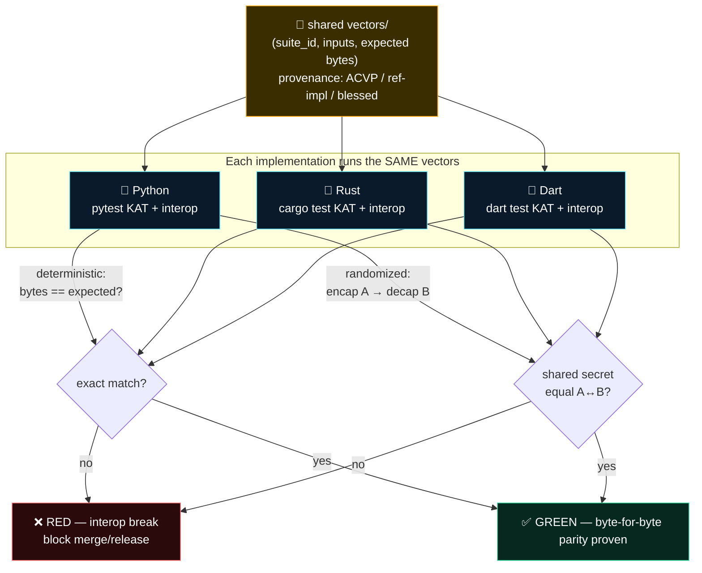

# SK Testing & CI Standard

**Status:** Going-forward ecosystem standard for all `sk*` repos. Companion to
[`SK_REPO_DOC_STANDARD`](./SK_REPO_DOC_STANDARD.md),
[`CRYPTOGRAPHY_STANDARD`](./CRYPTOGRAPHY_STANDARD.md), and
[`ARCHITECTURE_AND_DATAFLOW_STANDARD`](./ARCHITECTURE_AND_DATAFLOW_STANDARD.md).

> One sentence: **tests are the evidence behind every claim a repo makes — a green
> bar is the only thing that earns the words "it works," and three implementations
> of the same crypto are only "the same" if they agree byte-for-byte.**

**Why:** Across the `sk*` ecosystem the *same* primitive is implemented in more than
one language — `sk_pqc` exists in Python, Rust, and Dart; envelopes are signed in
Python and verified in Dart; at-rest blobs are written by one impl and opened by
another. "Compatible" is not a vibe — it is a **test that pins the wire bytes** and
runs all impls against the same vectors. This standard says how we prove it.

---

## 1. TDD is the default (where there's logic)

Write the failing test **first**, watch it fail for the right reason, then write the
code that makes it pass. This is not ceremony — a test you write *after* the code is
a test shaped to the code's bugs.

**TDD applies to anything with logic:** codecs, parsers, key derivation, suite
negotiation, state machines, framing, serialization, signature verification, access
checks. The test exists before the implementation.

**TDD does not apply to** glue with no branching: a one-line config passthrough, a
generated DTO, a `__repr__`. Don't write a test that only restates the assignment.
Use judgement — the question is "does this contain a decision that could be wrong?"

**The discipline, concretely:**
1. **Red** — write the test, run it, confirm it fails *because the behavior is
   missing* (not because of a typo/import error).
2. **Green** — minimum code to pass. No extra.
3. **Refactor** — clean up with the test holding you safe.

Tests live next to the code they cover (`tests/`, `test/`, `*_test.dart`, `#[cfg(test)]`)
and the suite name is obvious from the module name.

---

## 2. Cross-impl KAT & parity gates (the load-bearing rule)

Any primitive that exists in more than one language **MUST** share a single set of
**Known-Answer Tests (KATs)** — fixed input → fixed expected output bytes — that
**every** implementation runs and passes. Python, Rust, and Dart must agree
**byte-for-byte** on the wire.

### 2.1 Shared vectors are the contract
- KAT vectors live in **one** canonical, language-neutral place — a `vectors/` dir of
  JSON/hex files in the primitive's home repo (e.g. `sk-pqc-*/vectors/`), or a pinned
  shared repo. Hex/base64 in, hex/base64 out. **No impl owns its own private copy.**
- Each vector file records: `suite_id`, the inputs, the expected outputs, and a
  one-line provenance note (where the expected bytes came from — a NIST ACVP/CAVP
  vector, the reference impl, or a frozen first-impl output blessed by review).
- Where an upstream standard ships official vectors (FIPS 203 ML-KEM, FIPS 204 ML-DSA
  ACVP vectors), **use those** as the root of trust and cite them. A self-generated
  vector is weaker evidence — mark it as such.

### 2.2 What "parity" means per primitive
- **Deterministic functions** (KDF, hash, encode/decode, signature *verify*, AEAD with
  fixed nonce): assert exact output bytes equal the vector. Trivial to pin.
- **Randomized functions** (KEM encapsulate, KEM/sig keygen, sig *sign*): you can't pin
  the random output, so pin the **round-trip / interop** instead:
  - **encap in impl A → decap in impl B yields the same shared secret**, for every
    ordered pair of impls (A→B and B→A).
  - **sign in impl A → verify in impl B == accept**; **tamper one byte → reject**, for
    every pair.
  - decap/verify of a **frozen KAT ciphertext/signature** (produced once, committed)
    must reproduce the pinned shared-secret / accept verdict in every impl.
- **The hybrid combiner is a KAT, not a round-trip.** `HKDF-SHA256(X25519_ss ‖
  ML-KEM-768_ss, info)` is deterministic given both shared secrets — pin its output
  bytes across all impls. Per the [crypto standard](./CRYPTOGRAPHY_STANDARD.md):
  concatenate-then-KDF, never XOR. A combiner mismatch is a silent interop break, so
  it gets an exact-bytes vector.

### 2.3 The parity gate flow



A parity failure is **never** "flaky" — it is two impls disagreeing about the wire,
which means one of them is wrong. It blocks the merge.

---

## 3. The green-bar release gate

**No release ships on a red or skipped bar.** A version is taggable only when:

1. **All tests pass** on every supported impl/platform in the matrix (§4) — no
   `xfail`, no `@skip`, no commented-out test standing in for a fixed bug.
2. **Cross-impl parity passes** for every shared primitive (§2). One language green is
   not "green."
3. **The crypto self-report matches reality** — if `SECURITY.md`/`SOP.md` claims a
   surface is hybrid-pq, a test exercises that surface and the
   [self-report](./CRYPTOGRAPHY_STANDARD.md#5-self-report-claim-evidence-mandatory)
   confirms the negotiated suite. The doc and the code agree.
4. **Coverage didn't fall** on the logic-bearing modules (track it; a hard % is less
   important than "new logic arrived with new tests").
5. **The CHANGELOG entry** names what was tested.

The release notes may only claim what the green bar covers. "Verified" means *a named
test ran and passed in CI* — link it. See
[`verification-before-completion`] discipline: evidence before assertions, always.

---

## 4. GHA test-matrix sketch

Every repo's CI runs the **full** matrix on PR and on `main`. Sketch (adapt
language/versions per repo; the *shape* is the standard):

```yaml
# .github/workflows/ci.yml
name: ci
on:
  pull_request:
  push: { branches: [main] }

jobs:
  test:
    strategy:
      fail-fast: false          # one impl's red must not hide another's
      matrix:
        include:
          - { impl: python, ver: "3.12", os: ubuntu-latest }
          - { impl: python, ver: "3.13", os: ubuntu-latest }
          - { impl: rust,   ver: stable, os: ubuntu-latest }
          - { impl: rust,   ver: stable, os: macos-latest }   # FFI / native binary
          - { impl: dart,   ver: stable, os: ubuntu-latest }
    runs-on: ${{ matrix.os }}
    steps:
      - uses: actions/checkout@v4
      - name: Run unit + KAT tests
        run: ./ci/test.sh ${{ matrix.impl }}     # pytest / cargo test / dart test

  parity:                       # the cross-impl gate — runs all three, compares bytes
    needs: test
    runs-on: ubuntu-latest
    steps:
      - uses: actions/checkout@v4
      - name: Cross-impl KAT + round-trip parity
        run: ./ci/parity.sh     # encap(py)->decap(rs/dart); combiner exact-bytes; sig A->verify B
```

Conventions:
- **`fail-fast: false`** — surface *every* impl's failures in one run, never mask one
  red behind another.
- **`parity` depends on `test`** and is its own required check — green units do not
  imply byte parity.
- **Branch protection** marks `test (*)` **and** `parity` as required status checks.
  The green bar is enforced by the platform, not by good intentions.
- Native/FFI impls (liboqs, PyO3→Sequoia, Flutter FFI) build their binary **in CI per
  platform** — never assume a dev machine's local lib. (Per the crypto standard's
  browser/Flutter constraint: a web leg that can't run native PQ gets a *disclosed*
  reduced-assurance test, not a faked-green one.)

---

## 5. Tests are evidence — the honest gate

This standard is the testing arm of the ecosystem honesty rule
([CRYPTOGRAPHY_STANDARD §honest-claim rules](./CRYPTOGRAPHY_STANDARD.md#honest-claim-rules-ecosystem-wide)):

- **A claim with no test is a hope.** "DMs are encrypted at rest" is true when a test
  writes a DM, reads the raw store, and asserts the plaintext is absent. Otherwise it's
  marketing.
- **"It works" requires a named, passing test** — in the PR or release notes, link it.
  Do not say "verified" for something you reasoned about but didn't run.
- **Map claims → tests.** Crypto components keep a short claim-to-test table (claim →
  the test id that proves it) so a reviewer can audit "what evidence backs this?" at a
  glance. The data-flow diagram's crypto annotations
  ([architecture standard](./ARCHITECTURE_AND_DATAFLOW_STANDARD.md)) each correspond to
  a test that proves that hop is the colour it's painted.
- **A failing test that's "known broken" is deleted or fixed, never silenced.** A
  skipped test is a lie the next reader believes.
- **Never overclaim from a partial pass.** Green on Python alone is not "cross-platform
  verified." Hybrid passing is not "quantum-proof" — that word is forbidden everywhere
  (say **post-quantum** / **quantum-resistant**); a hybrid test proves the
  [either-leg](./CRYPTOGRAPHY_STANDARD.md) property (secure if *either* X25519 *or*
  ML-KEM-768 holds), nothing more.

---

## 6. Per-repo compliance checklist

- [ ] Logic-bearing code arrived **test-first** (red → green → refactor).
- [ ] Tests live next to the code and run with one command (`ci/test.sh <impl>`).
- [ ] Every multi-language primitive shares **one** `vectors/` set; all impls pass it.
- [ ] Randomized primitives have **A→B round-trip / interop** tests for every impl pair.
- [ ] The hybrid combiner has an **exact-bytes KAT** shared across impls.
- [ ] CI matrix covers every supported impl × platform with **`fail-fast: false`**.
- [ ] `parity` is a **required** status check, separate from `test`.
- [ ] Crypto claims have a **claim → test** mapping; the self-report is exercised.
- [ ] No `skip`/`xfail` standing in for an unfixed bug at release.
- [ ] Release notes claim only what the green bar covers, and **link** the evidence.

---

## Related standards

- [CRYPTOGRAPHY_STANDARD](./CRYPTOGRAPHY_STANDARD.md) — the suites/combiner these KATs pin, and the honest-claim rules tests enforce.
- [SECURITY_DISCLOSURE_STANDARD](./SECURITY_DISCLOSURE_STANDARD.md) — the experimental/unaudited posture every crypto lib states (a green bar is **not** an audit).
- [SK_REPO_DOC_STANDARD](./SK_REPO_DOC_STANDARD.md) — `CONTRIBUTING.md` declares the test gate; the README links here.
- [ARCHITECTURE_AND_DATAFLOW_STANDARD](./ARCHITECTURE_AND_DATAFLOW_STANDARD.md) — each crypto-annotated hop maps to a test that proves it.

---

*License: Apache-2.0. Part of [sk-standards](../README.md); the skstacks copies carry a
"canonical home" pointer back here.*
