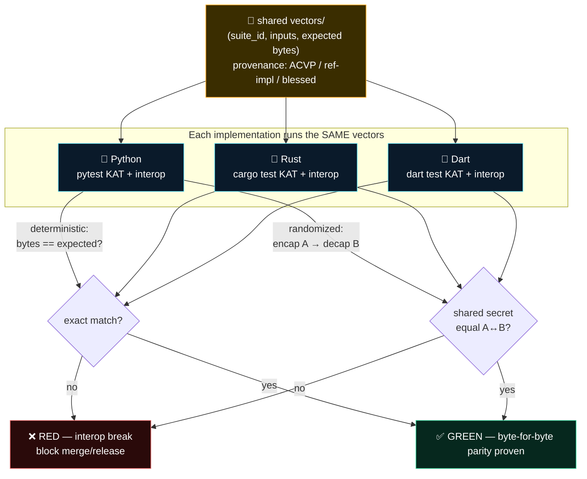

# SK Testing & CI Standard

**Status:** Going-forward ecosystem standard for all `sk*` repos. Companion to
[`SK_REPO_DOC_STANDARD`](./SK_REPO_DOC_STANDARD.md),
[`CRYPTOGRAPHY_STANDARD`](./CRYPTOGRAPHY_STANDARD.md), and
[`ARCHITECTURE_AND_DATAFLOW_STANDARD`](./ARCHITECTURE_AND_DATAFLOW_STANDARD.md).

> One sentence: **tests are the evidence behind every claim a repo makes — a green
> bar is the only thing that earns the words "it works," and three implementations
> of the same crypto are only "the same" if they agree byte-for-byte.**

**Why:** Across the `sk*` ecosystem the *same* primitive is implemented in more than
one language — `sk_pqc` exists in Python, Rust, and Dart; envelopes are signed in
Python and verified in Dart; at-rest blobs are written by one impl and opened by
another. "Compatible" is not a vibe — it is a **test that pins the wire bytes** and
runs all impls against the same vectors. This standard says how we prove it.

---

## 1. TDD is the default (where there's logic)

Write the failing test **first**, watch it fail for the right reason, then write the
code that makes it pass. This is not ceremony — a test you write *after* the code is
a test shaped to the code's bugs.

**TDD applies to anything with logic:** codecs, parsers, key derivation, suite
negotiation, state machines, framing, serialization, signature verification, access
checks. The test exists before the implementation.

**TDD does not apply to** glue with no branching: a one-line config passthrough, a
generated DTO, a `__repr__`. Don't write a test that only restates the assignment.
Use judgement — the question is "does this contain a decision that could be wrong?"

**The discipline, concretely:**
1. **Red** — write the test, run it, confirm it fails *because the behavior is
   missing* (not because of a typo/import error).
2. **Green** — minimum code to pass. No extra.
3. **Refactor** — clean up with the test holding you safe.

Tests live next to the code they cover (`tests/`, `test/`, `*_test.dart`, `#[cfg(test)]`)
and the suite name is obvious from the module name.

---

## 2. Cross-impl KAT & parity gates (the load-bearing rule)

Any primitive that exists in more than one language **MUST** share a single set of
**Known-Answer Tests (KATs)** — fixed input → fixed expected output bytes — that
**every** implementation runs and passes. Python, Rust, and Dart must agree
**byte-for-byte** on the wire.

### 2.1 Shared vectors are the contract
- KAT vectors live in **one** canonical, language-neutral place — a `vectors/` dir of
  JSON/hex files in the primitive's home repo (e.g. `sk-pqc-*/vectors/`), or a pinned
  shared repo. Hex/base64 in, hex/base64 out. **No impl owns its own private copy.**
- Each vector file records: `suite_id`, the inputs, the expected outputs, and a
  one-line provenance note (where the expected bytes came from — a NIST ACVP/CAVP
  vector, the reference impl, or a frozen first-impl output blessed by review).
- Where an upstream standard ships official vectors (FIPS 203 ML-KEM, FIPS 204 ML-DSA
  ACVP vectors), **use those** as the root of trust and cite them. A self-generated
  vector is weaker evidence — mark it as such.

### 2.2 What "parity" means per primitive
- **Deterministic functions** (KDF, hash, encode/decode, signature *verify*, AEAD with
  fixed nonce): assert exact output bytes equal the vector. Trivial to pin.
- **Randomized functions** (KEM encapsulate, KEM/sig keygen, sig *sign*): you can't pin
  the random output, so pin the **round-trip / interop** instead:
  - **encap in impl A → decap in impl B yields the same shared secret**, for every
    ordered pair of impls (A→B and B→A).
  - **sign in impl A → verify in impl B == accept**; **tamper one byte → reject**, for
    every pair.
  - decap/verify of a **frozen KAT ciphertext/signature** (produced once, committed)
    must reproduce the pinned shared-secret / accept verdict in every impl.
- **The hybrid combiner is a KAT, not a round-trip.** `HKDF-SHA256(X25519_ss ‖
  ML-KEM-768_ss, info)` is deterministic given both shared secrets — pin its output
  bytes across all impls. Per the [crypto standard](./CRYPTOGRAPHY_STANDARD.md):
  concatenate-then-KDF, never XOR. A combiner mismatch is a silent interop break, so
  it gets an exact-bytes vector.

### 2.3 The parity gate flow


```mermaid
flowchart TD
    V["📐 shared vectors/<br/>(suite_id, inputs, expected bytes)<br/>provenance: ACVP / ref-impl / blessed"]:::vec

    subgraph impls[Each implementation runs the SAME vectors]
      PY["🐍 Python<br/>pytest KAT + interop"]:::impl
      RS["🦀 Rust<br/>cargo test KAT + interop"]:::impl
      DA["🎯 Dart<br/>dart test KAT + interop"]:::impl
    end

    V --> PY
    V --> RS
    V --> DA

    PY -- "deterministic:<br/>bytes == expected?" --> DET{exact match?}
    RS --> DET
    DA --> DET

    PY -- "randomized:<br/>encap A → decap B" --> RT{shared secret<br/>equal A↔B?}
    RS --> RT
    DA --> RT

    DET -->|no| FAIL[❌ RED — interop break<br/>block merge/release]:::fail
    RT -->|no| FAIL
    DET -->|yes| PASS
    RT -->|yes| PASS[✅ GREEN — byte-for-byte parity proven]:::pass

    classDef vec fill:#3a2d00,stroke:#ffa500,color:#fff;
    classDef impl fill:#0a1a2a,stroke:#67e8f9,color:#fff;
    classDef pass fill:#06281e,stroke:#34d399,color:#fff;
    classDef fail fill:#2a0a0a,stroke:#f87171,color:#fff;
```

A parity failure is **never** "flaky" — it is two impls disagreeing about the wire,
which means one of them is wrong. It blocks the merge.

---

## 3. The green-bar release gate

**No release ships on a red or skipped bar.** A version is taggable only when:

1. **All tests pass** on every supported impl/platform in the matrix (§4) — no
   `xfail`, no `@skip`, no commented-out test standing in for a fixed bug.
2. **Cross-impl parity passes** for every shared primitive (§2). One language green is
   not "green."
3. **The crypto self-report matches reality** — if `SECURITY.md`/`SOP.md` claims a
   surface is hybrid-pq, a test exercises that surface and the
   [self-report](./CRYPTOGRAPHY_STANDARD.md#5-self-report-claim-evidence-mandatory)
   confirms the negotiated suite. The doc and the code agree.
4. **Coverage didn't fall** on the logic-bearing modules (track it; a hard % is less
   important than "new logic arrived with new tests").
5. **The CHANGELOG entry** names what was tested.

The release notes may only claim what the green bar covers. "Verified" means *a named
test ran and passed in CI* — link it. See
[`verification-before-completion`] discipline: evidence before assertions, always.

---

## 4. GHA test-matrix sketch

Every repo's CI runs the **full** matrix on PR and on `main`. Sketch (adapt
language/versions per repo; the *shape* is the standard):

```yaml
# .github/workflows/ci.yml
name: ci
on:
  pull_request:
  push: { branches: [main] }

jobs:
  test:
    strategy:
      fail-fast: false          # one impl's red must not hide another's
      matrix:
        include:
          - { impl: python, ver: "3.12", os: ubuntu-latest }
          - { impl: python, ver: "3.13", os: ubuntu-latest }
          - { impl: rust,   ver: stable, os: ubuntu-latest }
          - { impl: rust,   ver: stable, os: macos-latest }   # FFI / native binary
          - { impl: dart,   ver: stable, os: ubuntu-latest }
    runs-on: ${{ matrix.os }}
    steps:
      - uses: actions/checkout@v4
      - name: Run unit + KAT tests
        run: ./ci/test.sh ${{ matrix.impl }}     # pytest / cargo test / dart test

  parity:                       # the cross-impl gate — runs all three, compares bytes
    needs: test
    runs-on: ubuntu-latest
    steps:
      - uses: actions/checkout@v4
      - name: Cross-impl KAT + round-trip parity
        run: ./ci/parity.sh     # encap(py)->decap(rs/dart); combiner exact-bytes; sig A->verify B
```

Conventions:
- **`fail-fast: false`** — surface *every* impl's failures in one run, never mask one
  red behind another.
- **`parity` depends on `test`** and is its own required check — green units do not
  imply byte parity.
- **Branch protection** marks `test (*)` **and** `parity` as required status checks.
  The green bar is enforced by the platform, not by good intentions.
- Native/FFI impls (liboqs, PyO3→Sequoia, Flutter FFI) build their binary **in CI per
  platform** — never assume a dev machine's local lib. (Per the crypto standard's
  browser/Flutter constraint: a web leg that can't run native PQ gets a *disclosed*
  reduced-assurance test, not a faked-green one.)

---

## 5. Tests are evidence — the honest gate

This standard is the testing arm of the ecosystem honesty rule
([CRYPTOGRAPHY_STANDARD §honest-claim rules](./CRYPTOGRAPHY_STANDARD.md#honest-claim-rules-ecosystem-wide)):

- **A claim with no test is a hope.** "DMs are encrypted at rest" is true when a test
  writes a DM, reads the raw store, and asserts the plaintext is absent. Otherwise it's
  marketing.
- **"It works" requires a named, passing test** — in the PR or release notes, link it.
  Do not say "verified" for something you reasoned about but didn't run.
- **Map claims → tests.** Crypto components keep a short claim-to-test table (claim →
  the test id that proves it) so a reviewer can audit "what evidence backs this?" at a
  glance. The data-flow diagram's crypto annotations
  ([architecture standard](./ARCHITECTURE_AND_DATAFLOW_STANDARD.md)) each correspond to
  a test that proves that hop is the colour it's painted.
- **A failing test that's "known broken" is deleted or fixed, never silenced.** A
  skipped test is a lie the next reader believes.
- **Measure the thing the config actually resolves to.** When benchmarking or probing a
  deployed component, read its config, resolve the URL/model/endpoint it really uses,
  and measure *that*. Querying a convenient endpoint that happens to accept the same
  identifier measures a different system and reads as authoritative. A 2026-08-14
  latency claim, that a service was six times too slow to meet its deadline, came from
  probing a shared gateway the service never called; on its own configured endpoint it
  was comfortably inside budget. The identifier matched, the path did not. Cite the
  resolved endpoint alongside the number, so a reader can tell which system you timed.
- **Never overclaim from a partial pass.** Green on Python alone is not "cross-platform
  verified." Hybrid passing is not "quantum-proof" — that word is forbidden everywhere
  (say **post-quantum** / **quantum-resistant**); a hybrid test proves the
  [either-leg](./CRYPTOGRAPHY_STANDARD.md) property (secure if *either* X25519 *or*
  ML-KEM-768 holds), nothing more.

---

## 6. Gate integrity: a red bar on `main` is an incident

§3 says no release ships on a red bar. This section says the harder thing: **the bar
must be green on `main` at rest**, and a gate that is red for reasons nobody caused is
worse than no gate at all.

The failure mode is not that a gate breaks. It is that a gate **stays** broken. Once
`main` is red, the honest reading of your own red X is "probably that same thing", so
nobody looks, the gate stops being read, and a real failure lands invisibly beside the
stale one. §5 already says a skipped test is a lie the next reader believes. A
permanently-red gate is the same lie at the CI level, and it scales worse: it silences
every check in the job, not one test.

Grounded in a 2026-08-14 fleet sweep that found **11 red gates across 8 repos, all
pre-existing, none noticed**. In one repo a formatting gate had been red for ~10 hours
and two merges landed on top of it. In another, a release workflow read red on every
push while the package published fine, so nobody trusted the signal in either
direction.

### 6.1 The rules

1. **Red on `main` is an incident, not a backlog item.** Fix it or revert it the same
   day. If neither is possible, the gate is disabled with a linked card that says why
   and when it returns. A deliberately-disabled gate is honest; a permanently-failing
   one is not.
2. **Fix a pre-existing break in its own PR**, never folded into a feature branch.
   Mixing them makes both harder to review and impossible to revert independently.
3. **Before diagnosing your own red X, check whether `main` is already red on that
   same gate.** It is a five-second query and it reframes the whole investigation.
   ```
   gh run list --repo <owner>/<repo> --branch main --limit 5
   ```
4. **Pin every tool that can fail the build.** Linters and formatters ship new rules;
   an unpinned one means `main` can go red with **no code change at all**. A gate that
   breaks itself is a gate people learn to ignore. Pin the exact version in CI and
   reproduce locally with that same version, or you will "fix" nothing.
5. **Every job in a release graph carries a guard.** A job with neither `needs:` nor
   `if:` runs on every trigger, including branch pushes it was never meant for. This is
   the mirror of the skip-propagation rule in §3: one job too eager, the other too
   skipped, both silent.
6. **A monitor that cannot run is not a green monitor.** A sweep that fails to
   authenticate, or a check whose assertion can never fail, reports success by
   accident. Ship checks with a **negative control** proving they can fail (see
   [`docs_check.py --self-test`](../scripts/docs_check.py)).

### 6.2 Stale red is not live red

A tag-triggered workflow shows its last completed run indefinitely. If someone fixed
the workflow afterwards and it simply has not been re-triggered, the last run is still
red **and the repo is fine**. Two repos in the sweep looked broken this way; both had
been fixed 29 minutes after the failing run.

> **The rule:** compare the failing run's timestamp against the last commit touching
> that workflow file. Workflow touched *after* the run means **stale**, and stale is
> not breakage.

Compare timestamps, not dates. The two cases above differed by 29 minutes on the same
calendar day, so a date-level comparison would have called both live.

### 6.3 The five failure classes

Worth naming, because they are not equally urgent and the loudest is not the worst.

| Class | Signature | Why it matters |
|---|---|---|
| **Tests never ran** | `ModuleNotFoundError` at **collection**; "N errors" beside the passes, or `Interrupted: N errors during collection` | The worst kind. The job reports that tests ran when none did. A missing optional dep must produce an explicit **skip**, which is visible, not a collection error, which is not. |
| **Release-path** | Publish job red while the artifact publishes fine, or green while nothing uploads | Nobody trusts the signal in either direction. Both directions have cost a real release. |
| **Real failures** | An assertion, a non-zero CLI exit | The gate is working. Read it. |
| **Lint debt** | "Found N errors" | Not breakage, but it holds the gate red permanently, which is the disease above. Fix the violations, or disable the rule **with a comment saying why**. Leaving it red is the one unacceptable option. |
| **Environment** | `command not found`, a platform-only step on the wrong runner | Usually a one-line `runner.os` guard. Preserve the step's intent rather than deleting it. |

### 6.4 Monitoring: alert, do not page

A red gate is never a 3am problem, and paging on it trains the operator to ignore the
pager. Sweep on a schedule and alert through the normal failure path
([OBSERVABILITY_AND_SCHEDULING_STANDARD](./OBSERVABILITY_AND_SCHEDULING_STANDARD.md)),
with two properties that are not optional:

- **Alert on NEW breakage only.** Carry known-red in a state file. A recurring alert
  everyone has learned to skip is precisely the disease the monitor exists to cure,
  relocated from CI into the alert channel. A long-lived break must not drown a fresh
  one.
- **Report stale separately from live** (§6.2), or the monitor manufactures its own
  false positives and burns its own credibility.

Reference implementation: [`scripts/ci_gate_check.py`](../scripts/ci_gate_check.py)
`sweep`, run every 6h as a wrapped scheduled job.

### 6.5 Adopting the gate

The preventive half of §6.1 is checkable in CI. Call the reusable workflow rather
than copying it, since thirty copies drift and that is the trap this standard exists
to close:

```yaml
jobs:
  ci-gates:
    uses: smilinTux/sk-standards/.github/workflows/ci-gate-check.yml@main
    # with: { soft-fail: true }   # while adopting; log-only, then flip it off
```

It runs [`ci_gate_check.py`](../scripts/ci_gate_check.py) in `audit` mode, and runs
the negative control **first**, so a checker that has rotted into a no-op cannot pass
as a clean repo.

The rollout rules are the same ones
[DOCS_FRESHNESS_STANDARD](./DOCS_FRESHNESS_STANDARD.md) already sets out for any new
gate, and they apply here without restatement: **green on day one** (adopt with
`soft-fail`, fix, then enforce), **prove it can fail**, and **a skip is not a pass**.
Turning on a gate that is immediately red just recreates the problem in §6.

The detective half (`sweep`) deliberately runs **outside** CI: a repo cannot notice
from inside its own red build that it has been red for ten hours.

---

## 7. Per-repo compliance checklist

- [ ] Logic-bearing code arrived **test-first** (red → green → refactor).
- [ ] Tests live next to the code and run with one command (`ci/test.sh <impl>`).
- [ ] Every multi-language primitive shares **one** `vectors/` set; all impls pass it.
- [ ] Randomized primitives have **A→B round-trip / interop** tests for every impl pair.
- [ ] The hybrid combiner has an **exact-bytes KAT** shared across impls.
- [ ] CI matrix covers every supported impl × platform with **`fail-fast: false`**.
- [ ] `parity` is a **required** status check, separate from `test`.
- [ ] Crypto claims have a **claim → test** mapping; the self-report is exercised.
- [ ] No `skip`/`xfail` standing in for an unfixed bug at release.
- [ ] Release notes claim only what the green bar covers, and **link** the evidence.
- [ ] **`main` is green at rest**; any red gate has an open card or is disabled with a reason (§6).
- [ ] **Linters/formatters are version-pinned** in CI, so the gate cannot break itself (§6.1).
- [ ] **Every job in the release graph has a `needs:` or `if:` guard**, so none runs on a bare branch push (§6.1).
- [ ] A missing optional dependency yields an explicit **skip**, never a collection error (§6.3).
- [ ] Checks that gate merges ship a **negative control** proving they can fail (§6.1).

---

## Related standards

- [CRYPTOGRAPHY_STANDARD](./CRYPTOGRAPHY_STANDARD.md) — the suites/combiner these KATs pin, and the honest-claim rules tests enforce.
- [CRYPTO_AGILITY_STANDARD](./CRYPTO_AGILITY_STANDARD.md) — a new suite flips `active=True` only after its cross-impl KAT is green; the dual-stack window these parity gates protect.
- [SECURITY_DISCLOSURE_STANDARD](./SECURITY_DISCLOSURE_STANDARD.md) — the experimental/unaudited posture every crypto lib states (a green bar is **not** an audit).
- [SK_REPO_DOC_STANDARD](./SK_REPO_DOC_STANDARD.md) — `CONTRIBUTING.md` declares the test gate; the README links here.
- [ARCHITECTURE_AND_DATAFLOW_STANDARD](./ARCHITECTURE_AND_DATAFLOW_STANDARD.md) — each crypto-annotated hop maps to a test that proves it.

---

*License: Apache-2.0. Part of [sk-standards](../README.md); the skstacks copies carry a
"canonical home" pointer back here.*
