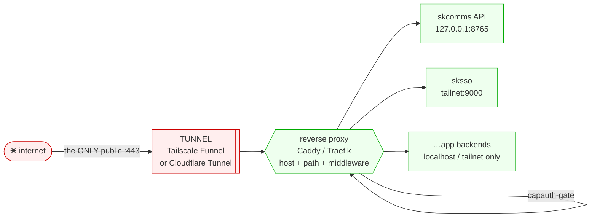
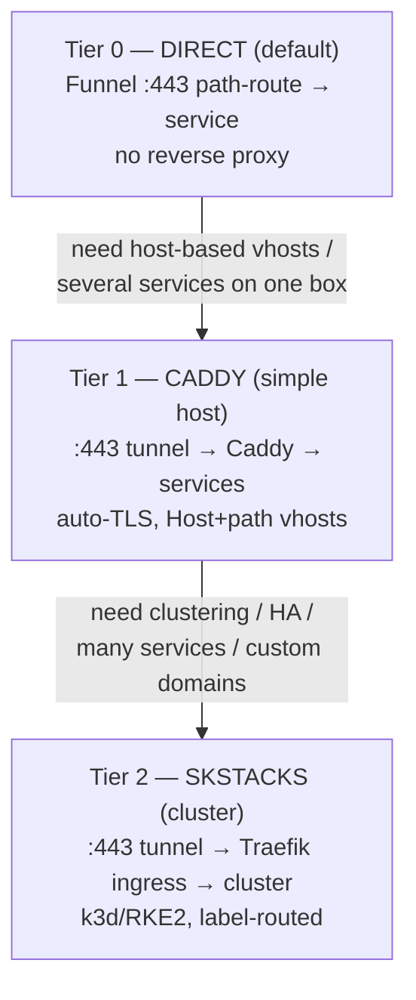
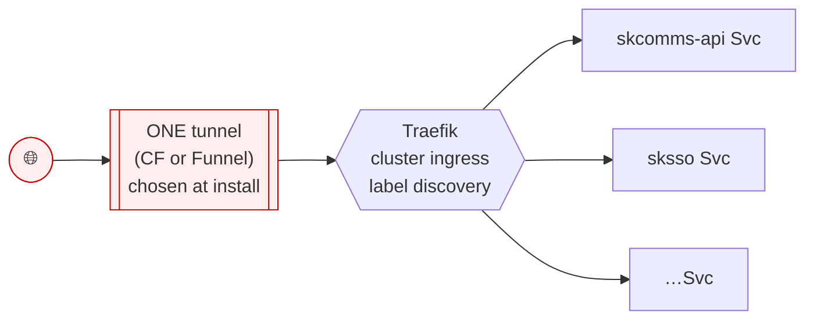
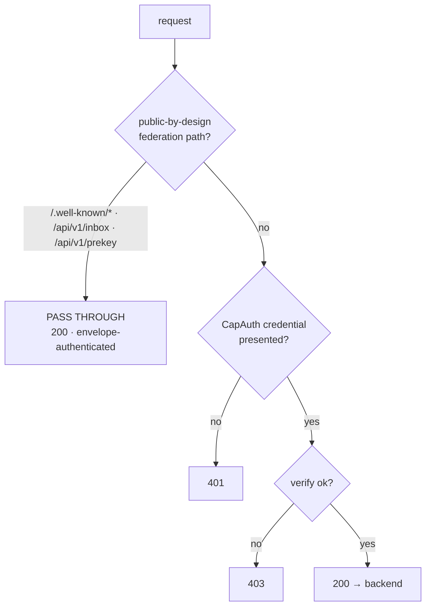

# SKWorld — Unified :443 Sovereign Ingress Standard

**Status:** Going-forward ecosystem standard (design). Coord `ff622cad`.
**Scope:** how every public-facing `sk*` service is exposed to the internet.
**Posture:** this is an *architecture + reference-config* standard. The reference
configs in [`../reference/ingress/`](../reference/ingress/) are sketches to copy,
not a live deploy. The one piece of executable code — the capauth-gate decision
core — ships with a passing test suite (`reference/ingress/test_capauth_gate.py`).

> One sentence: **minimize the attack surface to exactly ONE public `:443`, route
> everything behind it, and keep every backend on localhost or the tailnet.**

---

## 1. Why this exists — minimize port vectors

Every open public port is an attack vector and a thing to patch, monitor, and
reason about. The sovereign-ingress thesis is therefore blunt: **there should be
exactly one public listener — `:443` — and it should be a tunnel, not a port we
opened.** Everything else binds to `127.0.0.1` or a tailnet (`100.64.0.0/10`,
`*.tail204f0c.ts.net`) address and is unreachable from the internet by
construction.

This is the same principle as the [redundancy mantra](https://github.com/smilinTux/sk-standards)
inverted: where redundancy says "if you need one, get two," surface-minimization
says **"if you can expose zero, expose zero; if you must expose one, expose
exactly one."** The two compose — the *single* public ingress is itself run
HA (two tunnel connectors), but it is still one logical surface.

**Non-goals.** This standard does not replace per-message crypto. The ingress is
a *transport and coarse-authorization* layer; SKFed envelopes are still
end-to-end signed (and PQ-hybrid encrypted) regardless of how they arrive. The
ingress narrows *who can reach a backend at all*; the envelope layer decides
*whether a specific message is authentic*.

---

## 2. The pattern



**internet → `:443` TUNNEL → reverse-proxy (vhost + middleware) → backends.**

Three layers, each with one job:

| Layer | Job | What it is NOT |
|---|---|---|
| **Tunnel** | Carry the single public `:443` to the box without opening an inbound port. TLS terminates here (or at the CF edge). | Not a router. Funnel can't host-route; CF's per-hostname origins can't do path+middleware. |
| **Reverse proxy** | Host-route + path-route + run middleware (capauth-gate, headers, strip). Fan out to backends. | Not internet-exposed; only the tunnel talks to it. |
| **Backends** | Serve the app / API. Bind localhost or tailnet only. | Never reachable from the internet directly. |

---

## 2a. Deployment tiers — runs DIRECT by default; add a layer only when you need it

The three-layer pattern above is the *ceiling*, not the *floor*. A sovereign node
**starts at Tier 0 and climbs only when a real need appears.** Every tier keeps the
same `:443`-only, zero-extra-port principle — you add a reverse proxy or an
orchestrator solely to gain **vhosting** or **clustering**, never to open a port.



| Tier | Use when | Front-end | How the service runs | Add by |
|---|---|---|---|---|
| **0 — Direct** *(DEFAULT)* | One node, a handful of endpoints | **Tailscale Funnel `:443` path-route straight to the service** — `tailscale funnel --bg --https=443 --set-path=/x http://localhost:PORT/x` (preserve the target path). No reverse proxy. | `systemd` user unit, binds `127.0.0.1` / tailnet | nothing — it's the default |
| **1 — Caddy** *(simple host)* | Host-based vhosts, or more than a few services on one box | **Caddy** behind the `:443` tunnel (Funnel or CF) — auto-TLS, `Host`+path vhosts, tiny config | still `systemd`; Caddy fans out to them | `apt/brew install caddy` + a `Caddyfile` (reference in `../reference/ingress/`) |
| **2 — SKStacks** *(cluster)* | Clustering, HA, many services, `*.skworld.io` custom domains | **Traefik** cluster ingress (k3d/RKE2) fronted by ONE tunnel — Funnel (sovereign) or CF-Tunnel (wildcard hosts) | cluster workloads; Traefik label-routes by service | `skstacks` install (ships Traefik + the tunnel adapter + per-deploy config) |

**Golden rule.** Tier 0 is the default and is *sufficient* for the SKFed federation
surface (S2S inbox, prekey, the SKFed directory) on a single node — that is exactly
how `.158` and `.41` run today. Move to Tier 1 the moment you want two services at
different **hostnames**; Tier 2 when you want a **cluster**. **Never open a second
public port to avoid moving up a tier — moving tier IS the answer.** The choice of
tier (and, at Tier 1/2, which tunnel) is a deployment config — for a cluster it is
part of the `skstacks` install.

---

## 3. Why a reverse proxy is *required* for vhosting

The tunnel alone cannot do host-based virtual hosting in the sovereign case, and
this is the load-bearing reason the middle layer exists:

- **Tailscale Funnel exposes exactly ONE hostname per node**
  (`<node>.tail204f0c.ts.net`) and routes **by PATH only**. There is no second
  public hostname and no `Host:`-header fan-out. Proven in this environment:
  federation rides the single public `:443` at
  `https://<node>.tail204f0c.ts.net/api/v1/inbox` and `/api/v1/prekey`. If you
  want `skchat.skworld.io` *and* `sksso.skworld.io` to be distinct vhosts behind
  Funnel, **Funnel cannot do it** — you must put a reverse proxy behind Funnel
  (which then host-routes if it owns real TLS, or you settle for path-based
  separation under the one Funnel hostname).

- **Cloudflare Tunnel *can* host-route** (its `ingress:` list matches by
  `hostname:`, including `*.skworld.io` wildcards), but each hostname still maps
  to exactly **one** origin service. The moment you need path-routing *and*
  middleware *and* a capauth-gate on one hostname, cloudflared's ingress is too
  coarse — you point CF at a real reverse proxy and let *that* do the vhosting.

So in both tunnel modes, anything beyond "one hostname, one backend" requires a
reverse proxy. That is why the standard pattern is always three layers.

---

## 4. Tunnel adapters

Both are first-class. Choose per deployment at install time.

### 4.1 Tailscale Funnel — sovereign, zero-dep

- **No third party in control of routing.** Tailscale's ingress terminates TLS
  and forwards down the existing tailnet connection. Zero inbound ports opened
  on the box.
- **One hostname, PATH routing only** (see §3). Reference commands:
  [`reference/ingress/tailscale-funnel.sh`](../reference/ingress/tailscale-funnel.sh).
- **The proven `--set-path` gotcha — target path preserved.**
  `tailscale funnel --set-path=/P <target>` mounts path `/P`. The **target URL
  must carry the path the backend actually routes on**, so the path is
  **preserved end-to-end** to the backend. The proven, working form mounts each
  federation path at its *full* target path:

  ```
  tailscale funnel --bg --set-path=/api/v1/inbox  http://127.0.0.1:8765/api/v1/inbox
  ```

  rather than mounting `/` and assuming a prefix survives. (Mounting `/` onto a
  reverse proxy is also valid — then the proxy does the routing; that is the
  recommended OPTION B in the script.)
- **Trade-off:** single hostname is the whole constraint. Great for one node
  publishing the federation endpoints + one app; needs a reverse proxy the
  moment you want multiple host-named vhosts.

### 4.2 Cloudflare Tunnel (`cloudflared`) — outbound, zero inbound ports

- **`cloudflared` dials OUT to the CF edge.** Nothing listens publicly on the
  box; the firewall stays closed. TLS terminates at the CF edge.
- **Host-routes via `ingress:`**, including `*.skworld.io` wildcard vhosts. DNS
  is a proxied CNAME `<host> → <tunnel-uuid>.cfargotunnel.com` on the
  `skworld.io` zone. **This is the proven sksso pattern** today
  (`runbooks/sksso-cloudflared-setup.sh`, `sksso-tunnel-create.py`).
- Reference: [`reference/ingress/cloudflared-config.yml`](../reference/ingress/cloudflared-config.yml).
- **Trade-off:** Cloudflare is in the data path (edge TLS termination, a
  dependency on a third party). Per-hostname origins are one-service-each, so
  real path+middleware vhosting still wants a reverse proxy behind the tunnel.
- **HA note:** run the connector with `replicas: 2`; pin pod DNS to `1.1.1.1`
  so it can reach the CF edge despite a captive cluster CoreDNS upstream
  (proven `.13` gotcha).

| | Tailscale Funnel | Cloudflare Tunnel |
|---|---|---|
| Inbound ports opened | 0 | 0 (outbound connector) |
| Third party in data path | Tailscale ingress (TLS) | Cloudflare edge (TLS) |
| Host-routing | ❌ one hostname only | ✅ `ingress:` by hostname / wildcard |
| Path-routing | ✅ `--set-path` (path preserved) | ✅ (per-hostname) |
| Wildcard vhosts | ❌ | ✅ `*.skworld.io` |
| Sovereign / zero-dep | ✅ | partial (CF dependency) |
| Best for | sovereign single-node + federation | many `*.skworld.io` public names |

---

## 5. Reverse-proxy choice

| | **Caddy** | **Traefik** |
|---|---|---|
| Posture | sovereign-simple, few vhosts | cluster-native, many services |
| Config | one readable `Caddyfile` | dynamic file / CRD / labels |
| Service discovery | static | **label-based auto-discovery** (k3d/RKE2) |
| TLS | auto-TLS built in | auto-TLS (or edge-terminated) |
| Use when | a box or two, hand-maintained | the SKStacks cluster ingress |
| Reference | [`Caddyfile`](../reference/ingress/Caddyfile) | [`traefik-dynamic.yml`](../reference/ingress/traefik-dynamic.yml) |

**Rule of thumb:** a standalone sovereign node (e.g. the `.158` skcomms node)
fronts with **Caddy**; the **SKStacks** k3d/RKE2 cluster fronts with **Traefik**
(it is already the cluster ingress, and label discovery means new Services route
themselves).

---

## 6. SKStacks integration

In the cluster, **Traefik is the single cluster ingress** and **one tunnel
fronts the whole cluster**:



- **Per-deployment tunnel choice.** Each cluster install picks **sovereign-funnel**
  *or* **CF-tunnel** as the front door. The cluster routing (Traefik
  IngressRoutes / labels) is identical either way — only the front-door adapter
  differs. This keeps the cluster routing sovereign and in-repo while the public
  edge is swappable.
- **CF-tunnel deployment** = the proven sksso connector: `cloudflared`
  Deployment (replicas 2) → Traefik ClusterIP, wildcard `*.skworld.io`.
- **Sovereign-funnel deployment** = Tailscale (operator/sidecar) Funnel on a
  node → Traefik; single hostname, so route by **PathPrefix** inside Traefik.

---

## 7. The capauth-gate middleware

The ingress enforces capauth **before** a request reaches a backend — coarse
authorization at the edge, on top of (not instead of) per-envelope verification.

### 7.1 The contract



Two rules, and they are not symmetric:

1. **Federation endpoints PASS THROUGH the gate, unconditionally.**
   `/api/v1/inbox`, `/api/v1/prekey`, and `/.well-known/*` (DID docs + SKFed
   descriptors) are **public-by-design**: they authenticate at the *envelope*
   layer. Every SKFed envelope is PGP/PQC-signed and the backend verifies it
   with `skcomms.signing.EnvelopeVerifier` (signature → freshness → replay).
   A peer node holds a **signed envelope, not an edge credential** — gating
   these at the ingress would break federation. So the gate *allowlists* the
   federation prefixes. This is the proven foundation: federation rides ONE
   public `:443` and self-authenticates per message.

2. **Everything else is gated.** A protected app/admin route requires a presented
   CapAuth credential (`Authorization: CapAuth <token>`) that capauth accepts.
   Honest status codes: **401** = no CapAuth credential presented; **403** = a
   CapAuth credential was presented and rejected.

### 7.2 The sketch

The decision core is real, tiny, and tested:
[`reference/ingress/capauth_gate.py`](../reference/ingress/capauth_gate.py).
`gate_decision(path, headers, verify) -> Decision` is pure and
framework-agnostic; `verify` is injected so it unit-tests with no live capauth.
Wrappers shipped in the sketch:

- `CapAuthGate` — ASGI middleware that drives the decision and returns
  401/403 with a `WWW-Authenticate: CapAuth` challenge.
- `cli()` — a `forward_auth` helper (env contract) for a Caddy/Traefik
  external-auth hop or a tiny sidecar.

In production, wire `verify` to capauth: token introspection, **or** verify a
detached request signature against the caller's pinned capauth pubkey (the same
trust the `EnvelopeVerifier` TOFU store holds). The federation allowlist
(`PUBLIC_PREFIXES`) is mirrored verbatim into every reference config so the edge
and the proxy agree on what is public.

---

## 8. Reference configs — what they route

All four front the **same** SKFed federation endpoints + example app vhosts:

| File | Front door | Routes |
|---|---|---|
| [`Caddyfile`](../reference/ingress/Caddyfile) | Caddy behind CF/Funnel | `/.well-known/skfed/*`, `/.well-known/did.json`, `/api/v1/inbox`, `/api/v1/prekey` → skcomms; `skchat.skworld.io`, `sksso.skworld.io` vhosts; capauth-gate snippet |
| [`traefik-dynamic.yml`](../reference/ingress/traefik-dynamic.yml) | Traefik cluster ingress | same federation routers (public, no gate, priority 100) + gated app router + sksso |
| [`cloudflared-config.yml`](../reference/ingress/cloudflared-config.yml) | CF Tunnel | wildcard `*.skworld.io` → reverse proxy (Option A) or per-host origins (Option B, the live sksso shape) |
| [`tailscale-funnel.sh`](../reference/ingress/tailscale-funnel.sh) | TS Funnel | `--set-path` mounts for the federation endpoints (path preserved) or `/` → reverse proxy |

**Federation endpoint set (canonical):**

- `/.well-known/skfed/*` — SKFed node descriptor *(planned route; the SKFed
  family currently advertises via DID + Nostr directory — honest status)*.
- `/.well-known/did.json` — DID document *(exists: `skcomms.did_router`)*.
- `/api/v1/inbox` — S2S signed-envelope receive *(exists: `skcomms.api`)*.
- `/api/v1/prekey` — PQ prekey publish/fetch *(exists: `skcomms.node_registry`)*.

---

## 9. What's testable / proven vs designed

**Proven (honest claims):**
- The capauth-gate decision core: 12 passing tests
  (`pytest reference/ingress/test_capauth_gate.py -q`).
- Federation rides ONE public `:443` funnel at
  `https://<node>.tail204f0c.ts.net/api/v1/{inbox,prekey}` — live foundation.
- The sksso CF-Tunnel pattern (proxied CNAME → `cfargotunnel.com`, in-cluster
  connector, replicas 2, pinned DNS) — live in production.
- `EnvelopeSigner`/`EnvelopeVerifier` (`skcomms.signing`) sign/verify per-message
  — the layer the federation allowlist relies on.

**Designed (not yet a live deploy):**
- The unified Caddy/Traefik front fan-out as written here.
- `/.well-known/skfed/*` as a literal HTTP route.
- The capauth-gate wired to a live capauth verifier (the sketch injects a stub).

---

## Related standards / see also

- [CRYPTOGRAPHY_STANDARD](./CRYPTOGRAPHY_STANDARD.md) — the envelope-layer crypto
  the federation endpoints rely on (why they can be public).
- [ARCHITECTURE_AND_DATAFLOW_STANDARD](./ARCHITECTURE_AND_DATAFLOW_STANDARD.md) —
  the mermaid + data-flow mandate this doc follows.
- [TESTING_AND_CI_STANDARD](./TESTING_AND_CI_STANDARD.md) — "tests are evidence
  for claims"; §9 above is that gate applied to ingress.
- Proven runbooks: `runbooks/sksso-cloudflared-setup.sh`,
  `runbooks/sksso-tunnel-create.py`.
