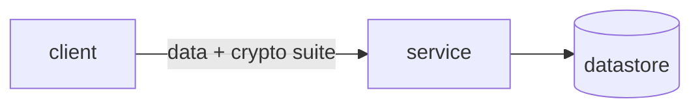

# <Repo> — Standard Operating Procedures

<1–3 line overview: what it is, primary standard/protocol, who calls it.>

## 1. Overview
Purpose, scope, what it owns, what it explicitly does NOT do.

## 2. Architecture
<!-- MUST contain ≥1 mermaid diagram. Add a data-flow diagram (crypto-per-hop) for services. -->

**Start here:** the 3–5 entry-point files a reader should open first, each with a one-liner.

## 3. Build
## 4. Test
## 5. Release / Deploy
<!-- service: docker/k3d deploy + rollback · library: build + publish (PyPI/pub.dev), bump, tag, changelog -->
## 6. Configuration / Usage
## 7. API / Reference
## 8. Troubleshooting
<!-- Symptom → Check table -->
## 9. Maturity-tier + Version reference
T<0–4> · VERSION_LIFECYCLE phase · SemVer · CRYPTOGRAPHY_STANDARD compliance line.
